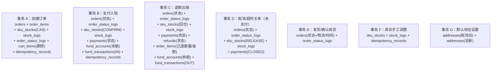

# 电商商城系统 — 数据库表设计

| 项目信息 | 内容 |
| --- | --- |
| 文档版本 | **v2.0**（对应 `05-PRD-变更.md` v1.1 单一支付方式口径） |
| 上游文档 | `docs/01-PRD.md`、`docs/02-architecture.md`、**`docs/05-PRD-变更.md`（v1.1，v2 需求基线）** |
| 数据库 | **MySQL 8.0**（InnoDB，`utf8mb4_unicode_ci`） |
| ORM | **Prisma ^5.22**（迁移用 `prisma migrate`） |
| 模型总数 | **38 个**（含 42 个枚举）｜v1 为 24 个模型 / 25 个枚举 |
| 文档语言 | 简体中文 |

> **本文的 `schema.prisma` 为可直接使用的全文**，复制到 `server/prisma/schema.prisma` 后执行 `npx prisma migrate dev --name init` 即可建库。
> **约束**：所有金额 = 「分」= `BIGINT`；所有表 `created_at` / `updated_at` 统一；软删除用 `deleted_at`（可空）。

> **[v2 变更] 本文相对 v1.0 的四组结构性改动**（逐处用 `> **[v2 变更]**` 标注，未标注处沿用 v1）：
> 1. **优惠券 / 促销域**：新增 8 张表（`coupon_templates` / `coupon_template_scopes` / `coupons` / `coupon_use_logs` / `promotions` / `promotion_rules` / `promotion_scopes` / `order_coupon_records`）；`orders` / `order_items` 优惠字段由「恒 0 单字段」改为三级扣减 + 行级分摊。
> 2. **RBAC 域**：新增 4 张表（`roles` / `permissions` / `role_permissions` / `admin_user_roles`）；`admin_users.role` 枚举列**移除**。
> 3. **支付域**：`PayChannel` 扩 `BALANCE` / `BANKCARD`；`payments` 增加 `biz_type` 复用为充值单凭证；新增 `payment_methods`、`recharge_orders`。**删除 v1 变更记录中曾出现过的 `refund_segments` 多段退款结构**（v1.1 取消混合支付，退款去向唯一）。
> 4. **资金域**：`fund_accounts` 支持每用户一条 `USER_BALANCE` 负债账户并启用 `frozen_balance`；`fund_transactions` 增加 `counterparty_account_id` / `tx_group_no` / `is_liability`。记账模型最终选定 **方案 A+（单式流水 + 对手方 + 交易组号 + 结转对）**，论证见 **§3.6.4**。
>
> **全文迁移方案见 §10**（v1 schema → v2 的建表 / 加字段 / 改枚举 / 数据迁移清单）。

---

## 1. 全局约定

### 1.1 命名规范

| 对象 | 规范 | 示例 |
| --- | --- | --- |
| 表名 | 复数 snake_case | `orders`、`order_items`、`fund_transactions` |
| 字段名 | snake_case（Prisma 内为 camelCase，用 `@map` 映射） | `pay_amount` ← `payAmount` |
| 主键 | 统一 `id BIGINT AUTO_INCREMENT` | — |
| 业务单号 | `order_no` / `payment_no` / `refund_no` / `tx_no`，唯一索引 | `SO202401021234567890` |
| 外键 | `{表名单数}_id` | `user_id`、`sku_id` |
| 时间 | `xxx_at`，`DATETIME(3)` | `paid_at`、`expire_at` |
| 布尔 | `is_xxx` | `is_default` |
| 软删 | `deleted_at DATETIME(3) NULL` | — |
| 索引 | 唯一 `uk_xxx`，普通 `idx_xxx` | `uk_order_no` |

> **为什么表名用复数**：避免 `order`、`user` 等 MySQL 保留/关键字带来的反引号摩擦，工程师写原生 SQL 时心智负担更低。

### 1.2 金额字段公约（**最重要**）

| 规则 | 说明 |
| --- | --- |
| 类型 | `BigInt`（Prisma）→ MySQL `BIGINT`，**单位「分」** |
| 禁止 | `Decimal` / `Float` / `Double` 一律禁止用于金额；比例字段用万分比 `Int` |
| 符号 | 金额一律存**正数**，方向由 `direction` 等独立字段表达，不用负号 |
| 读取 | Prisma 返回 JS `bigint`，由 `core/response.ts` 的 `jsonReplacer` 统一转 `number`（安全范围内无损） |
| 计算 | `MoneyUtil` 内部 `bigint` 运算；分摊用「按权重分摊 + 尾差计入最大项」 |
| 溢出 | `BIGINT` 上限 9.2e18 分，业务不可能触及；`Number.MAX_SAFE_INTEGER`(9e15 分 ≈ 90 万亿元) 保证 JS 转换无损 |

### 1.3 单号生成规则（`core/idGenerator.ts`）

| 单号 | 格式 | 示例 |
| --- | --- | --- |
| 订单号 | `SO` + `yyyyMMdd` + 6 位序列 + 6 位随机 | `SO20240102000001834729` |
| 支付单号 | `PAY` + 同上 | `PAY20240102000001912047` |
| 退款单号 | `SR` + 同上 | `SR20240102000002048391` |
| 资金流水号 | `FT` + `yyyyMMdd` + 8 位序列 | `FT2024010200000001` |
| SKU 编码 | `SKU-` + 8 位业务码（后台可手填） | `SKU-2024001` |
| 幂等号 | 客户端 UUID v4；服务端兜底 `BIZ:{bizNo}` | — |
| **[v2] 充值单号** | `RC` + `yyyyMMdd` + 6 位序列 + 6 位随机 | `RC20240102000001234567` |
| **[v2] 券模板编号** | `CT` + `yyyyMMdd` + 6 位序列 | `CT20240102000001` |
| **[v2] 券实例编号** | `CP` + `yyyyMMdd` + 10 位序列 + 4 位随机 | `CP20240102000000012345` |
| **[v2] 活动编号** | `PM` + `yyyyMMdd` + 6 位序列 | `PM20240102000003` |
| **[v2] 交易组号**（`tx_group_no`） | `TG` + `yyyyMMdd` + 12 位序列 + 4 位随机 | `TG2024010200000000012345` |
| **[v2] 账户编号** | 平台 `ACC_PLATFORM_CASH`；用户 `UB` + `yyyyMMdd` + 用户 ID 补零 12 位 | `UB20240102000000000001` |

> 序列段由 DB 自增 ID 补齐（不引入额外序列表），随机段防枚举。

> **[v2 变更] `tx_group_no` 的用途澄清**：v1 设计阶段曾把它定位为「混合支付多段流水的分组键」。取消混合支付后该定位失效，但它立刻有了**更关键的用途** —— 绑定「**负债结转对**」（见 §3.6.4）。一笔余额消费在同一个 `tx_group_no` 下产生 3 条流水：用户余额 `OUT` + 平台 `IN`（确认收入）+ 平台 `OUT`（冲减负债）。**没有 `tx_group_no` 就无法证明后两条属于同一次结转**，负债与收入会各自漂移。

### 1.4 状态字段通用原则

1. 状态字段一律用 **Prisma enum**（MySQL `ENUM`），禁止魔法字符串。
2. 变更前**必须**先读后写并用条件更新（`WHERE status = 期望值`），以 `affectedRows` 判定并发胜负。
3. 每次状态变更写一条轨迹/流水，**与状态更新在同一事务**。
4. Enum 新增取值需 `ALTER TABLE`（MySQL ENUM 变更），成本可控但需走迁移；**一期已把所有状态机的取值枚举完整**（见 §4）。

---

## 2. 完整 Prisma Schema（可直接复制）

```prisma
// server/prisma/schema.prisma
generator client {
  provider = "prisma-client-js"
}

datasource db {
  provider = "mysql"
  url      = env("SHOP__DB__URL")
}

// ============================================================================
// 枚举定义
// ============================================================================

/// 用户角色
enum UserRole {
  USER
  ADMIN
  SUPER_ADMIN
}

/// 用户状态
enum UserStatus {
  ACTIVE
  DISABLED
}

/// [v2 变更] 后台管理员角色枚举 **已移除**（原 `AdminRole{ADMIN,SUPER_ADMIN}` 作废）。
/// 后台权限改为动态 RBAC：`admin_users` ↔ `roles`（多对多）↔ `permissions`（多对多）。
/// C 端 `UserRole` 保持静态枚举（guest 未登录 / USER 买家），不涉及后台权限。
/// 迁移见 §10.3；RBAC 五表设计见 §3.10；迁移期兼容策略见 §10.3 注。

/// [v2 新增] RBAC 角色状态
enum RoleStatus {
  ENABLED
  DISABLED
}

/// [v2 新增] 数据权限范围（一期两档）
enum DataScope {
  ALL     // 全部数据
  SELF    // 仅自己创建的数据（查询层统一注入 creator_id 过滤）
}

/// 后台管理员状态
enum AdminStatus {
  ACTIVE
  DISABLED
}

/// 操作人类型（资金流水、库存流水、订单轨迹共用）
enum OperatorType {
  USER
  ADMIN
  SYSTEM
}

/// Token 主体类型（C 端用户 / 后台管理员，复用 refresh_tokens 表）
enum SubjectType {
  USER
  ADMIN
}

/// 商品分类状态
enum CategoryStatus {
  ENABLED
  DISABLED
}

/// 商品（SPU）状态。DRAFT/PENDING_AUDIT 为审核流预留（PRD P1），一期使用 ON_SALE/OFF_SALE
enum ProductStatus {
  DRAFT
  PENDING_AUDIT
  ON_SALE
  OFF_SALE
}

/// SKU 状态
enum SkuStatus {
  ENABLED
  DISABLED
}

/// 库存变动类型
enum StockChangeType {
  ORDER_FREEZE       // 下单冻结：available → frozen
  ORDER_CONFIRM      // 支付确认：frozen → sold
  ORDER_RELEASE      // 取消/超时释放：frozen → available
  REFUND_RETURN      // 退款回仓：sold → available
  MANUAL_IN          // 手工入库：→ available
  MANUAL_LOSS        // 手工报损：available → 出账
  MANUAL_CHECK       // 盘点修正（可正可负，修正 available）
}

/// 订单状态
enum OrderStatus {
  PENDING_PAYMENT    // 待支付
  PAID               // 已支付（待发货）
  SHIPPED            // 已发货（待收货）
  COMPLETED          // 已完成
  CANCELLED          // 已取消
  REFUNDING          // 退款中
  REFUNDED           // 已退款
}

/// 订单取消原因
enum CancelReason {
  USER_CANCEL
  ADMIN_CANCEL
  TIMEOUT
  SYSTEM
}

/// 支付渠道
/// [v2 变更] 新增 BALANCE（余额，本地记账不走外部渠道）、BANKCARD（银行卡，走聚合支付服务商）
enum PayChannel {
  MOCK       // 模拟支付（沙箱 / 生产降级）
  ALIPAY     // 支付宝
  WECHAT     // 微信支付
  BANKCARD   // [v2] 银行卡（聚合支付服务商：网关支付 / 快捷支付）
  BALANCE    // [v2] 用户余额（本地事务，无外部调用）
}

/// [v2 新增] 子支付方式（同一渠道下的不同支付场景）
enum SubChannel {
  WEB        // 支付宝 PC 网页支付 / 银行卡网关
  SCAN       // 支付宝当面付扫码 / 微信 Native
  JSAPI      // 微信内 / 公众号
  H5         // 非微信手机浏览器
  GATEWAY    // 银行卡网关支付（跳转聚合商收银台选银行）
  QUICK      // 银行卡快捷支付（绑卡 + 短信）
  BALANCE    // 余额支付（与 channel=BALANCE 配对）
}

/// [v2 新增] 支付单业务类型：一张 payments 表同时承载「订单支付」与「余额充值」
enum PaymentBizType {
  ORDER      // 订单支付（关联 orders.order_no）
  RECHARGE   // 余额充值（关联 recharge_orders.recharge_no）
}

/// [v2 新增] 充值单状态
enum RechargeStatus {
  PENDING    // 待支付
  SUCCESS    // 充值成功（余额已到账）
  CLOSED     // 已关闭（超时 30 分钟 / 用户取消）
}

/// 支付单状态
enum PayStatus {
  PENDING     // 待支付
  SUCCESS     // 支付成功
  CLOSED      // 已关闭
  FAILED      // 支付失败
  REFUNDED    // 已全额退款
}

/// 退款类型
enum RefundType {
  FULL
  PARTIAL
}

/// 退款单状态
enum RefundStatus {
  PENDING     // 待审核
  REJECTED    // 已驳回
  PROCESSING  // 退款中（已调渠道）
  SUCCESS     // 退款成功
  FAILED      // 退款失败（可重试）
}

/// [v2 新增] 退款去向（单一支付方式下，退款去向唯一，不存在拆分）
enum RefundTarget {
  BALANCE    // 退回用户余额账户（本地事务，即时到账）
  CHANNEL    // 原路退回原渠道（调渠道 refund）
}

/// [v2 新增] 渠道回调处理状态（回调接口只落日志 + 投递队列，由 Worker 消费）
enum PaymentNotifyStatus {
  RECEIVED   // 已收回调（已落 integration_call_logs）
  QUEUED     // 已投递 BullMQ
  CONSUMED   // Worker 已成功消费并完成入账事务
  SKIPPED    // 重复通知被幂等跳过
  DEAD       // 重试耗尽，进入死信，需人工介入
}

/// 资金方向：IN = 入账，OUT = 出账
enum FundDirection {
  IN
  OUT
}

/// 资金业务类型
/// [v2 变更] 由 10 类扩到 21 类。新增部分分三组：
///   ① 用户余额账户（USER_BALANCE）流水；② 平台侧充值收款（负债）；
///   ③ 负债结转对（LIABILITY_SETTLE_IN / LIABILITY_SETTLE_OUT，必须成对、共享 tx_group_no）
/// ⚠️ LIABILITY_SETTLE_OUT 必须**晚于** LIABILITY_SETTLE_IN 写入（先 IN 后 OUT），
///    否则中间态可能触发 fund_accounts 的 CHECK(balance >= 0)。详见 §3.6.4。
enum FundBizType {
  // ---- v1 原有（订单/退款/调账，记在 PLATFORM_CASH 账户）----
  ORDER_PAY            // 渠道支付订单入账（IN）
  ORDER_REFUND         // 订单整单退款（OUT）
  ORDER_REFUND_PART    // 订单部分退款（OUT）
  ORDER_CANCEL_REFUND  // 已支付订单取消退款（OUT）
  CHANNEL_FEE          // 支付渠道手续费（OUT）
  FREIGHT_ADD          // 运费补收（IN）
  FREIGHT_REFUND       // 运费退还（OUT）
  MANUAL_ADJUST_IN     // 手工调账-补记（IN）
  MANUAL_ADJUST_OUT    // 手工调账-冲减（OUT）
  REVERSAL             // 冲正流水（与原流水反向，related_tx_no 必填）

  // ---- [v2] 充值侧 ----
  PLATFORM_RECHARGE_IN   // 充值：平台账户收到渠道款项（IN，is_liability=true，是负债不是收入）
  BALANCE_RECHARGE       // 充值：用户余额账户入账（IN）
  BALANCE_GIFT           // 充值赠送：用户余额账户入账（IN，对应平台侧记营销费用，不进收入）

  // ---- [v2] 消费 / 退款侧（USER_BALANCE 账户）----
  BALANCE_CONSUME        // 余额支付订单（OUT）
  BALANCE_ROLLBACK       // 余额支付失败/关单回滚（IN）
  BALANCE_REFUND         // 退款退回余额（IN）
  BALANCE_ADJUST_IN      // 余额手工调账-补记（IN，super_admin，必填原因）
  BALANCE_ADJUST_OUT     // 余额手工调账-冲减（OUT，super_admin，必填原因）
  BALANCE_WITHDRAW       // 余额提现（OUT，一期不做，占位）

  // ---- [v2] 负债结转对（记在 PLATFORM_CASH 账户，必须成对）----
  LIABILITY_SETTLE_IN    // 结转：负债转收入（IN，is_liability=false，先写）
  LIABILITY_SETTLE_OUT   // 结转：冲减负债（OUT，is_liability=true，后写）
}

/// 账户类型
/// [v2 变更] 由「一期只有 PLATFORM_CASH」改为「PLATFORM_CASH（1 条）+ USER_BALANCE（每用户 1 条）」。
/// POINT 为二阶段积分账户预留扩展位，一期不建账户。
enum FundAccountType {
  PLATFORM_CASH   // 平台现金账户（全局 1 条）；其「余额」= 平台实际持有的现金
  USER_BALANCE    // [v2] 用户余额负债账户（每用户 1 条）；其「余额」= 平台对该用户的负债
  POINT           // 二阶段积分账户预留
}

/// 资金账户状态
/// [v2 变更] FROZEN 由「预留」变为「实际可用」：风控/争议场景下冻结用户余额账户
enum AccountStatus {
  ACTIVE
  FROZEN
}

// ============================================================================
// [v2 新增] 优惠券 / 促销域枚举
// ============================================================================

/// 券类型
enum CouponType {
  FULL_REDUCE    // 满减券：threshold_amount(>0) + discount_amount(分)
  DISCOUNT       // 折扣券：threshold_amount + discount_rate(万分比) + max_discount(必填)
  NO_THRESHOLD   // 无门槛券：threshold_amount 恒 0 + discount_amount(分)
}

/// 券有效期策略（两种互斥）
enum CouponValidType {
  FIXED_RANGE    // 固定时间段：valid_start ~ valid_end
  AFTER_CLAIM    // 领取后 N 天有效：valid_days，领取时算 expire_at
}

/// 券模板状态（运营侧生命周期）
enum CouponTemplateStatus {
  NOT_START   // 未开始（已创建但未到 claim_start_at）
  CLAIMABLE   // 可领取
  PAUSED      // 已暂停（运营手动）
  ENDED       // 已结束（到 claim_end_at 或发完）
}

/// 券实例状态（用户侧生命周期，见 05-PRD-变更 §2.3.2 状态机）
enum CouponStatus {
  UNUSED       // 已领取·未使用
  LOCKED       // 已占用·锁定（提交订单时占用，与订单同事务）
  USED         // 已使用（支付成功）
  EXPIRED      // 已过期（定时任务批量置位）
  INVALIDATED  // 已作废（运营整批作废）
}

/// 券轨迹业务动作
enum CouponLogBizType {
  CLAIM      // 领取
  LOCK       // 下单占用
  UNLOCK     // 解冻（取消/超时/支付失败）
  USE        // 核销（支付成功）
  RESTORE    // 退款返还（整单退款）
  EXPIRE     // 过期
  INVALIDATE // 运营作废
}

/// 适用范围类型（券模板与促销活动共用语义，各自一张关联表）
enum ScopeType {
  ALL               // 全场通用
  CATEGORY          // 指定分类
  PRODUCT           // 指定商品（SPU）
  EXCLUDE_PRODUCT   // 排除商品（SKU/SPU 黑名单）
}

/// 促销活动类型
enum PromotionType {
  FULL_REDUCE    // 满减：订单级，满 N 分减 M 分，可阶梯
  FULL_DISCOUNT  // 满折：行级，参与商品打 X 折（discount_rate 万分比）
  FLASH_SALE     // 限时折扣：行级，指定商品按折扣价/固定价销售
}

/// 促销活动作用层级
enum PromotionLevel {
  ORDER   // 订单级（满减）：优惠需分摊到行
  ROW     // 行级（满折 / 限时折扣）：天然归属该行，无需分摊
}

/// 促销活动状态
enum PromotionStatus {
  DRAFT     // 草稿
  ENABLED   // 已启用
  DISABLED  // 已停用
  ENDED     // 已结束
}

/// [v2 新增] 支付方式（后台可配置）状态
enum PaymentMethodStatus {
  NORMAL      // 正常，可选
  MAINTAINING // 维护中（展示但不可选，带提示文案）
}

/// 幂等记录状态
enum IdempotencyStatus {
  PROCESSING
  SUCCESS
  FAILED
}

/// 文件存储类型
enum StorageType {
  LOCAL
  OSS
}

/// 第三方适配器类型
enum AdapterType {
  PAYMENT
  LOGISTICS
  SUPPORT
  SMS
}

/// 后台操作结果
enum OpResult {
  SUCCESS
  FAIL
}

// ============================================================================
// 用户域
// ============================================================================

/// 用户（C 端买家）
model User {
  id           BigInt     @id @default(autoincrement())
  phone        String     @unique @db.VarChar(20)
  email        String?    @db.VarChar(128)
  passwordHash String     @map("password_hash") @db.VarChar(255)
  /// [v2 新增] 支付密码（6 位数字，BCrypt 存储，独立于登录密码）—— BAL-06
  /// NULL 表示未设置，余额支付前强制引导设置
  payPasswordHash String? @map("pay_password_hash") @db.VarChar(255)
  /// [v2 新增] 支付密码连续错误次数与锁定截止时间 —— BAL-06（错 5 次锁 30 分钟）
  payPwdFailCount Int     @default(0) @map("pay_pwd_fail_count")
  payPwdLockedUntil DateTime? @map("pay_pwd_locked_until") @db.DateTime(3)
  nickname     String     @db.VarChar(64)
  avatar       String?    @db.VarChar(512)
  role         UserRole   @default(USER)
  status       UserStatus @default(ACTIVE)
  /// token 版本号：+1 即让该用户所有已签发 access token 失效（强制下线）
  tokenVersion Int        @default(1) @map("token_version")
  lastLoginAt  DateTime?  @map("last_login_at")
  lastLoginIp  String?    @map("last_login_ip") @db.VarChar(64)
  createdAt    DateTime   @default(now()) @map("created_at") @db.DateTime(3)
  updatedAt    DateTime   @updatedAt @map("updated_at") @db.DateTime(3)
  deletedAt    DateTime?  @map("deleted_at") @db.DateTime(3)

  addresses     Address[]
  refreshTokens RefreshToken[]
  cartItems     CartItem[]
  orders        Order[]
  payments      Payment[]
  refunds       Refund[]
  /// [v2 新增] 每用户 1 条 USER_BALANCE 账户（与注册同事务开户，见 §7.1 事务 H）
  fundAccounts      FundAccount[]
  /// [v2 新增]
  coupons           Coupon[]
  couponUseLogs     CouponUseLog[]
  orderCouponRecords OrderCouponRecord[]
  rechargeOrders    RechargeOrder[]

  @@index([status, createdAt])
  @@index([createdAt])
  @@map("users")
}

/// 收货地址（软删除；订单保存下单时快照，删除地址不影响历史订单）
model Address {
  id            BigInt   @id @default(autoincrement())
  userId        BigInt   @map("user_id")
  receiverName  String   @map("receiver_name") @db.VarChar(64)
  phone         String   @db.VarChar(20)
  provinceCode  String   @map("province_code") @db.VarChar(20)
  provinceName  String   @map("province_name") @db.VarChar(64)
  cityCode      String   @map("city_code") @db.VarChar(20)
  cityName      String   @map("city_name") @db.VarChar(64)
  districtCode  String   @map("district_code") @db.VarChar(20)
  districtName  String   @map("district_name") @db.VarChar(64)
  detailAddress String   @map("detail_address") @db.VarChar(255)
  /// 标签：HOME / COMPANY / SCHOOL
  tag           String?  @db.VarChar(16)
  isDefault     Boolean  @default(false) @map("is_default")
  createdAt     DateTime @default(now()) @map("created_at") @db.DateTime(3)
  updatedAt     DateTime @updatedAt @map("updated_at") @db.DateTime(3)
  deletedAt     DateTime? @map("deleted_at") @db.DateTime(3)

  user User @relation(fields: [userId], references: [id])

  @@index([userId, deletedAt, createdAt])
  @@index([userId, isDefault])
  @@map("addresses")
}

/// 刷新令牌（C 端与后台共用，subjectType 区分）。只存 sha256 哈希，支持轮换与家族吊销
model RefreshToken {
  id           BigInt      @id @default(autoincrement())
  subjectType  SubjectType @map("subject_type")
  userId       BigInt?     @map("user_id")
  adminId      BigInt?     @map("admin_id")
  tokenHash    String      @unique @map("token_hash") @db.VarChar(128)
  /// 轮换家族 ID：检测到重放时吊销整族
  familyId     String      @map("family_id") @db.VarChar(64)
  userAgent    String?     @map("user_agent") @db.VarChar(512)
  ip           String?     @db.VarChar(64)
  expiresAt    DateTime    @map("expires_at") @db.DateTime(3)
  revokedAt    DateTime?   @map("revoked_at") @db.DateTime(3)
  /// 轮换后指向的新记录 ID（不建外键，便于跨主体）
  replacedById BigInt?     @map("replaced_by_id")
  createdAt    DateTime    @default(now()) @map("created_at") @db.DateTime(3)

  user  User?      @relation(fields: [userId], references: [id])
  admin AdminUser? @relation(fields: [adminId], references: [id])

  @@index([subjectType, userId, revokedAt])
  @@index([subjectType, adminId, revokedAt])
  @@index([familyId])
  @@index([expiresAt])
  @@map("refresh_tokens")
}

// ============================================================================
// 商品域
// ============================================================================

/// 商品分类（最多三级树）。path = '/1/12/123/' 便于一次性取子树
model Category {
  id        BigInt         @id @default(autoincrement())
  parentId  BigInt?        @map("parent_id")
  name      String         @db.VarChar(64)
  /// 层级：1 / 2 / 3
  level     Int            @db.TinyInt
  /// 层级路径，如 '/1/12/123/'，前缀匹配可查整棵子树
  path      String         @db.VarChar(255)
  sort      Int            @default(0)
  icon      String?        @db.VarChar(512)
  status    CategoryStatus @default(ENABLED)
  createdAt DateTime       @default(now()) @map("created_at") @db.DateTime(3)
  updatedAt DateTime       @updatedAt @map("updated_at") @db.DateTime(3)
  deletedAt DateTime?      @map("deleted_at") @db.DateTime(3)

  parent   Category?  @relation("CategoryTree", fields: [parentId], references: [id])
  children Category[] @relation("CategoryTree")
  products Product[]

  @@index([parentId, sort])
  @@index([path])
  @@index([status, level, sort])
  @@map("categories")
}

/// 商品 SPU
model Product {
  id         BigInt        @id @default(autoincrement())
  categoryId BigInt        @map("category_id")
  name       String        @db.VarChar(255)
  subTitle   String?       @map("sub_title") @db.VarChar(255)
  mainImage  String        @map("main_image") @db.VarChar(512)
  /// 图文详情（HTML，入库前必须过 sanitize-html 白名单）
  detail     String?       @db.Text
  status     ProductStatus @default(DRAFT)
  /// 冗余最低/最高售价（分），便于列表页展示，SKU 变动时同步更新
  minPrice   BigInt        @default(0) @map("min_price")
  maxPrice   BigInt        @default(0) @map("max_price")
  totalSales Int           @default(0) @map("total_sales")
  sort       Int           @default(0)
  createdBy  BigInt?       @map("created_by")
  createdAt  DateTime      @default(now()) @map("created_at") @db.DateTime(3)
  updatedAt  DateTime      @updatedAt @map("updated_at") @db.DateTime(3)
  deletedAt  DateTime?     @map("deleted_at") @db.DateTime(3)

  category Category       @relation(fields: [categoryId], references: [id])
  skus     Sku[]
  images   ProductImage[]
  specs    ProductSpec[]

  @@index([categoryId, status, sort])
  @@index([status, createdAt])
  @@index([deletedAt, name])
  @@map("products")
}

/// 商品规格定义（如「颜色」= ["陨石黑","冰川银"]），用于后台生成 SKU 组合
model ProductSpec {
  id        BigInt   @id @default(autoincrement())
  productId BigInt   @map("product_id")
  /// 规格名，如「颜色」「版本」
  name      String   @db.VarChar(64)
  /// 规格值数组，JSON，如 ["陨石黑","冰川银"]
  values    Json     @db.Json
  sort      Int      @default(0)
  createdAt DateTime @default(now()) @map("created_at") @db.DateTime(3)

  product Product @relation(fields: [productId], references: [id], onDelete: Cascade)

  @@index([productId, sort])
  @@map("product_specs")
}

/// 商品图集
model ProductImage {
  id        BigInt   @id @default(autoincrement())
  productId BigInt   @map("product_id")
  url       String   @db.VarChar(512)
  sort      Int      @default(0)
  createdAt DateTime @default(now()) @map("created_at") @db.DateTime(3)

  product Product @relation(fields: [productId], references: [id], onDelete: Cascade)

  @@index([productId, sort])
  @@map("product_images")
}

/// SKU（最小库存单位）
model Sku {
  id            BigInt    @id @default(autoincrement())
  productId     BigInt    @map("product_id")
  skuCode       String    @unique @map("sku_code") @db.VarChar(64)
  /// 规格组合 JSON：{"颜色":"陨石黑","版本":"8G+128G"}
  specValues    Json      @map("spec_values") @db.Json
  /// 规格值按规格名排序后拼接（如 "颜色:陨石黑|版本:8G+128G"），用于同 SPU 下组合唯一与展示
  specDigest    String    @map("spec_digest") @db.VarChar(255)
  /// 售价（分）
  price         BigInt
  /// 划线原价（分），可空
  originalPrice BigInt?   @map("original_price")
  /// 成本价（分），仅后台可见
  costPrice     BigInt    @default(0) @map("cost_price")
  /// 重量（克），为 P1 按重量计费运费预留
  weight        Int       @default(0)
  barcode       String?   @db.VarChar(64)
  imageUrl      String?   @map("image_url") @db.VarChar(512)
  status        SkuStatus @default(ENABLED)
  sales         Int       @default(0)
  createdAt     DateTime  @default(now()) @map("created_at") @db.DateTime(3)
  updatedAt     DateTime  @updatedAt @map("updated_at") @db.DateTime(3)
  deletedAt     DateTime? @map("deleted_at") @db.DateTime(3)

  product   Product      @relation(fields: [productId], references: [id])
  stock     SkuStock?
  cartItems CartItem[]
  orderItems OrderItem[]
  refundItems RefundItem[]

  @@unique([productId, specDigest], map: "uk_product_spec")
  @@index([productId, status])
  @@index([skuCode])
  @@map("skus")
}

/// SKU 库存（三段口径 + 乐观锁）
model SkuStock {
  id       BigInt   @id @default(autoincrement())
  skuId    BigInt   @unique @map("sku_id")
  /// 总量 = available + frozen + sold（恒等式，由巡检任务校验）
  total    Int      @default(0)
  /// 可用库存（可售）
  available Int     @default(0)
  /// 冻结库存（待支付订单占用）
  frozen   Int      @default(0)
  /// 已售库存（已支付出库）
  sold     Int      @default(0)
  /// 库存预警阈值，低于此值后台列表高亮
  warningThreshold Int @default(10) @map("warning_threshold")
  /// 乐观锁版本号，每次变更 +1
  version  Int      @default(0)
  createdAt DateTime @default(now()) @map("created_at") @db.DateTime(3)
  updatedAt DateTime @updatedAt @map("updated_at") @db.DateTime(3)

  sku Sku @relation(fields: [skuId], references: [id])

  @@index([available])
  @@index([skuId, version])
  @@map("sku_stocks")
}

/// 库存流水（每次库存变动一条，含变动前后三段值）
model StockLog {
  id              BigInt           @id @default(autoincrement())
  skuId           BigInt           @map("sku_id")
  changeType      StockChangeType  @map("change_type")
  /// 变动数量，带符号（冻结 +N / 释放 -N）
  changeQty       Int              @map("change_qty")
  beforeAvailable Int              @map("before_available")
  afterAvailable  Int              @map("after_available")
  beforeFrozen    Int              @map("before_frozen")
  afterFrozen     Int              @map("after_frozen")
  beforeSold      Int              @map("before_sold")
  afterSold       Int              @map("after_sold")
  /// 关联业务单号：订单号 / 退款单号 / 手工单号
  bizNo           String?          @map("biz_no") @db.VarChar(64)
  operatorType    OperatorType     @map("operator_type")
  /// SYSTEM 时填 0
  operatorId      BigInt           @map("operator_id")
  operatorName    String?          @map("operator_name") @db.VarChar(64)
  reason          String?          @db.VarChar(255)
  /// 幂等号，NULL 时允许多条（MySQL 唯一索引允许多个 NULL）
  idempotencyKey  String?          @map("idempotency_key") @db.VarChar(128)
  createdAt       DateTime         @default(now()) @map("created_at") @db.DateTime(3)

  sku Sku @relation(fields: [skuId], references: [id])

  @@unique([skuId, idempotencyKey], map: "uk_sku_idem")
  @@index([skuId, createdAt])
  @@index([bizNo])
  @@index([changeType, createdAt])
  @@map("stock_logs")
}

// ============================================================================
// 购物车
// ============================================================================

/// 购物车条目（登录后；未登录存 localStorage，登录后合并）
model CartItem {
  id            BigInt   @id @default(autoincrement())
  userId        BigInt   @map("user_id")
  skuId         BigInt   @map("sku_id")
  quantity      Int
  /// 是否勾选（未勾选不进入结算）
  selected      Boolean  @default(true)
  /// 加购时的单价快照（分），用于「价格已变动」提示
  priceSnapshot BigInt   @map("price_snapshot")
  createdAt     DateTime @default(now()) @map("created_at") @db.DateTime(3)
  updatedAt     DateTime @updatedAt @map("updated_at") @db.DateTime(3)

  user User @relation(fields: [userId], references: [id], onDelete: Cascade)
  sku  Sku  @relation(fields: [skuId], references: [id])

  @@unique([userId, skuId], map: "uk_user_sku")
  @@index([userId, selected, updatedAt])
  @@map("cart_items")
}

// ============================================================================
// 订单域
// ============================================================================

/// 订单主表
model Order {
  id        BigInt      @id @default(autoincrement())
  orderNo   String      @unique @map("order_no") @db.VarChar(32)
  userId    BigInt      @map("user_id")
  status    OrderStatus @default(PENDING_PAYMENT)

  // ---- 金额（单位：分）----
  /// 商品原价合计 = Σ 订单行 goodsAmount
  goodsAmount      BigInt @map("goods_amount")
  /// 运费
  freightAmount    BigInt @default(0) @map("freight_amount")

  // ---- [v2 变更] 优惠三级扣减（原 discountAmount 恒 0 单字段作废，见下）----
  /// ① 行级促销优惠合计 = Σ order_items.promo_discount（限时折扣 / 满折）
  rowPromoDiscount   BigInt @default(0) @map("row_promo_discount")
  /// ② 订单级促销优惠（满减，已分摊到行）
  orderPromoDiscount BigInt @default(0) @map("order_promo_discount")
  /// ③ 优惠券优惠（已分摊到行）
  couponDiscount     BigInt @default(0) @map("coupon_discount")
  /// 积分抵扣（二阶段，一期恒 0）—— 保留，不参与 v2 恒等式
  pointDeductAmount BigInt @default(0) @map("point_deduct_amount")

  /// 应付金额 = goods - row_promo - order_promo - coupon + freight
  /// ⚠️ 恒等式由 CHECK 约束保证（见 §2.1）
  payAmount        BigInt @map("pay_amount")
  /// 已退金额累计（校验防重复退款）
  refundedAmount   BigInt @default(0) @map("refunded_amount")

  // ---- [v2 变更] 支付方式（单一支付，无拆分金额字段）----
  /// 支付方式：BALANCE / ALIPAY / WECHAT / BANKCARD / MOCK。下单时选定，支付后不可变
  /// ⚠️ v1.1 明确取消混合支付：不再有 balance_paid / channel_paid 拆分字段
  payMethod        PayChannel? @map("pay_method")
  /// [v2 新增] 本单使用的券（整单限 1 张，CPN-09）；整单退款时据此返还
  couponId         BigInt?     @map("coupon_id")
  /// [v2 新增] 命中的订单级促销活动（冗余记录，便于售后复盘；行级活动记在 order_items）
  promotionId      BigInt?     @map("promotion_id")

  // ---- 收货地址快照（下单时固化，删除地址不影响历史订单）----
  receiverName     String  @map("receiver_name") @db.VarChar(64)
  receiverPhone    String  @map("receiver_phone") @db.VarChar(20)
  receiverProvince String  @map("receiver_province") @db.VarChar(64)
  receiverCity     String  @map("receiver_city") @db.VarChar(64)
  receiverDistrict String  @map("receiver_district") @db.VarChar(64)
  receiverAddress  String  @map("receiver_address") @db.VarChar(255)
  addressTag       String? @map("address_tag") @db.VarChar(16)

  // ---- 运费规则快照 ----
  freeThreshold    BigInt? @map("free_threshold")

  // ---- 关键时间 ----
  /// 支付超时时间 = createdAt + order.payTimeoutMinutes
  expireAt         DateTime  @map("expire_at") @db.DateTime(3)
  paidAt           DateTime? @map("paid_at") @db.DateTime(3)
  shippedAt        DateTime? @map("shipped_at") @db.DateTime(3)
  completedAt      DateTime? @map("completed_at") @db.DateTime(3)
  cancelledAt      DateTime? @map("cancelled_at") @db.DateTime(3)
  /// 自动确认收货时间点 = shippedAt + autoConfirmDays
  autoConfirmAt    DateTime? @map("auto_confirm_at") @db.DateTime(3)
  /// 售后期截止 = completedAt + afterSaleDays
  afterSaleExpireAt DateTime? @map("after_sale_expire_at") @db.DateTime(3)

  cancelReason     CancelReason? @map("cancel_reason")
  cancelNote       String?       @map("cancel_note") @db.VarChar(255)

  // ---- 物流 ----
  logisticsCompanyCode String? @map("logistics_company_code") @db.VarChar(32)
  logisticsCompanyName String? @map("logistics_company_name") @db.VarChar(64)
  logisticsNo          String? @map("logistics_no") @db.VarChar(64)

  buyerRemark      String? @map("buyer_remark") @db.VarChar(255)
  adminRemark      String? @map("admin_remark") @db.VarChar(255)
  clientIp         String? @map("client_ip") @db.VarChar(64)
  idempotencyKey   String? @map("idempotency_key") @db.VarChar(128)
  /// 乐观锁，状态变更时 +1
  version          Int     @default(0)
  createdAt        DateTime  @default(now()) @map("created_at") @db.DateTime(3)
  updatedAt        DateTime  @updatedAt @map("updated_at") @db.DateTime(3)
  /// C 端「删除订单」为软删除，后台仍可查
  deletedAt        DateTime? @map("deleted_at") @db.DateTime(3)

  user          User              @relation(fields: [userId], references: [id])
  items         OrderItem[]
  statusLogs    OrderStatusLog[]
  payments      Payment[]
  refunds       Refund[]
  /// [v2 新增]
  coupon        Coupon?             @relation(fields: [couponId], references: [id])
  promotion     Promotion?          @relation(fields: [promotionId], references: [id])
  couponRecord  OrderCouponRecord?

  @@index([userId, status, createdAt])
  @@index([userId, deletedAt, createdAt])
  @@index([status, expireAt])
  @@index([status, autoConfirmAt])
  @@index([createdAt])
  @@index([logisticsNo])
  /// [v2 新增] 后台按支付方式筛选订单 / 对账按渠道汇总
  @@index([payMethod, createdAt])
  /// [v2 新增] 退款返还券时反查「哪些订单用了这张券」
  @@index([couponId])
  @@map("orders")
}

/// 订单行（商品/SKU 快照，事后改价改名不影响历史订单）
model OrderItem {
  id             BigInt   @id @default(autoincrement())
  orderId        BigInt   @map("order_id")
  productId      BigInt   @map("product_id")
  skuId          BigInt   @map("sku_id")
  /// 快照字段
  skuCode        String   @map("sku_code") @db.VarChar(64)
  productName    String   @map("product_name") @db.VarChar(255)
  specDigest     String   @map("spec_digest") @db.VarChar(255)
  mainImage      String   @map("main_image") @db.VarChar(512)
  /// 成交单价（分）
  unitPrice      BigInt   @map("unit_price")
  originalPrice  BigInt?  @map("original_price")
  quantity       Int
  /// goodsAmount = unitPrice * quantity
  goodsAmount    BigInt   @map("goods_amount")

  // ---- [v2 变更] 行级优惠（原 discountAmount 恒 0 单字段作废）----
  /// ① 行级促销优惠（限时折扣 / 满折）：天然归属本行，无需分摊
  promoDiscount      BigInt @default(0) @map("promo_discount")
  /// ② 订单级优惠分摊额（订单级满减 + 优惠券），按行金额权重分摊，尾差计入权重最大行
  ///    ⚠️ 分摊结果固化在下单时，退款只读不算（CPN-13）
  allocatedDiscount  BigInt @default(0) @map("allocated_discount")
  /// [v2 新增] 命中的行级促销活动（冗余，便于复盘）
  promotionId        BigInt? @map("promotion_id")

  /// 本行实付（分）= goodsAmount - promoDiscount - allocatedDiscount（**不含运费**）
  /// ⚠️ 运费不参与行分摊：Σ payableAmount + freightAmount == orders.payAmount
  payableAmount  BigInt   @map("payable_amount")
  /// 已退数量与金额（部分退款校验用）
  refundedQuantity Int    @default(0) @map("refunded_quantity")
  refundedAmount   BigInt @default(0) @map("refunded_amount")
  createdAt      DateTime @default(now()) @map("created_at") @db.DateTime(3)

  order       Order        @relation(fields: [orderId], references: [id], onDelete: Cascade)
  sku         Sku          @relation(fields: [skuId], references: [id])
  refundItems RefundItem[]
  /// [v2 新增]
  promotion   Promotion?  @relation(fields: [promotionId], references: [id])

  @@index([orderId])
  @@index([skuId, createdAt])
  @@map("order_items")
}

/// 订单状态变更轨迹（只增不改不删）
model OrderStatusLog {
  id           BigInt       @id @default(autoincrement())
  orderId      BigInt       @map("order_id")
  orderNo      String       @map("order_no") @db.VarChar(32)
  /// 创建订单时 fromStatus 为 NULL
  fromStatus   OrderStatus? @map("from_status")
  toStatus     OrderStatus  @map("to_status")
  operatorType OperatorType @map("operator_type")
  /// SYSTEM 时填 0
  operatorId   BigInt       @map("operator_id")
  operatorName String?      @map("operator_name") @db.VarChar(64)
  /// 变更原因（取消原因、退款原因、超时等）
  reason       String?      @db.VarChar(255)
  remark       String?      @db.VarChar(500)
  /// 附加信息 JSON，如 {"paymentNo":"PAY...","refundNo":"SR...","logisticsNo":"SF..."}
  extra        Json?        @db.Json
  createdAt    DateTime     @default(now()) @map("created_at") @db.DateTime(3)

  order Order @relation(fields: [orderId], references: [id], onDelete: Cascade)

  @@index([orderId, createdAt])
  @@index([orderNo])
  @@index([toStatus, createdAt])
  @@map("order_status_logs")
}

// ============================================================================
// 支付域
// ============================================================================

/// 支付单
/// [v2 变更] ① **一张表同时承载「订单支付」与「余额充值」**（`biz_type` 区分）；
///          ② 订单支付场景下 **1 笔订单 = 1 个有效支付单**（v1.1 取消混合支付，
///             不存在父子支付单结构，允许多次「尝试」但成功者唯一）；
///          ③ 新增子支付方式 / 费率 / 回调处理状态 / mock 标记。
model Payment {
  id             BigInt     @id @default(autoincrement())
  paymentNo      String     @unique @map("payment_no") @db.VarChar(32)
  /// [v2 变更] 订单支付时必填；**余额充值时为 NULL**（改为关联 recharge_orders）
  orderId        BigInt?    @map("order_id")
  /// 冗余订单号，便于对账检索（充值场景为 NULL）
  orderNo        String?    @map("order_no") @db.VarChar(32)
  userId         BigInt     @map("user_id")
  /// [v2 新增] 业务类型：ORDER 订单支付 / RECHARGE 余额充值
  bizType        PaymentBizType @default(ORDER) @map("biz_type")
  /// [v2 新增] 业务单号：ORDER → orders.order_no；RECHARGE → recharge_orders.recharge_no
  bizNo          String     @map("biz_no") @db.VarChar(32)
  /// [v2 新增] 充值单 ID（bizType=RECHARGE 时必填）
  rechargeId     BigInt?    @map("recharge_id")
  channel        PayChannel @default(MOCK)
  /// [v2 新增] 子支付方式（WEB/SCAN/JSAPI/H5/GATEWAY/QUICK/BALANCE）
  subChannel     SubChannel? @map("sub_channel")
  /// 支付金额（分）
  amount         BigInt
  status         PayStatus  @default(PENDING)
  /// 渠道交易号（支付宝 trade_no / 微信 transaction_id）
  channelTradeNo String?    @map("channel_trade_no") @db.VarChar(64)
  /// 支付页地址（mock 为前端 /payment/:paymentNo；真实为渠道 payUrl）
  payUrl         String?    @map("pay_url") @db.VarChar(512)
  qrCodeUrl      String?    @map("qrcode_url") @db.VarChar(512)
  expireAt       DateTime?  @map("expire_at") @db.DateTime(3)
  paidAt         DateTime?  @map("paid_at") @db.DateTime(3)
  closedAt       DateTime?  @map("closed_at") @db.DateTime(3)
  /// 回调次数（幂等观察用）
  notifyCount    Int        @default(0) @map("notify_count")
  lastNotifyAt   DateTime?  @map("last_notify_at") @db.DateTime(3)
  /// [v2 新增] 回调处理状态（回调接口只落日志 + 投递队列，由 Worker 推进）
  notifyStatus   PaymentNotifyStatus? @map("notify_status")
  /// 回调原始数据（脱敏后），排查必备
  rawNotify      Json?      @map("raw_notify") @db.Json
  /// [v2 新增] 发起支付的渠道原始响应（脱敏），排查「下单成功但没拉起支付」必备
  rawRequest     Json?      @map("raw_request") @db.Json
  /// 渠道手续费（分），由 feeRate 计算，与渠道账单核对（允许 ±1 分舍入差异并记录）
  feeAmount      BigInt     @default(0) @map("fee_amount")
  /// [v2 新增] 下单时快照的渠道费率（万分比），防后台改配置导致历史对账漂移
  feeRate        Int        @default(0) @map("fee_rate")
  /// [v2 新增] mock 渠道标记：生产开启 mock 会产生「有订单无真实资金」的账，对账须剔除
  isMock         Boolean    @default(false) @map("is_mock")
  failReason     String?    @map("fail_reason") @db.VarChar(255)
  idempotencyKey String?    @map("idempotency_key") @db.VarChar(128)
  createdAt      DateTime   @default(now()) @map("created_at") @db.DateTime(3)
  updatedAt      DateTime   @updatedAt @map("updated_at") @db.DateTime(3)

  user         User           @relation(fields: [userId], references: [id])
  order        Order?         @relation(fields: [orderId], references: [id])
  rechargeOrder RechargeOrder? @relation(fields: [rechargeId], references: [id])

  @@index([orderId, status])
  @@index([orderNo])
  @@index([status, createdAt])
  @@index([channelTradeNo])
  /// [v2 新增] 充值单反查支付单；按业务类型 + 单号检索
  @@index([bizType, bizNo])
  @@index([rechargeId])
  /// [v2 新增] 对账：按渠道 + 状态扫待关单 / 待查单
  @@index([channel, status, createdAt])
  @@map("payments")
}

/// [v2 新增] 支付方式（后台可配置：开关 / 展示名 / 图标 / 排序 / 限额 / 费率 / 适用终端）
/// PAYC-05。收银台按 payment_methods 动态渲染，改配置无需发版。
model PaymentMethod {
  id          BigInt   @id @default(autoincrement())
  /// 唯一编码，如 `alipay_scan` / `wechat_jsapi` / `bankcard_gateway` / `balance`
  code        String   @unique @db.VarChar(32)
  channel     PayChannel
  subChannel  SubChannel? @map("sub_channel")
  /// 展示名称，如「支付宝扫码支付」
  name        String   @db.VarChar(64)
  icon        String?  @db.VarChar(512)
  enabled     Boolean  @default(false)
  status      PaymentMethodStatus @default(NORMAL)
  /// 收银台排序（升序）
  sort        Int      @default(100)
  /// 适用终端 JSON 数组，如 ["PC","H5","WECHAT_IN"]
  terminals   Json     @db.Json
  /// 单笔限额（分）；0 表示不限
  minAmount   BigInt   @default(1) @map("min_amount")
  maxAmount   BigInt   @default(0) @map("max_amount")
  /// 渠道费率（万分比整数），如 60 = 0.6%；仅用于成本估算，实际以渠道账单为准
  feeRate     Int      @default(0) @map("fee_rate")
  /// 渠道私有配置 JSON（聚合商标识、支持银行列表等），脱敏后落库
  config      Json?    @db.Json
  /// 维护中展示的提示文案
  maintainTip String?  @map("maintain_tip") @db.VarChar(255)
  createdAt   DateTime @default(now()) @map("created_at") @db.DateTime(3)
  updatedAt   DateTime @updatedAt @map("updated_at") @db.DateTime(3)

  @@index([channel, enabled, sort])
  @@map("payment_methods")
}

/// [v2 新增] 余额充值单（BAL-02 / BAL-17）。单号 `RC` 前缀。
/// ⚠️ 充值**不属于商品交易**，不参与优惠计算；**不允许用余额支付充值**（余额充余额会绕过充值限额）。
model RechargeOrder {
  id          BigInt          @id @default(autoincrement())
  rechargeNo  String          @unique @map("recharge_no") @db.VarChar(32)
  userId      BigInt          @map("user_id")
  /// 充值本金（分）
  amount      BigInt
  /// 赠送金额（分），P1（BAL-05）；一期建字段，无赠送时恒 0
  giftAmount  BigInt          @default(0) @map("gift_amount")
  /// 实付金额（分）= amount（渠道侧收款口径，赠送部分不由用户支付）
  payAmount   BigInt          @map("pay_amount")
  status      RechargeStatus  @default(PENDING)
  channel     PayChannel?
  /// 成功入账的支付单号（用于反查与幂等）
  paymentNo   String?         @map("payment_no") @db.VarChar(32)
  /// 支付超时时间 = createdAt + order.payTimeoutMinutes（30 分钟，与订单关单一致）
  expireAt    DateTime        @map("expire_at") @db.DateTime(3)
  paidAt      DateTime?       @map("paid_at") @db.DateTime(3)
  closedAt    DateTime?       @map("closed_at") @db.DateTime(3)
  idempotencyKey String?      @map("idempotency_key") @db.VarChar(128)
  createdAt   DateTime        @default(now()) @map("created_at") @db.DateTime(3)
  updatedAt   DateTime        @updatedAt @map("updated_at") @db.DateTime(3)

  user     User      @relation(fields: [userId], references: [id])
  payments Payment[]

  @@index([userId, status, createdAt])
  @@index([status, expireAt])
  @@map("recharge_orders")
}

/// 退款单
model Refund {
  id              BigInt       @id @default(autoincrement())
  refundNo        String       @unique @map("refund_no") @db.VarChar(32)
  orderId         BigInt       @map("order_id")
  orderNo         String       @map("order_no") @db.VarChar(32)
  paymentNo       String?      @map("payment_no") @db.VarChar(32)
  userId          BigInt       @map("user_id")
  type            RefundType   @default(FULL)
  /// 退款金额（分），≤ (payAmount - 已退金额)
  amount          BigInt
  /// [v2 变更] **退款去向（单一来源，唯一规则）**：
  ///   BALANCE = 退回用户余额账户（本地事务，即时到账）
  ///   CHANNEL = 原路退回原渠道（调渠道 refund）
  /// ⚠️ v1.1 取消混合支付后不存在「按余额段/渠道段拆分」，一笔退款只有一个去向，
  ///    因此**不需要 refund_segments 多段明细表**（该设计已删除）。
  refundTo        RefundTarget @default(CHANNEL) @map("refund_to")
  /// [v2 新增] 本次退还的运费（分）。仅整单退款退运费；部分退款默认 0（可配）
  freightRefundAmount BigInt   @default(0) @map("freight_refund_amount")
  /// [v2 新增] 本次退还的已分摊优惠合计（分）= Σ refund_items.allocated_discount_refund
  ///   用于核销「优惠退回」口径，不产生现金流
  discountRefundAmount BigInt  @default(0) @map("discount_refund_amount")
  /// [v2 新增] 是否返还优惠券（整单退款=true；部分退款恒 false，CPN-14）
  restoreCoupon   Boolean      @default(false) @map("restore_coupon")
  /// [v2 新增] 返还的券 ID（restoreCoupon=true 时必填）
  restoredCouponId BigInt?     @map("restored_coupon_id")
  /// [v2 新增] 渠道退款手续费损失（分）：渠道退款一般不退还已扣手续费，财务核算用
  feeLossAmount   BigInt       @default(0) @map("fee_loss_amount")
  status          RefundStatus @default(PENDING)
  /// 退款原因码（字典在代码常量中维护）
  reasonCode      String?      @map("reason_code") @db.VarChar(32)
  reasonText      String?      @map("reason_text") @db.VarChar(500)
  /// 凭证图片 URL 数组
  voucherImages   Json?        @map("voucher_images") @db.Json
  channelRefundNo String?      @map("channel_refund_no") @db.VarChar(64)
  /// 审核信息（PRD Q5：已发货/已完成需人工审核）
  auditBy         BigInt?      @map("audit_by")
  auditAt         DateTime?    @map("audit_at") @db.DateTime(3)
  auditRemark     String?      @map("audit_remark") @db.VarChar(500)
  rejectedReason  String?      @map("rejected_reason") @db.VarChar(500)
  refundedAt      DateTime?    @map("refunded_at") @db.DateTime(3)
  failReason      String?      @map("fail_reason") @db.VarChar(500)
  /// 重试次数，配合 nextRetryAt 做指数退避
  retryCount      Int          @default(0) @map("retry_count")
  nextRetryAt     DateTime?    @map("next_retry_at") @db.DateTime(3)
  idempotencyKey  String?      @map("idempotency_key") @db.VarChar(128)
  createdAt       DateTime     @default(now()) @map("created_at") @db.DateTime(3)
  updatedAt       DateTime     @updatedAt @map("updated_at") @db.DateTime(3)

  user  User         @relation(fields: [userId], references: [id])
  order Order        @relation(fields: [orderId], references: [id])
  items RefundItem[]
  /// [v2 新增]
  restoredCoupon Coupon? @relation(fields: [restoredCouponId], references: [id])

  @@index([orderId, status])
  @@index([orderNo])
  @@index([status, nextRetryAt])
  @@index([userId, createdAt])
  /// [v2 新增] 对账：按退款去向分组汇总（余额退款 vs 渠道退款分开核算）
  @@index([refundTo, status, createdAt])
  @@map("refunds")
}

/// 退款行明细
/// [v2 变更] **部分退款由 P1 上调为 P0**（05-PRD-变更 §9.2）：一单多件只退一件是高频售后场景。
/// 全额退款也写行，便于对账。每行记录本次退还的「实付」与「已分摊优惠」两个口径。
model RefundItem {
  id          BigInt   @id @default(autoincrement())
  refundId    BigInt   @map("refund_id")
  orderItemId BigInt   @map("order_item_id")
  skuId       BigInt   @map("sku_id")
  /// 本次退款数量（≤ order_items.quantity - refunded_quantity）
  quantity    Int
  /// 该行本次退款金额（分）= 按比例折算的行实付，向下取整
  ///   行实付 = goodsAmount - promoDiscount - allocatedDiscount
  amount      BigInt
  /// [v2 新增] 本次退还的**行级促销优惠**（分），按比例折算，向下取整
  promoDiscountRefund     BigInt @default(0) @map("promo_discount_refund")
  /// [v2 新增] 本次退还的**行分摊优惠**（分），按比例折算，向下取整
  ///   ⚠️ 尾差归入最后一行，保证「Σ 行退款 + 尾差 == 退款单 amount」，不丢不重
  allocatedDiscountRefund BigInt @default(0) @map("allocated_discount_refund")
  createdAt   DateTime @default(now()) @map("created_at") @db.DateTime(3)

  refund    Refund    @relation(fields: [refundId], references: [id], onDelete: Cascade)
  orderItem OrderItem @relation(fields: [orderItemId], references: [id])
  sku       Sku       @relation(fields: [skuId], references: [id])

  @@index([refundId])
  @@index([orderItemId])
  @@map("refund_items")
}

// ============================================================================
// 资金域（核心 · 客户点名）
// ============================================================================

/// 资金账户
/// [v2 变更] 由「一期仅 1 条平台现金账户」升级为**双账户体系**：
///   · PLATFORM_CASH —— 全局 1 条，账户余额 = 平台实际持有的现金（含代管的用户余额）
///   · USER_BALANCE  —— **每用户 1 条**，账户余额 = 平台对该用户的负债
/// ⚠️ 关键语义：USER_BALANCE 账户的「余额」对平台而言是**负债不是收入**。
///    用户充值时钱确实进了平台银行账户，但它是用户的钱（用户可消费），
///    只有被消费时才结转为主营业务收入 —— 这个结转靠「结转对」流水完成，详见 §3.6.4。
model FundAccount {
  id           BigInt           @id @default(autoincrement())
  accountNo    String           @unique @map("account_no") @db.VarChar(32)
  accountType  FundAccountType  @default(PLATFORM_CASH) @map("account_type")
  /// [v2 新增] 归属用户。PLATFORM_CASH 恒 NULL；USER_BALANCE 必填且唯一（见 uk_user_account）
  userId       BigInt?          @map("user_id")
  name         String           @db.VarChar(64)
  currency     String           @default("CNY") @db.Char(3)
  /// 当前余额（分）= Σ(IN) - Σ(OUT)。**受 CHECK(balance >= 0) 保护，永不透支**
  balance      BigInt           @default(0)
  /// [v2 变更] 冻结余额（分）。由「二阶段预留」变为**实际可用**：
  ///   一期余额支付场景恒 0（待支付订单不冻结余额，见 05-PRD-变更 §5.3.2）；
  ///   风控/争议冻结、二期提现冻结、预售定金用它。可用余额 = balance - frozenBalance
  frozenBalance BigInt          @default(0) @map("frozen_balance")
  totalIn      BigInt           @default(0) @map("total_in")
  totalOut     BigInt           @default(0) @map("total_out")
  /// 乐观锁，配合 FOR UPDATE 使用
  version      Int              @default(0)
  status       AccountStatus    @default(ACTIVE)
  createdAt    DateTime         @default(now()) @map("created_at") @db.DateTime(3)
  updatedAt    DateTime         @updatedAt @map("updated_at") @db.DateTime(3)

  transactionsOut FundTransaction[] @relation("FundTxAccount")
  transactionsIn  FundTransaction[] @relation("FundTxCounterparty")
  user            User?            @relation(fields: [userId], references: [id])

  /// [v2 新增] 每用户每类型最多一个账户。MySQL 唯一索引允许多个 NULL，
  /// 故 PLATFORM_CASH（userId=NULL）可有多条，USER_BALANCE（userId 非空）天然唯一
  @@unique([userId, accountType], map: "uk_user_account")
  @@index([accountType, status])
  @@map("fund_accounts")
}

/// 资金流水（只增、不改、不删；更正只能写 REVERSAL 冲正流水）
/// ⚠️ 本表不提供 update / delete 的 Repository 方法
///
/// [v2 变更] 采用 **方案 A+：单式流水 + 对手方 + 交易组号**（论证见 §3.6.4）：
///   · 每条流水仍只记**一个账户**的增减（单式，不改表的基本语义）
///   · `counterparty_account_id` 记对手账户，回答「钱从哪来、到哪去」
///   · `tx_group_no` 把同一笔业务的多条流水绑成一组（负债结转对强依赖它）
///   · `is_liability` 标记该笔流水属于「负债口径」还是「收入口径」，
///     **平台负债/收入是派生量**，由对账任务校验（§4.5 + 04-flows F11），不建独立账户
model FundTransaction {
  id           BigInt          @id @default(autoincrement())
  /// 流水号：FT + yyyyMMdd + 8 位序列
  txNo         String          @unique @map("tx_no") @db.VarChar(40)
  accountId    BigInt          @map("account_id")
  /// 冗余账户号与类型，便于按账户检索与二阶段扩展
  accountNo    String          @map("account_no") @db.VarChar(32)
  accountType  FundAccountType @map("account_type")
  /// [v2 新增] 对手方账户（资金流向的另一端）。PLATFORM 与 USER_BALANCE 互指。
  /// 单向转账（如 CHANNEL_FEE 手续费给渠道）时可为 NULL
  counterpartyAccountId BigInt? @map("counterparty_account_id")
  counterpartyAccountNo String? @map("counterparty_account_no") @db.VarChar(32)
  /// [v2 新增] 交易组号：同一笔业务产生的多条流水共享，是「负债结转对」的绑定键
  txGroupNo    String?         @map("tx_group_no") @db.VarChar(40)
  bizType      FundBizType     @map("biz_type")
  /// IN = 入账（账户增加），OUT = 出账（账户减少）
  direction    FundDirection
  /// 金额（分），恒为正数，方向由 direction 表达
  amount       BigInt
  currency     String          @default("CNY") @db.Char(3)
  /// [v2 新增] 该笔流水是否计入「平台负债」口径。
  ///   true  = 这笔钱属于用户（充值收款、负债结转的冲减侧）
  ///   false = 这笔钱属于平台（订单收入、手续费、结转的收入侧）
  /// ⚠️ 只有 accountType = PLATFORM_CASH 的流水需要区分；USER_BALANCE 流水恒 false
  isLiability  Boolean         @default(false) @map("is_liability")
  /// 变动前余额快照（分）
  beforeBalance BigInt         @map("before_balance")
  /// 变动后余额快照（分）
  afterBalance  BigInt         @map("after_balance")

  // ---- 关联单号（对账还原的关键）----
  orderNo      String?         @map("order_no") @db.VarChar(32)
  paymentNo    String?         @map("payment_no") @db.VarChar(32)
  refundNo     String?         @map("refund_no") @db.VarChar(32)
  /// [v2 新增] 关联充值单号（充值相关流水必填）
  rechargeNo   String?         @map("recharge_no") @db.VarChar(32)
  /// 关联原流水号（冲正时必填）
  relatedTxNo  String?         @map("related_tx_no") @db.VarChar(40)
  /// 其它业务单号（手工单号等）
  bizNo        String?         @map("biz_no") @db.VarChar(64)

  // ---- 操作人 ----
  operatorType OperatorType    @map("operator_type")
  /// SYSTEM 时填 0
  operatorId   BigInt          @map("operator_id")
  operatorName String?         @map("operator_name") @db.VarChar(64)

  idempotencyKey String?       @map("idempotency_key") @db.VarChar(128)
  remark       String?         @db.VarChar(500)
  extra        Json?           @db.Json
  createdAt    DateTime        @default(now()) @map("created_at") @db.DateTime(3)

  account      FundAccount  @relation("FundTxAccount", fields: [accountId], references: [id])
  counterparty FundAccount? @relation("FundTxCounterparty", fields: [counterpartyAccountId], references: [id])

  @@unique([bizType, idempotencyKey], map: "uk_biz_idem")
  @@index([orderNo, createdAt])
  @@index([bizType, createdAt])
  @@index([accountId, createdAt])
  @@index([direction, createdAt])
  @@index([paymentNo])
  @@index([refundNo])
  @@index([operatorType, operatorId, createdAt])
  /// [v2 新增] 按交易组号还原「一笔业务的全部流水」（结转对校验、F11 对账核心索引）
  @@index([txGroupNo])
  /// [v2 新增] 负债口径汇总：Σ(is_liability=true) - Σ(is_liability=false) 分层统计
  @@index([accountType, isLiability, createdAt])
  /// [v2 新增] 充值相关流水反查
  @@index([rechargeNo])
  /// [v2 新增] 按对手方账户还原跨账户资金流向
  @@index([counterpartyAccountId, createdAt])
  @@map("fund_transactions")
}

// ============================================================================
// 幂等
// ============================================================================

/// 幂等记录表（唯一索引 (scope, idempotency_key) 保证抢占）
model IdempotencyRecord {
  id                 BigInt             @id @default(autoincrement())
  /// 作用域，如 ORDER_CREATE:{userId}、PAY_CALLBACK、STOCK_ADJUST:{adminId}
  scope              String             @db.VarChar(64)
  idempotencyKey     String             @map("idempotency_key") @db.VarChar(128)
  /// 请求体 sha256 指纹（规范化后计算），防同 Key 不同参
  requestFingerprint String             @map("request_fingerprint") @db.VarChar(64)
  /// 首次成功响应的完整快照（含 code/message/data），命中时原样返回
  responseSnapshot   Json?              @map("response_snapshot") @db.Json
  status             IdempotencyStatus  @default(PROCESSING)
  expireAt           DateTime           @map("expire_at") @db.DateTime(3)
  createdAt          DateTime           @default(now()) @map("created_at") @db.DateTime(3)
  updatedAt          DateTime           @updatedAt @map("updated_at") @db.DateTime(3)

  @@unique([scope, idempotencyKey], map: "uk_scope_key")
  @@index([expireAt])
  @@map("idempotency_records")
}

// ============================================================================
// 后台管理
// ============================================================================

/// 后台管理员（与 C 端用户完全隔离，Token 作用域独立）
model AdminUser {
  id             BigInt      @id @default(autoincrement())
  username       String      @unique @db.VarChar(64)
  passwordHash   String      @map("password_hash") @db.VarChar(255)
  realName       String?     @map("real_name") @db.VarChar(64)
  phone          String?     @db.VarChar(20)
  /// [v2 变更] `role` 枚举列 **已移除**，改为多对多关联 `roles`（见 §3.10）
  status         AdminStatus @default(ACTIVE)
  /// [v2 新增] token 版本号：+1 即让该管理员所有已签发 access token 失效。
  /// 用途：权限变更后强制重登录、账号禁用即时下线（RBAC-12）
  tokenVersion   Int         @default(1) @map("token_version")
  lastLoginAt    DateTime?   @map("last_login_at") @db.DateTime(3)
  lastLoginIp    String?     @map("last_login_ip") @db.VarChar(64)
  loginFailCount Int         @default(0) @map("login_fail_count")
  lockedUntil    DateTime?   @map("locked_until") @db.DateTime(3)
  /// [v2 新增] 内置超级管理员标记：不可删除、不可解绑 SUPER_ADMIN 角色（RBAC-03）
  isBuiltin      Boolean     @default(false) @map("is_builtin")
  createdAt      DateTime    @default(now()) @map("created_at") @db.DateTime(3)
  updatedAt      DateTime    @updatedAt @map("updated_at") @db.DateTime(3)
  deletedAt      DateTime?   @map("deleted_at") @db.DateTime(3)

  refreshTokens RefreshToken[]
  /// [v2 新增] 多角色（RBAC-05）：权限点取并集，数据范围取最宽（RBAC-06）
  adminRoles    AdminUserRole[]

  @@index([status])
  @@map("admin_users")
}

// ============================================================================
// [v2 新增] RBAC 域（变更②：动态角色管理台，推翻 A8）
// ============================================================================

/// 角色。与 `admin_users` 多对多（`admin_user_roles`）。
/// 内置角色 `SUPER_ADMIN`（不可删除、不可编辑权限）+ `ADMIN`（可编辑、不可删除），
/// 均 `isBuiltin = true`（RBAC-03）。
model Role {
  id          BigInt      @id @default(autoincrement())
  /// 角色编码（唯一，如 `SUPER_ADMIN` / `OPERATOR` / `FINANCE`），代码内引用
  code        String      @unique @db.VarChar(64)
  name        String      @db.VarChar(64)
  description String?     @db.VarChar(255)
  /// 数据权限范围（一期两档 ALL / SELF，RBAC-09）
  dataScope   DataScope   @default(SELF) @map("data_scope")
  status      RoleStatus  @default(ENABLED)
  /// 内置角色：不可删除；SUPER_ADMIN 额外不可编辑权限、前端不显示删除/编辑按钮
  isBuiltin   Boolean     @default(false) @map("is_builtin")
  /// 排序（后台列表展示）
  sort        Int         @default(100)
  createdAt   DateTime    @default(now()) @map("created_at") @db.DateTime(3)
  updatedAt   DateTime    @updatedAt @map("updated_at") @db.DateTime(3)
  deletedAt   DateTime?   @map("deleted_at") @db.DateTime(3)

  rolePermissions RolePermission[]
  adminRoles      AdminUserRole[]

  @@index([status, sort])
  @@map("roles")
}

/// 权限点。编码规范 `资源:操作`（两段式为主，特殊场景三段式如 `order:refund:audit`）。
/// 资源清单（一期）：product / category / sku / stock / order / refund / coupon / promo /
///                  user / balance / fund / rbac:role / rbac:admin / pay:channel / log
/// 操作枚举：list / detail / create / update / delete / export / audit / adjust / publish
model Permission {
  id           BigInt   @id @default(autoincrement())
  /// 权限点编码（唯一），如 `product:create`
  code         String   @unique @db.VarChar(64)
  /// 模块分组（前端权限树按此分组，如 `product` / `order` / `rbac`）
  module       String   @db.VarChar(32)
  name         String   @db.VarChar(64)
  description  String?  @db.VarChar(255)
  /// 敏感权限：绕过 60s 权限缓存，**每次实时判定**（refund:audit / balance:adjust / rbac:*）
  isSensitive  Boolean  @default(false) @map("is_sensitive")
  sort         Int      @default(100)
  createdAt    DateTime @default(now()) @map("created_at") @db.DateTime(3)

  rolePermissions RolePermission[]

  @@index([module, sort])
  @@map("permissions")
}

/// 角色 - 权限点关联（多对多）
model RolePermission {
  id           BigInt     @id @default(autoincrement())
  roleId       BigInt     @map("role_id")
  permissionId BigInt     @map("permission_id")
  createdAt    DateTime   @default(now()) @map("created_at") @db.DateTime(3)

  role       Role       @relation(fields: [roleId], references: [id], onDelete: Cascade)
  permission Permission @relation(fields: [permissionId], references: [id], onDelete: Cascade)

  @@unique([roleId, permissionId], map: "uk_role_perm")
  @@index([permissionId])
  @@map("role_permissions")
}

/// 管理员 - 角色关联（多对多，RBAC-05）。同一角色不可重复分配。
model AdminUserRole {
  id           BigInt   @id @default(autoincrement())
  adminUserId  BigInt   @map("admin_user_id")
  roleId       BigInt   @map("role_id")
  /// 分配人（审计用）
  createdBy    BigInt?  @map("created_by")
  createdAt    DateTime @default(now()) @map("created_at") @db.DateTime(3)

  adminUser AdminUser @relation(fields: [adminUserId], references: [id], onDelete: Cascade)
  role      Role      @relation(fields: [roleId], references: [id], onDelete: Cascade)

  @@unique([adminUserId, roleId], map: "uk_admin_role")
  @@index([roleId])
  @@map("admin_user_roles")
}

// ============================================================================
// [v2 新增] 优惠券 / 促销域（变更①：一期实现，推翻 A2）
// ============================================================================

/// 券模板（运营侧定义，CPN-01 ~ CPN-03 / CPN-11）
model CouponTemplate {
  id          BigInt   @id @default(autoincrement())
  templateNo  String   @unique @map("template_no") @db.VarChar(32)
  name        String   @db.VarChar(128)
  type        CouponType
  /// 使用门槛（分）。NO_THRESHOLD 券强制为 0；门槛基于**促销后**商品金额判定（Q-B14）
  thresholdAmount BigInt @default(0) @map("threshold_amount")
  /// 满减/无门槛券面额（分）
  discountAmount  BigInt? @map("discount_amount")
  /// 折扣券折扣率（**万分比整数**，8500 = 85 折）
  discountRate    Int?    @map("discount_rate")
  /// 折扣券封顶金额（分），DISCOUNT 类型**必填**
  maxDiscount     BigInt? @map("max_discount")

  // ---- 有效期策略（两种互斥，CPN-11）----
  validType   CouponValidType @default(FIXED_RANGE) @map("valid_type")
  /// 券的使用有效期（FIXED_RANGE 必填）
  validStart  DateTime? @map("valid_start") @db.DateTime(3)
  validEnd    DateTime? @map("valid_end") @db.DateTime(3)
  /// 领取后 N 天有效（AFTER_CLAIM 必填）
  validDays   Int?      @map("valid_days")

  // ---- 领取窗口（模板自身的可领取时间段）----
  claimStartAt DateTime? @map("claim_start_at") @db.DateTime(3)
  claimEndAt   DateTime? @map("claim_end_at") @db.DateTime(3)

  // ---- 发放控制 ----
  /// 发放总量；NULL 表示不限
  totalCount   Int?     @map("total_count")
  /// 已发放量（领取时 CAS +1，防超发）
  issuedCount  Int      @default(0) @map("issued_count")
  /// 已核销量（统计用，支付成功时 +1）
  usedCount    Int      @default(0) @map("used_count")
  /// 每人限领（1~10，默认 1，CPN-03）
  perLimit     Int      @default(1) @map("per_limit")

  // ---- 适用范围与叠加策略 ----
  /// 适用范围主类型；明细在 coupon_template_scopes
  scopeType    ScopeType @default(ALL) @map("scope_type")
  /// 券只抵扣商品金额，不抵扣运费（默认关，CPN-12）
  applyToFreight   Boolean @default(false) @map("apply_to_freight")
  /// 是否可与促销叠加：true = 可叠加；false = 不与促销同享（CPN-10，默认可叠加）
  stackableWithPromo Boolean @default(true) @map("stackable_with_promo")

  status      CouponTemplateStatus @default(NOT_START)
  createdBy   BigInt?  @map("created_by")
  createdAt   DateTime @default(now()) @map("created_at") @db.DateTime(3)
  updatedAt   DateTime @updatedAt @map("updated_at") @db.DateTime(3)
  deletedAt   DateTime? @map("deleted_at") @db.DateTime(3)

  scopes CouponTemplateScope[]
  coupons Coupon[]

  @@index([status, claimStartAt, claimEndAt])
  @@index([type, status])
  @@map("coupon_templates")
}

/// 券模板适用范围明细（CPN-03）。scopeType=ALL 时无记录。
model CouponTemplateScope {
  id         BigInt    @id @default(autoincrement())
  templateId BigInt    @map("template_id")
  scopeType  ScopeType @map("scope_type")
  /// 目标 ID：CATEGORY → categories.id；PRODUCT → products.id；EXCLUDE_PRODUCT → products.id
  targetId   BigInt    @map("target_id")
  createdAt  DateTime  @default(now()) @map("created_at") @db.DateTime(3)

  template CouponTemplate @relation(fields: [templateId], references: [id], onDelete: Cascade)

  @@unique([templateId, scopeType, targetId], map: "uk_tpl_scope")
  @@index([scopeType, targetId])
  @@map("coupon_template_scopes")
}

/// 券实例（用户持有的券，CPN-04 ~ CPN-07）
/// ⚠️ 状态流转必须与业务事务绑定，见 §7.1 事务 A/B/C/D/I
model Coupon {
  id         BigInt       @id @default(autoincrement())
  couponNo   String       @unique @map("coupon_no") @db.VarChar(40)
  templateId BigInt       @map("template_id")
  userId     BigInt       @map("user_id")
  status     CouponStatus @default(UNUSED)
  /// 领取时间
  claimedAt  DateTime     @map("claimed_at") @db.DateTime(3)
  /// 过期时间（FIXED_RANGE 取模板 validEnd；AFTER_CLAIM 领取时算 claimedAt + validDays）
  expireAt   DateTime     @map("expire_at") @db.DateTime(3)
  /// 核销时间 / 核销订单号（USED 时必填）
  usedAt     DateTime?    @map("used_at") @db.DateTime(3)
  usedOrderNo String?     @map("used_order_no") @db.VarChar(32)
  /// 占用时间 / 占用订单号（LOCKED 时必填，用于关单/回滚时精确解冻）
  lockedAt   DateTime?    @map("locked_at") @db.DateTime(3)
  lockedOrderNo String?   @map("locked_order_no") @db.VarChar(32)
  /// 发放来源：CLAIM 领券中心 / SYSTEM 新客礼包 / ADMIN 后台定向发放
  source     String       @default("CLAIM") @db.VarChar(24)
  /// 发放批次号（定向发券幂等用，P1）
  grantBatchNo String?    @map("grant_batch_no") @db.VarChar(40)
  createdAt  DateTime     @default(now()) @map("created_at") @db.DateTime(3)
  updatedAt  DateTime     @updatedAt @map("updated_at") @db.DateTime(3)

  template    CouponTemplate       @relation(fields: [templateId], references: [id])
  user        User                 @relation(fields: [userId], references: [id])
  useLogs     CouponUseLog[]
  orders      Order[]
  orderRecords OrderCouponRecord[]
  restoredBy  Refund[]

  /// 「我的优惠券」按状态 Tab 筛选 + 有效期排序（CPN-07）
  @@index([userId, status, expireAt])
  /// 领券校验：限领计数、按模板统计核销率（CPN-19）
  @@index([templateId, status])
  /// 定时任务扫描过期券（CPN-11）
  @@index([status, expireAt])
  /// 关单/回滚时按订单号精确定位被锁定的券
  @@index([lockedOrderNo])
  @@map("coupons")
}

/// 券状态轨迹（只增不改不删）。CPN-04「非法流转拒绝并留日志」的落点。
model CouponUseLog {
  id         BigInt            @id @default(autoincrement())
  couponId   BigInt            @map("coupon_id")
  couponNo   String            @map("coupon_no") @db.VarChar(40)
  fromStatus CouponStatus?     @map("from_status")
  toStatus   CouponStatus      @map("to_status")
  bizType    CouponLogBizType  @map("biz_type")
  /// 关联订单号（LOCK / UNLOCK / USE / RESTORE 场景）
  orderNo    String?           @map("order_no") @db.VarChar(32)
  /// 关联退款单号（RESTORE 场景）
  refundNo   String?           @map("refund_no") @db.VarChar(32)
  operatorType OperatorType    @map("operator_type")
  operatorId   BigInt          @map("operator_id")
  remark     String?           @db.VarChar(500)
  createdAt  DateTime          @default(now()) @map("created_at") @db.DateTime(3)

  coupon Coupon @relation(fields: [couponId], references: [id], onDelete: Cascade)
  user   User   @relation(fields: [operatorId], references: [id])

  @@index([couponId, createdAt])
  @@index([bizType, createdAt])
  @@map("coupon_use_logs")
}

/// 订单 - 券使用记录（1 单 1 券，CPN-09）。与订单同事务写入，退款返还时回写 restored_at。
model OrderCouponRecord {
  id         BigInt   @id @default(autoincrement())
  orderNo    String   @unique @map("order_no") @db.VarChar(32)
  orderId    BigInt   @map("order_id")
  couponId   BigInt   @map("coupon_id")
  templateId BigInt   @map("template_id")
  userId     BigInt   @map("user_id")
  /// 本单券优惠额（分），已分摊到行
  discountAmount BigInt @map("discount_amount")
  /// 券快照（面额/门槛/类型/名称），券模板事后被改不影响历史订单复盘
  snapshot   Json     @db.Json
  /// 返还时间 / 返还退款单号（整单退款才返还，CPN-14）
  restoredAt DateTime? @map("restored_at") @db.DateTime(3)
  restoredRefundNo String? @map("restored_refund_no") @db.VarChar(32)
  createdAt  DateTime @default(now()) @map("created_at") @db.DateTime(3)

  order    Order           @relation(fields: [orderId], references: [id], onDelete: Cascade)
  coupon   Coupon          @relation(fields: [couponId], references: [id])
  template CouponTemplate  @relation(fields: [templateId], references: [id])
  user     User            @relation(fields: [userId], references: [id])

  @@index([userId, createdAt])
  @@index([templateId, createdAt])
  @@map("order_coupon_records")
}

/// 促销活动（CPN-15 ~ CPN-17）
model Promotion {
  id          BigInt          @id @default(autoincrement())
  promoNo     String          @unique @map("promo_no") @db.VarChar(32)
  name        String          @db.VarChar(128)
  type        PromotionType
  /// 作用层级：ORDER（满减，需分摊到行）/ ROW（满折、限时折扣，天然归行）
  level       PromotionLevel
  status      PromotionStatus @default(DRAFT)
  startAt     DateTime        @map("start_at") @db.DateTime(3)
  endAt       DateTime        @map("end_at") @db.DateTime(3)
  /// 优先级：同一商品命中多个活动时的排序（数值小者优先；同类型互斥时取优惠力度最大）
  priority    Int             @default(100)
  /// 是否可与优惠券叠加（false = 券模板勾选「不与促销同享」时该组合不可用）
  stackable   Boolean         @default(true)
  /// 每单限购数量（0 = 不限）
  perOrderLimit Int           @default(0) @map("per_order_limit")
  /// 适用范围主类型；明细在 promotion_scopes
  scopeType   ScopeType       @default(ALL) @map("scope_type")
  createdBy   BigInt?         @map("created_by")
  createdAt   DateTime        @default(now()) @map("created_at") @db.DateTime(3)
  updatedAt   DateTime        @updatedAt @map("updated_at") @db.DateTime(3)
  deletedAt   DateTime?       @map("deleted_at") @db.DateTime(3)

  rules  PromotionRule[]
  scopes PromotionScope[]
  orders Order[]
  orderItems OrderItem[]

  @@index([status, startAt, endAt])
  @@index([type, level, status])
  @@map("promotions")
}

/// 促销活动规则（阶梯满减用多行，取最高命中档）
model PromotionRule {
  id          BigInt   @id @default(autoincrement())
  promotionId BigInt   @map("promotion_id")
  /// 门槛金额（分）；0 表示不看金额门槛
  thresholdAmount BigInt @default(0) @map("threshold_amount")
  /// 门槛件数；0 表示不看件数门槛
  thresholdQuantity Int  @default(0) @map("threshold_quantity")
  /// 满减免额（分），FULL_REDUCE 用
  discountAmount BigInt? @map("discount_amount")
  /// 折扣率（万分比整数），FULL_DISCOUNT / FLASH_SALE 用（8500 = 85 折）
  discountRate   Int?    @map("discount_rate")
  /// 限时折扣固定价（分），FLASH_SALE 用（与 discountRate 二选一）
  fixedPrice     BigInt? @map("fixed_price")
  /// 折扣优惠封顶（分），FULL_DISCOUNT / FLASH_SALE 可选
  maxDiscount    BigInt? @map("max_discount")
  sort           Int     @default(0)
  createdAt      DateTime @default(now()) @map("created_at") @db.DateTime(3)

  promotion Promotion @relation(fields: [promotionId], references: [id], onDelete: Cascade)

  @@index([promotionId, sort])
  @@map("promotion_rules")
}

/// 促销活动适用范围明细
model PromotionScope {
  id          BigInt    @id @default(autoincrement())
  promotionId BigInt    @map("promotion_id")
  scopeType   ScopeType @map("scope_type")
  /// 目标 ID：CATEGORY → categories.id；PRODUCT → products.id
  targetId    BigInt    @map("target_id")
  createdAt   DateTime  @default(now()) @map("created_at") @db.DateTime(3)

  promotion Promotion @relation(fields: [promotionId], references: [id], onDelete: Cascade)

  @@unique([promotionId, scopeType, targetId], map: "uk_promo_scope")
  @@index([scopeType, targetId])
  @@map("promotion_scopes")
}

/// 后台操作日志（审计留痕，关键操作 100% 记录，不可删改）
/// [v2 新增] 权限变更审计（RBAC-10）**复用本表**：`module='rbac'`，
/// `action` ∈ {role.create, role.update, role.delete, role.assign, role.revoke, role.toggle}，
/// `before_value` / `after_value` 存**权限点数组差异**，按操作人 / 目标角色两个维度可查。
model OperationLog {
  id          BigInt   @id @default(autoincrement())
  adminId     BigInt   @map("admin_id")
  adminName   String?  @map("admin_name") @db.VarChar(64)
  /// 模块：goods / order / stock / user / fund / system
  module      String   @db.VarChar(32)
  /// 动作：create / update / delete / ship / audit / adjust
  action      String   @db.VarChar(64)
  targetType  String?  @map("target_type") @db.VarChar(64)
  targetId    String?  @map("target_id") @db.VarChar(64)
  /// 变更前值（脱敏后 JSON）
  beforeValue Json?    @map("before_value") @db.Json
  afterValue  Json?    @map("after_value") @db.Json
  ip          String?  @db.VarChar(64)
  userAgent   String?  @map("user_agent") @db.VarChar(512)
  result      OpResult @default(SUCCESS)
  failReason  String?  @map("fail_reason") @db.VarChar(500)
  requestId   String?  @map("request_id") @db.VarChar(64)
  durationMs  Int?     @map("duration_ms")
  /// 是否敏感操作（手工调账、批量上下架等，需二次确认）
  sensitive   Boolean  @default(false)
  createdAt   DateTime @default(now()) @map("created_at") @db.DateTime(3)

  @@index([adminId, createdAt])
  @@index([targetType, targetId])
  @@index([module, createdAt])
  @@index([sensitive, createdAt])
  @@map("operation_logs")
}

// ============================================================================
// 文件与第三方调用记录
// ============================================================================

/// 上传文件记录
model UploadFile {
  id           BigInt        @id @default(autoincrement())
  /// 存储相对路径，如 product/20240102/xxx.png
  fileKey      String        @unique @map("file_key") @db.VarChar(255)
  originalName String        @map("original_name") @db.VarChar(255)
  mimeType     String        @map("mime_type") @db.VarChar(100)
  /// 文件大小（字节）
  size         Int
  storage      StorageType   @default(LOCAL)
  url          String        @db.VarChar(512)
  /// 业务类型：product / avatar / voucher / category
  bizType      String?       @map("biz_type") @db.VarChar(32)
  checksum     String?       @db.VarChar(64)
  uploaderType OperatorType  @map("uploader_type")
  uploaderId   BigInt        @map("uploader_id")
  createdAt    DateTime      @default(now()) @map("created_at") @db.DateTime(3)

  @@index([uploaderType, uploaderId, createdAt])
  @@index([bizType, createdAt])
  @@map("upload_files")
}

/// 第三方适配器调用记录（P1，请求/响应脱敏存储）
model IntegrationCallLog {
  id             BigInt      @id @default(autoincrement())
  adapterType    AdapterType @map("adapter_type")
  /// mock / alipay / wechat / kuaidi100 / aliyun ...
  provider       String      @db.VarChar(32)
  /// createPayment / queryTrace / sendVerifyCode ...
  action         String      @db.VarChar(64)
  requestId      String?     @map("request_id") @db.VarChar(64)
  /// 关联业务单号（支付单号/订单号/运单号）
  bizNo          String?     @map("biz_no") @db.VarChar(64)
  requestPayload Json?       @map("request_payload") @db.Json
  responsePayload Json?      @map("response_payload") @db.Json
  success        Boolean
  /// 适配器返回码
  code           String?     @db.VarChar(32)
  message        String?     @db.VarChar(500)
  durationMs     Int         @map("duration_ms")
  retryCount     Int         @default(0) @map("retry_count")
  createdAt      DateTime    @default(now()) @map("created_at") @db.DateTime(3)

  @@index([adapterType, createdAt])
  @@index([bizNo])
  @@index([success, createdAt])
  @@map("integration_call_logs")
}
```

### 2.1 Prisma 不支持、需手工迁移补充的约束

新建空迁移并把以下 SQL 放入（`prisma/sql/` 已有对应文件）：

```sql
-- 001_add_check_constraints.sql
ALTER TABLE `sku_stocks`
  ADD CONSTRAINT `chk_stock_non_negative`
  CHECK (`available` >= 0 AND `frozen` >= 0 AND `sold` >= 0 AND `total` >= 0);

ALTER TABLE `sku_stocks`
  ADD CONSTRAINT `chk_stock_identity`
  CHECK (`total` = `available` + `frozen` + `sold`);

ALTER TABLE `orders`
  ADD CONSTRAINT `chk_order_amount_identity`
  -- [v2 变更] 恒等式改写为四级扣减（05-PRD-变更 §2.3.8），原 discount_amount 单字段已拆为三级
  CHECK (`pay_amount` = `goods_amount` - `row_promo_discount` - `order_promo_discount`
                        - `coupon_discount` - `point_deduct_amount` + `freight_amount`);

ALTER TABLE `orders`
  ADD CONSTRAINT `chk_order_amount_non_negative`
  CHECK (`goods_amount` >= 0 AND `pay_amount` >= 0 AND `refunded_amount` >= 0 AND `pay_amount` >= `refunded_amount`);

ALTER TABLE `fund_transactions`
  ADD CONSTRAINT `chk_fund_amount_positive`
  CHECK (`amount` > 0 AND `before_balance` >= 0 AND `after_balance` >= 0);

ALTER TABLE `order_items`
  ADD CONSTRAINT `chk_order_item_positive`
  CHECK (`quantity` > 0 AND `unit_price` >= 0 AND `goods_amount` = `unit_price` * `quantity`);

-- ============================================================================
-- [v2 新增] 003_add_v2_constraints.sql
-- ============================================================================

-- ① 资金账户：永不透支（防透支的最后一道兜底，BAL-05「硬校验，不可配」）
ALTER TABLE `fund_accounts`
  ADD CONSTRAINT `chk_account_balance_non_negative`
  CHECK (`balance` >= 0 AND `frozen_balance` >= 0 AND `total_in` >= 0 AND `total_out` >= 0);

-- ② 用户余额账户：可用余额 = 余额 - 冻结，不得为负
ALTER TABLE `fund_accounts`
  ADD CONSTRAINT `chk_account_available_non_negative`
  CHECK (`balance` >= `frozen_balance`);

-- ③ 平台账户唯一性：一期只允许 1 条 PLATFORM_CASH
--    （用 generated column 绕开 MySQL 不支持部分唯一索引的限制）
ALTER TABLE `fund_accounts`
  ADD COLUMN `platform_unique_key` VARCHAR(16)
    GENERATED ALWAYS AS (IF(`account_type` = 'PLATFORM_CASH', 'PLATFORM_CASH', NULL)) VIRTUAL,
  ADD UNIQUE KEY `uk_platform_cash` (`platform_unique_key`);

-- ④ 订单行：行实付守恒 —— 行实付 = 行金额 - 行促销优惠 - 行分摊优惠
--    （约束 ③ 分摊守恒由业务层 + 对账任务保证，行内守恒可下推到 DB）
ALTER TABLE `order_items`
  ADD CONSTRAINT `chk_order_item_payable`
  CHECK (`payable_amount` = `goods_amount` - `promo_discount` - `allocated_discount`);

ALTER TABLE `order_items`
  ADD CONSTRAINT `chk_order_item_discount_bound`
  CHECK (`promo_discount` >= 0 AND `allocated_discount` >= 0
         AND `promo_discount` + `allocated_discount` <= `goods_amount`
         AND `refunded_amount` <= `payable_amount`
         AND `refunded_quantity` <= `quantity`);

-- ⑤ 券模板：类型与字段的组合合法性（CPN-02）
ALTER TABLE `coupon_templates`
  ADD CONSTRAINT `chk_coupon_type_fields`
  CHECK (
    (`type` = 'FULL_REDUCE'   AND `threshold_amount` > 0 AND `discount_amount` > 0 AND `discount_rate` IS NULL)
 OR (`type` = 'DISCOUNT'      AND `threshold_amount` >= 0 AND `discount_rate` > 0 AND `discount_rate` < 10000 AND `max_discount` > 0)
 OR (`type` = 'NO_THRESHOLD'  AND `threshold_amount` = 0 AND `discount_amount` > 0 AND `discount_rate` IS NULL)
  );

-- ⑥ 券模板：有效期策略与字段互斥（CPN-11）
ALTER TABLE `coupon_templates`
  ADD CONSTRAINT `chk_coupon_valid_type`
  CHECK (
    (`valid_type` = 'FIXED_RANGE' AND `valid_start` IS NOT NULL AND `valid_end` IS NOT NULL AND `valid_start` < `valid_end` AND `valid_days` IS NULL)
 OR (`valid_type` = 'AFTER_CLAIM' AND `valid_days` > 0 AND `valid_start` IS NULL AND `valid_end` IS NULL)
  );

-- ⑦ 券模板：发放量不超总量（配合 issued_count 的 CAS 更新，双保险）
ALTER TABLE `coupon_templates`
  ADD CONSTRAINT `chk_coupon_issued_bound`
  CHECK (`total_count` IS NULL OR `issued_count` <= `total_count`);

-- ⑧ 券实例：状态与关联字段的一致性（防止「USED 却没有订单号」这类脏数据）
ALTER TABLE `coupons`
  ADD CONSTRAINT `chk_coupon_status_fields`
  CHECK (
    (`status` = 'UNUSED'      AND `used_order_no` IS NULL AND `locked_order_no` IS NULL)
 OR (`status` = 'LOCKED'      AND `used_order_no` IS NULL AND `locked_order_no` IS NOT NULL)
 OR (`status` = 'USED'        AND `used_order_no` IS NOT NULL)
 OR (`status` IN ('EXPIRED','INVALIDATED'))
  );

-- ⑨ 充值单：单笔限额（BAL-03，默认 100 ~ 500000 分，可配）
ALTER TABLE `recharge_orders`
  ADD CONSTRAINT `chk_recharge_amount_range`
  CHECK (`amount` >= 100 AND `amount` <= 500000 AND `gift_amount` >= 0 AND `pay_amount` = `amount`);

-- ⑩ 支付方式：限额合法性
ALTER TABLE `payment_methods`
  ADD CONSTRAINT `chk_pay_method_limit`
  CHECK (`min_amount` >= 0 AND (`max_amount` = 0 OR `max_amount` >= `min_amount`)
         AND `fee_rate` >= 0 AND `fee_rate` <= 10000);

-- ⑪ 促销活动时间区间
ALTER TABLE `promotions`
  ADD CONSTRAINT `chk_promotion_time_range`
  CHECK (`start_at` < `end_at`);

-- ⑫ 负债结转对：只有 PLATFORM_CASH 账户可以写 LIABILITY_SETTLE_* ，且必须带 tx_group_no
--    （USER_BALANCE 账户的流水 is_liability 恒 false，见 §3.6.4）
ALTER TABLE `fund_transactions`
  ADD CONSTRAINT `chk_liability_settle_pair`
  CHECK (
    (`biz_type` NOT IN ('LIABILITY_SETTLE_IN','LIABILITY_SETTLE_OUT'))
 OR (`account_type` = 'PLATFORM_CASH' AND `tx_group_no` IS NOT NULL
     AND `is_liability` = (`biz_type` = 'LIABILITY_SETTLE_OUT'))
  );
```

> **⚠️ 关于 ③ `platform_unique_key`**：MySQL 不支持「带 WHERE 的部分唯一索引」。这里用 MySQL 5.7+ 的 **generated column + 唯一索引**实现：`account_type != 'PLATFORM_CASH'` 时生成列值为 `NULL`，而 MySQL 唯一索引允许多个 `NULL`，因此只对平台账户生效。Prisma 侧需在迁移后把该列加入 `schema.prisma` 并标 `@ignore`，否则 `prisma migrate dev` 会试图删掉它。

> **⚠️ 关于 ⑫**：这是「负债结转对」正确性的**数据库级护栏**。它保证：① 结转流水只可能记在平台账户；② 结转流水必带 `tx_group_no`（否则对账无法配对）；③ `LIABILITY_SETTLE_IN` 的收入侧 `is_liability` 必为 false、`LIABILITY_SETTLE_OUT` 的负债侧必为 true —— 三者任一被写反，事务直接失败，不会污染账目。

```sql
-- 002_add_fulltext_index.sql（可选，商品搜索 P1）
ALTER TABLE `products` ADD FULLTEXT INDEX `ft_products_name` (`name`, `sub_title`);
```

> **说明**：`CHECK` 约束是**超卖与账目不平的最后一道兜底**。业务层 CAS 已做拦截，约束只用于捕获逻辑漏洞并触发告警。若压测发现 `CHECK` 影响写入 TPS（可忽略级别），可在生产评估后保留前两条、移除金额恒等式约束。

---

## 3. 逐表说明

### 3.1 用户域

| 表名 | 用途 | 关键字段 | 关系 |
| --- | --- | --- | --- |
| `users` | C 端买家主表 | `phone` 唯一（登录账号）；`password_hash` bcrypt；`role` ∈ {`USER`,`ADMIN`,`SUPER_ADMIN`}；`status` ∈ {`ACTIVE`,`DISABLED`}；`token_version` 用于强制下线 | 1:N → `addresses`、`refresh_tokens`、`cart_items`、`orders`、`payments`、`refunds` |
| `addresses` | 收货地址 | `is_default` 默认地址标记；软删除 `deleted_at`；省市区用 code + name 双存 | N:1 → `users` |
| `refresh_tokens` | 刷新令牌 | `token_hash`（sha256，唯一）；`family_id` 轮换家族；`revoked_at` 吊销；`replaced_by_id` 链；`subject_type` 区分 C 端/后台 | N:1 → `users` / `admin_users` |

**默认地址互斥方案（ADDR-02）**

```sql
-- 在事务内两步完成（推荐，简单可靠）
UPDATE addresses SET is_default = 0 WHERE user_id = ? AND is_default = 1 AND deleted_at IS NULL;
UPDATE addresses SET is_default = 1 WHERE id = ? AND user_id = ?;
```
> 备选：加 `default_mark BIGINT NULL` + 唯一索引 `(user_id, default_mark)`，默认时填 `user_id`、非默认填 `NULL`（MySQL 唯一索引允许多 NULL），数据库层面兜底。一期用事务方案即可，二期再上唯一索引。

### 3.2 商品域

| 表名 | 用途 | 关键字段 | 关系 |
| --- | --- | --- | --- |
| `categories` | 商品分类（≤3 级） | `parent_id` 自关联；`level` 1-3；`path` = `/1/12/123/`；`status` ∈ {`ENABLED`,`DISABLED`}；`sort` | 自关联树；1:N → `products` |
| `products` | 商品 SPU | `status` ∈ {`DRAFT`,`PENDING_AUDIT`,`ON_SALE`,`OFF_SALE`}；`min_price`/`max_price` 冗余（分）；`detail` 富文本（入库前清洗） | N:1 → `categories`；1:N → `skus`、`product_images`、`product_specs` |
| `product_specs` | 规格定义 | `name` 规格名；`values` JSON 数组 | N:1 → `products` |
| `product_images` | 商品图集 | `url`、`sort` | N:1 → `products` |
| `skus` | SKU | `sku_code` 全局唯一；`spec_values` JSON；`spec_digest` 有序拼接（唯一键组成）；`price`/`original_price`/`cost_price`（分）；`status` ∈ {`ENABLED`,`DISABLED`} | N:1 → `products`；1:1 → `sku_stocks` |
| `sku_stocks` | SKU 库存 | 三段：`available`/`frozen`/`sold` + `total`（恒等式）；`version` 乐观锁；`warning_threshold` 预警阈值 | 1:1 → `skus` |
| `stock_logs` | 库存流水 | `change_type`（见 §4）；`change_qty` 带符号；变动前后**三段值各一对**；`biz_no` 关联单号；`operator_type`/`operator_id`；`idempotency_key` + 唯一索引 `(sku_id, idempotency_key)` | N:1 → `skus` |

**库存三段恒等式**：`total = available + frozen + sold`，由 `CHECK` 约束 + 巡检任务双重保障。

| 业务动作 | available | frozen | sold | `change_type` |
| --- | --- | --- | --- | --- |
| 下单冻结 | `-n` | `+n` | — | `ORDER_FREEZE` |
| 支付确认 | — | `-n` | `+n` | `ORDER_CONFIRM` |
| 取消/超时释放 | `+n` | `-n` | — | `ORDER_RELEASE` |
| 退款回仓 | `+n` | — | `-n` | `REFUND_RETURN` |
| 手工入库 | `+n` | — | — | `MANUAL_IN` |
| 手工报损 | `-n` | — | — | `MANUAL_LOSS` |
| 盘点修正 | `±n` | — | — | `MANUAL_CHECK` |

### 3.3 购物车

| 表名 | 用途 | 关键字段 | 关系 |
| --- | --- | --- | --- |
| `cart_items` | 购物车条目 | 唯一键 `(user_id, sku_id)`（同 SKU 累加不增行）；`selected` 是否勾选；`price_snapshot` 加购时单价（分），用于「价格已变动」提示 | N:1 → `users`、`skus` |

未登录购物车存 `localStorage`，登录后 `CartService.mergeGuestCart()` 合并（同 SKU 数量累加，上限 999）。

### 3.4 订单域

| 表名 | 用途 | 关键字段 | 关系 |
| --- | --- | --- | --- |
| `orders` | 订单主表 | `order_no` 唯一；`status` ∈ 7 种；金额 = `goods_amount` + `freight_amount` − **三级优惠**（`row_promo_discount` / `order_promo_discount` / `coupon_discount`）− `point_deduct_amount` → `pay_amount`；`refunded_amount` 已退累计；**收货地址快照 7 字段**；`expire_at` / `auto_confirm_at` / `after_sale_expire_at` | N:1 → `users`、`coupons`、`promotions`；1:N → `order_items`、`order_status_logs`、`payments`、`refunds`；1:1 → `order_coupon_records` |
| `order_items` | 订单行（快照） | `sku_code`/`product_name`/`spec_digest`/`main_image` 固化；`unit_price`（分）；`goods_amount`；**`promo_discount`（行级促销）+ `allocated_discount`（订单级分摊）**；`payable_amount` 行实付；`refunded_quantity`/`refunded_amount` | N:1 → `orders`、`skus`、`promotions` |
| `order_status_logs` | 状态变更轨迹 | `from_status` → `to_status`；`operator_type`/`operator_id`（SYSTEM 填 0）；`reason`；`extra` JSON 携带关联单号 | N:1 → `orders` |
| `order_coupon_records` | **[v2 新增]** 订单-券使用记录 | `order_no` 唯一（1 单 1 券）；`discount_amount` 券优惠额；`snapshot` 券快照 JSON（模板事后被改不影响复盘）；`restored_at`/`restored_refund_no` 返还留痕 | N:1 → `orders`、`coupons`、`coupon_templates`、`users` |

> **[v2 变更] 金额恒等式改写为四级扣减**（05-PRD-变更 §2.3.8）：
> `pay_amount = goods_amount - row_promo_discount - order_promo_discount - coupon_discount - point_deduct_amount + freight_amount`
> 原 `orders.discount_amount` 与 `order_items.discount_amount`（一期恒 0）**已删除并拆分**，见 §10.4 迁移。

**四条守恒约束（下单时校验，任一不满足拒绝下单并告警）**

| # | 约束 | 表达式 | 落点 |
| --- | --- | --- | --- |
| ① | 恒等式 | `goods - row_promo - order_promo - coupon - point + freight == pay` | `orders.CHECK` + `PriceService` |
| ② | 分摊守恒 | `Σ order_items.allocated_discount == orders.order_promo_discount + orders.coupon_discount` | `PriceService` + 对账任务 |
| ③ | 行实付守恒 | `Σ order_items.payable_amount + orders.freight_amount == orders.pay_amount` | 对账任务（F11） |
| ④ | 行内守恒 | `payable = goods - promo - allocated`，且 `promo + allocated <= goods` | `order_items.CHECK` |

**优惠分摊算法（`PriceService.allocateDiscount()`，CPN-13）**

```
1. 权重  weight_i = goodsAmount_i - promoDiscount_i   （促销后行金额）
2. 逐行  allocated_i = floor(totalDiscount * weight_i / totalWeight)
3. 尾差  remainder = totalDiscount - Σ allocated_i → 加到「权重最大」的行（并列取行号最小者）
4. 截断  若 allocated_i > weight_i 则 allocated_i = weight_i，截断额按步骤 3 规则补给其它行
5. 固化  结果写入 order_items.allocated_discount，退款时**只读不重算**
```
> **分摊范围**：只有订单级优惠（订单级满减 + 优惠券）需要分摊；行级促销天然归行。
> **运费不参与分摊**（运费单独处理，仅整单退才退）。
> **结算页与下单必须调用同一个 `PriceService` 方法**（CPN-08：禁止两套实现）。

### 3.5 支付与退款域

| 表名 | 用途 | 关键字段 | 关系 |
| --- | --- | --- | --- |
| `payments` | 支付单（**订单支付 + 余额充值共表**） | `payment_no` 唯一；`biz_type` ∈ {`ORDER`,`RECHARGE`}；`channel` ∈ {`MOCK`,`ALIPAY`,`WECHAT`,**`BANKCARD`,`BALANCE`**}；`sub_channel` 子支付方式；`status` ∈ 5 种；`channel_trade_no`；`pay_url`/`qrcode_url`；`notify_status` 回调处理状态；`raw_notify`/`raw_request` 原始报文；`fee_amount`/`fee_rate` 手续费；`is_mock` 标记 | N:1 → `orders`（**充值时 NULL**）、`users`、`recharge_orders` |
| `refunds` | 退款单 | `refund_no` 唯一；`type` ∈ {`FULL`,`PARTIAL`}；**`refund_to` ∈ {`BALANCE`,`CHANNEL`}（去向唯一）**；`freight_refund_amount`；`discount_refund_amount`；`restore_coupon`/`restored_coupon_id`；`fee_loss_amount`；审核三字段；重试 `retry_count`/`next_retry_at` | N:1 → `orders`、`users`、`coupons`；1:N → `refund_items` |
| `refund_items` | 退款行明细（**P0**） | `quantity`、`amount`（行实付退款）；**`promo_discount_refund` / `allocated_discount_refund`**（退还的优惠，不产生现金流） | N:1 → `refunds`、`order_items`、`skus` |
| `payment_methods` | **[v2 新增]** 支付方式配置 | `code` 唯一；`channel`+`sub_channel`；`enabled`/`status`；`sort`；`terminals` JSON；`min_amount`/`max_amount`；`fee_rate`；`config` JSON | 无外键（配置表） |
| `recharge_orders` | **[v2 新增]** 余额充值单 | `recharge_no` 唯一（`RC` 前缀）；`amount` 本金 + `gift_amount` 赠送 + `pay_amount` 实付；`status` ∈ {`PENDING`,`SUCCESS`,`CLOSED`}；`expire_at` 30 分钟 | N:1 → `users`；1:N → `payments` |

> **[v2 变更] 关于「1 订单 = 1 支付单」的精确口径**（v1.1 取消混合支付后）：
> - **不存在父子支付单结构**，`payments` 保持扁平。
> - 用户在收银台**换一种支付方式重新发起**时，旧的 `PENDING` 支付单被关闭，新建一条 `PENDING`（沿用 v1 的 D1：允许多次尝试，同时只有一条能成功）。
> - 因此**「成功状态的支付单」对一笔订单恒为 1 条**；`PENDING`/`CLOSED` 的历史尝试可有多条。对账口径是「按 `status='SUCCESS'` 聚合」。
> - 幂等 scope 统一为 `PAY:{orderNo}`（原 `MIXED_PAY` / `MIXED_PAY_ITEM` 已删除）。

### 3.6 资金域（**核心，客户点名**）

| 表名 | 用途 | 关键字段 | 关系 |
| --- | --- | --- | --- |
| `fund_accounts` | 资金账户（**双账户体系**） | `account_no` 唯一；`account_type` ∈ {`PLATFORM_CASH`（全局 1 条）, **`USER_BALANCE`（每用户 1 条）**, `POINT`}；`user_id` + `uk_user_account` 保证每用户 1 个余额账户；`balance`（分，**`CHECK >= 0`**）；`frozen_balance`（**v2 启用**）；`total_in`/`total_out`；`version` 乐观锁 | N:1 → `users`；1:N → `fund_transactions`（出/入两侧） |
| `fund_transactions` | **资金流水** | 见下方详解 | N:1 → `fund_accounts`（`account_id` 与 `counterparty_account_id` 两个方向） |

#### `fund_transactions` 字段详解（FUND-01 ~ FUND-05）

| 字段 | 类型 | 说明 |
| --- | --- | --- |
| `tx_no` | VARCHAR(40) 唯一 | 流水号 `FT + yyyyMMdd + 8 位序列` |
| `account_id` / `account_no` / `account_type` | BIGINT / VARCHAR / ENUM | 账户标识。`account_type` ∈ {`PLATFORM_CASH`,`USER_BALANCE`,`POINT`} |
| **[v2] `counterparty_account_id` / `counterparty_account_no`** | BIGINT / VARCHAR | **对手方账户**（资金流向的另一端）。PLATFORM 与 USER_BALANCE 互指；单向转账（如 `CHANNEL_FEE`）为 NULL |
| **[v2] `tx_group_no`** | VARCHAR(40) | **交易组号**（`TG` 前缀）。同一笔业务的多条流水共享，**「负债结转对」的绑定键**，见 §3.6.4 |
| `biz_type` | ENUM | 业务类型码，**v1 = 10 种 → v2 = 21 种**（见 §4.5） |
| **[v2] `is_liability`** | TINYINT(1) | 该笔流水是否计入「平台负债」口径。仅 `PLATFORM_CASH` 流水需要区分；`USER_BALANCE` 流水恒 false |
| `direction` | ENUM | `IN` = 入账（账户增加）；`OUT` = 出账（账户减少） |
| `amount` | BIGINT | 金额（分），**恒为正数**，方向由 `direction` 表达 |
| `currency` | CHAR(3) | 一期固定 `CNY` |
| `before_balance` | BIGINT | **变动前账户余额快照（分）** |
| `after_balance` | BIGINT | **变动后账户余额快照（分）** |
| `order_no` | VARCHAR(32) | 关联订单号（对账主索引） |
| `payment_no` | VARCHAR(32) | 关联支付单号 |
| `refund_no` | VARCHAR(32) | 关联退款单号 |
| **[v2] `recharge_no`** | VARCHAR(32) | 关联充值单号（充值相关流水必填） |
| `related_tx_no` | VARCHAR(40) | 关联原流水号（`REVERSAL` 冲正时必填） |
| `biz_no` | VARCHAR(64) | 其它业务单号（手工单号等） |
| `operator_type` | ENUM | `USER` / `ADMIN` / `SYSTEM`（定时任务写 `SYSTEM`） |
| `operator_id` | BIGINT | 操作人 ID（`SYSTEM` 填 0） |
| `operator_name` | VARCHAR(64) | 操作人快照名（冗余，便于展示） |
| `idempotency_key` | VARCHAR(128) | 幂等号 |
| `remark` | VARCHAR(500) | 备注（手工调账必填原因） |
| `extra` | JSON | 扩展信息 |
| `created_at` | DATETIME(3) | 创建时间（**无 updated_at，体现只增不改不删**） |

**索引设计（FUND-03 / FUND-04）**

| 索引 | 覆盖场景 |
| --- | --- |
| `uk_biz_idem (biz_type, idempotency_key)` | **幂等唯一索引**，同业务类型下幂等号唯一，抢占并发重复记账 |
| `idx_order_no_created (order_no, created_at)` | **单笔订单资金全景**：输入订单号查全部流水并按时间排序（FUND-04 核心查询） |
| `idx_biztype_created (biz_type, created_at)` | 按业务类型 + 时间筛选（对账/统计） |
| `idx_account_created (account_id, created_at)` | 按账户查流水、日结汇总 |
| `idx_direction_created (direction, created_at)` | 按方向筛选（收入/支出分列） |
| `idx_payment_no` / `idx_refund_no` | 按支付单号/退款单号反查流水 |
| `idx_operator (operator_type, operator_id, created_at)` | 按操作人筛选与审计 |
| **[v2] `idx_tx_group (tx_group_no)`** | **按交易组号还原一笔业务的全部流水**；校验「负债结转对」是否成对（F11 核心） |
| **[v2] `idx_account_type_liability (account_type, is_liability, created_at)`** | 负债/收入口径分层汇总（对账恒等式 ②） |
| **[v2] `idx_recharge_no`** | 充值相关流水反查 |
| **[v2] `idx_counterparty (counterparty_account_id, created_at)`** | 按对手方账户还原跨账户资金流向 |

### 3.6.4 [v2 新增] 记账模型论证 —— 焦点：**用户余额负债如何确认收入**

> 本节是 v2 资金模型的核心决策。v1 会话曾选定 **方案 A+（单式流水 + 对手方 + 交易组号）**，当时要解决的难题是「混合支付怎么拆账」。**取消混合支付后难题换了一种形态**，下面重新论证。

#### ① 问题重述

| 时点 | 现金实际动作 | PLATFORM_CASH 账户 | USER_BALANCE 账户 |
| --- | --- | --- | --- |
| 用户充值 100 元（走支付宝） | 支付宝把 100 元打到平台银行账户 | **IN 100**（现金增加 100） | IN 100 |
| 用户用余额全额支付 200 元订单 | **无现金流动** | **无现金流** | OUT 200 |

**难题**：钱在充值时就已经进了平台银行账户，但那时它是**用户寄存的钱（负债）**，不是平台的收入。用户拿余额消费 200 元时，平台账户**一分钱现金都没增加** —— 那「平台卖出 200 元货」这笔收入，在账上如何体现？

**必须同时满足的三条恒等式**（缺一条就无法证明「账实相符」）：

| # | 恒等式 | 含义 |
| --- | --- | --- |
| L1 | `PLATFORM.balance == Σ(全部 PLATFORM 流水 IN) - Σ(全部 OUT)` | 平台账户余额 = 平台实际持有的现金（含代管的用户钱） |
| L2 | `Σ 全体用户余额 == Σ PLATFORM 流水中 is_liability=true 的净额` | **余额总额 = 平台负债总额**（总账校验） |
| L3 | `平台真实收入 == Σ PLATFORM 流水中 is_liability=false 的净额` | 收入口径必须能干净地算出来，不被负债污染 |

#### ② 三方案对比（论证焦点：余额负债如何确认收入）

| 维度 | **方案 A+：单式流水 + 对手方 + 交易组号 + 结转对** | **方案 B：复式记账（借贷双分录）** | **方案 C：分层负债账户（全局负债池）** |
| --- | --- | --- | --- |
| **表结构** | 现有 `fund_transactions` **只加 3 个字段**：`counterparty_account_id`、`tx_group_no`、`is_liability` | 重写为 `journal_entries`（凭证头）+ `journal_lines`（分录行，含 `account_id` / `dc` / `amount`） | 加一个全局 `LIABILITY_POOL` 账户（account_type 新取值），业务表不变 |
| **充值 100 怎么记** | 2 条流水，同 `tx_group_no`：<br>· `PLATFORM IN 100`, `is_liability=true`, 对手方=用户余额账户<br>· `USER_BALANCE IN 100`, 对手方=平台账户 | 1 张凭证 2 行分录：<br>借：银行存款 100 / 贷：用户余额负债 100 | 3 条流水：<br>· `PLATFORM IN 100`<br>· `LIABILITY_POOL IN 100`<br>· `USER_BALANCE IN 100` |
| **余额消费 200 如何确认收入**（核心） | **写「结转对」**：同 `tx_group_no` 的 2 条 PLATFORM 流水<br>· `LIABILITY_SETTLE_IN` IN 200, `is_liability=false` → **收入 +200** ✅<br>· `LIABILITY_SETTLE_OUT` OUT 200, `is_liability=true` → **负债 −200** ✅<br>净余额变动 **0**（现金没动，正确）<br>再加 `USER_BALANCE OUT 200`，共 3 条 | 1 张凭证 2 行分录：<br>借：用户余额负债 200 / 贷：主营业务收入 200<br>**天然就是复式的强项** | `USER_BALANCE OUT 200` + `LIABILITY_POOL OUT 200`<br>收入 = `PLATFORM.balance − LIABILITY_POOL.balance`（**派生量**，无需结转流水） |
| **L1/L2/L3 是否满足** | ✅ 全部满足。L2/L3 靠 `is_liability` 分层汇总 | ✅ 全部满足，且借贷平衡可由约束强制 | ✅ 满足，但 L3 是派生计算 |
| **余额可逐笔推演** | ✅ `before_balance` / `after_balance` 连续，**F11 现有对账查询基本不用改** | ❌ 账户余额变成聚合计算，v1 的对账 SQL 全部要重写 | ✅ 保持 |
| **实现复杂度** | 低（3 字段 + 约定） | **高**：借贷方向极易写反；`before/after_balance` 概念消失 | 低（1 个新账户类型） |
| **并发 / 锁** | 每笔涉及 2 个账户行锁（用户账户 + 平台账户） | 同左 | **❌ 致命**：多一个**全局热点行** `LIABILITY_POOL`。所有充值、消费、退款都要锁它 —— 单机部署下这是**串行瓶颈**（一次消费要锁 3 行：USER + POOL + PLATFORM，还要保证加锁顺序防死锁） |
| **负债可追溯到用户** | ✅ 由 `counterparty_account_id` 直接还原「这笔负债属于谁」 | ✅ | ❌ 负债池混了所有人，「Σ 用户余额 == 池余额」只能靠全表聚合校验，**出问题时无法定位到具体用户** |
| **对账出问题时** | 按 `tx_group_no` 一拉即出整笔业务的全部流水 | 按凭证号拉 | 池子里混了所有人，排查困难 |
| **未来迁移到复式** | ✅ `tx_group_no` 就是「凭证号」，`counterparty` 就是「对方科目」，迁移时可平铺 | — | — |

#### ③ 结论与关键实现约定

**最终选定：方案 A+（单式流水 + 对手方 + 交易组号 + 结转对）。**

**一句话理由**：取消混合支付后 `tx_group_no` 不但没失去价值，反而成为「**负债结转对**」的绑定键 —— 用 3 个字段的代价拿到复式记账 90% 的语义（负债/收入可分层汇总、负债可追溯到用户），同时避免了方案 C 的**全局负债池热点行**（单机部署下最不该引入的东西）和方案 B 的**全表重写 + 借贷方向风险**。

**⚠️ 三条必须写进代码的硬约定**（违反会直接触发 DB `CHECK` 失败或账目漂移）：

1. **结转对必须成对、同 `tx_group_no`**：`LIABILITY_SETTLE_IN` 与 `LIABILITY_SETTLE_OUT` 金额相等、方向相反，缺一不可。由 §2.1 约束 ⑫ 在数据库层护栏。
2. **写入顺序严格「先 IN 后 OUT」**：先写 `LIABILITY_SETTLE_IN`（余额 +N），再写 `LIABILITY_SETTLE_OUT`（余额 −N）。
   **原因**：若反过来，中间态 `PLATFORM.balance` 会瞬间 −N，在平台余额 < N 时**直接触发 `CHECK(balance >= 0)` 导致整个事务失败**。先 IN 后 OUT 则中间态为 +N，恒安全。
3. **`is_liability` 语义固定**：`LIABILITY_SETTLE_IN` → `false`（收入）；`LIABILITY_SETTLE_OUT` → `true`（负债）；`PLATFORM_RECHARGE_IN` → `true`（收款即负债）；`ORDER_PAY`（渠道支付订单）→ `false`（真收入）。`USER_BALANCE` 账户的流水**恒 `false`**（用户余额账户本身就是负债载体，不再嵌套标记）。

#### ④ 端到端记账示例（含结转对）

**场景**：用户充值 100 元（支付宝）→ 用余额支付 200 元订单（余额由其它渠道充值累积而来）。

| # | `tx_group_no` | 账户 | `biz_type` | 方向 | 金额 | `is_liability` | 对手方 | 账户余额变化 |
| --- | --- | --- | --- | --- | --- | --- | --- | --- |
| 1 | `TG…001` | PLATFORM_CASH | `PLATFORM_RECHARGE_IN` | IN | 10000 | **true** | 用户余额账户 | 平台 +10000 |
| 2 | `TG…001` | USER_BALANCE | `BALANCE_RECHARGE` | IN | 10000 | false | 平台账户 | 用户 +10000 |
| 3 | `TG…002` | USER_BALANCE | `BALANCE_CONSUME` | OUT | 20000 | false | 平台账户 | 用户 −20000 |
| 4 | `TG…002` | PLATFORM_CASH | `LIABILITY_SETTLE_IN` | **IN** | 20000 | **false** | 用户余额账户 | 平台 +20000（临时） |
| 5 | `TG…002` | PLATFORM_CASH | `LIABILITY_SETTLE_OUT` | **OUT** | 20000 | **true** | 用户余额账户 | 平台 −20000（回到原值） |

**验算**（假设充值前平台余额 0、用户余额 10000）：
- L1：平台余额 = 0 + 10000 + 20000 − 20000 = **10000**（与「实际收到 10000 分现金」一致 ✅）
- L2：负债 = 10000（#1）− 20000（#5）= **−10000**；用户余额 = 10000 + 10000 − 20000 = **0**… 
  → **注意**：这里负债出现负数，是因为示例中用户消费额 > 充值额。真实场景下用户余额不可能为负（`CHECK balance >= 0` 会拦住），因此**负债也不会为负**。若出现负债为负，说明有流水写漏了，对账任务会告警 —— 这正是 L2 的价值。
- L3：收入 = `ORDER_PAY` 类（本例无）+ `LIABILITY_SETTLE_IN` 20000 = **20000** = 用户消费掉的 200 元 ✅ **这就是「余额负债确认收入」的答案。**

#### ⑤ 各业务动作的完整记账表

| 业务动作 | 涉及账户 | 流水（`biz_type` / 方向 / `is_liability`） | `tx_group_no` | 事务 |
| --- | --- | --- | --- | --- |
| **渠道支付订单**（200 元，支付宝） | PLATFORM | `ORDER_PAY` / IN / **false** | 独立组 | B（支付入账） |
| | PLATFORM | `CHANNEL_FEE` / OUT / false（P1，手续费） | 同上 | 同上 |
| **余额充值**（100 元，走渠道） | PLATFORM | `PLATFORM_RECHARGE_IN` / IN / **true** | 同组 | **I（充值入账）** |
| | USER_BALANCE | `BALANCE_RECHARGE` / IN / false | 同上 | 同上 |
| **充值赠送**（10 元，P1） | USER_BALANCE | `BALANCE_GIFT` / IN / false | 同上 | 同上 |
| **余额支付订单**（200 元） | USER_BALANCE | `BALANCE_CONSUME` / OUT / false | 同组 | **B'（余额支付）** |
| | PLATFORM | `LIABILITY_SETTLE_IN` / IN / **false** | 同上 | 同上 |
| | PLATFORM | `LIABILITY_SETTLE_OUT` / OUT / **true** | 同上 | 同上 |
| **余额支付失败/关单回滚** | USER_BALANCE | `BALANCE_ROLLBACK` / IN / false | 独立组 | **D（关单）** |
| | PLATFORM | 反向结转对：`LIABILITY_SETTLE_IN`(true) + `LIABILITY_SETTLE_OUT`(false) | 同上 | 同上 |
| **渠道订单退款**（原路退） | PLATFORM | `ORDER_REFUND` / OUT / false | 独立组 | **C（退款出账）** |
| **余额订单退款**（退余额） | USER_BALANCE | `BALANCE_REFUND` / IN / false | 同组 | **C'（余额退款）** |
| | PLATFORM | 反向结转对：`LIABILITY_SETTLE_IN`(true) + `LIABILITY_SETTLE_OUT`(false) | 同上 | 同上 |
| **后台手工调账**（加 50 元） | USER_BALANCE | `BALANCE_ADJUST_IN` / IN / false | 独立组 | **J（调账）** |
| | PLATFORM | 结转对同「余额支付」（负债增加→收入减少，方向相反） | 同上 | 同上 |
| **记错账** | 原账户 | `REVERSAL` / 与原流水**反向** / 同原流水 `is_liability`；`related_tx_no` 必填 | 独立组 | 独立事务 |

> **「反向结转对」的方向**：退款与调账补记会让负债**增加**、收入**减少**，因此是 `LIABILITY_SETTLE_IN`(is_liability=**true**，负债增加) 先写、`LIABILITY_SETTLE_OUT`(is_liability=**false**，收入减少) 后写。
> **注意 IN/OUT 的顺序仍然是「先 IN 后 OUT」**（先加后减，中间态恒为正），只是 `is_liability` 的取值与消费场景相反。
> ⚠️ §2.1 约束 ⑫ 里 `is_liability = (biz_type = 'LIABILITY_SETTLE_OUT')` 的写法**只覆盖消费场景**；退款/调账的反向结转对需要放宽该约束为「同一 `tx_group_no` 下 `LIABILITY_SETTLE_IN` 与 `LIABILITY_SETTLE_OUT` 的 `is_liability` 取值必须相反」—— **这一条由应用层 + 对账任务保证，不下推到 DB**（MySQL CHECK 无法跨行）。**待对齐**（见文末）。

### 3.7 幂等与后台

| 表名 | 用途 | 关键字段 | 关系 |
| --- | --- | --- | --- |
| `idempotency_records` | 幂等记录 | `scope` + `idempotency_key` **唯一索引**；`request_fingerprint` 请求体 sha256；`response_snapshot` 首次响应 JSON；`status` ∈ {`PROCESSING`,`SUCCESS`,`FAILED`}；`expire_at` 过期时间 | 无外键（跨业务通用） |
| `admin_users` | 后台管理员 | `username` 唯一；**[v2] `role` 枚举列已移除**；`status` ∈ {`ACTIVE`,`DISABLED`}；`token_version` 强制下线；`login_fail_count`/`locked_until` 登录锁定；`is_builtin` 内置超管 | 1:N → `refresh_tokens`、`admin_user_roles` |
| **[v2] `roles`** | 角色 | `code` 唯一（`SUPER_ADMIN`/`ADMIN`/自定义）；`data_scope` ∈ {`ALL`,`SELF`}；`status` ∈ {`ENABLED`,`DISABLED`}；`is_builtin` | 1:N → `role_permissions`、`admin_user_roles` |
| **[v2] `permissions`** | 权限点 | `code` 唯一，格式 `资源:操作`；`module` 分组；`is_sensitive` 敏感权限（绕过缓存实时判定） | 1:N → `role_permissions` |
| **[v2] `role_permissions`** | 角色-权限关联 | `uk(role_id, permission_id)` | N:1 → 双方 |
| **[v2] `admin_user_roles`** | 管理员-角色关联（多对多） | `uk(admin_user_id, role_id)`；`created_by` 分配人 | N:1 → 双方 |
| `operation_logs` | 后台操作审计（**[v2] 兼任权限变更审计**） | `module`/`action`/`target_type`/`target_id`；`before_value`/`after_value` JSON 前后值；`result` ∈ {`SUCCESS`,`FAIL`}；`request_id` 关联链路；`sensitive` 敏感操作标记 | 无外键（跨模块通用） |
| `upload_files` | 上传文件 | `file_key` 唯一（存储相对路径）；`mime_type`/`size`；`storage` ∈ {`LOCAL`,`OSS`}；`uploader_type`/`uploader_id` | 无外键 |
| `integration_call_logs` | 第三方调用记录（**[v2] P0，回调必落**） | `adapter_type` ∈ {`PAYMENT`,`LOGISTICS`,`SUPPORT`,`SMS`}；`provider`/`action`；请求响应 JSON（脱敏）；`duration_ms`/`retry_count` | 无外键 |

#### [v2 变更] RBAC 选型说明（**推翻 v1 结论：由枚举改为动态 RBAC 五表**）

> v1 的结论是「一期用 `AdminUser.role` 枚举 + 权限点常量，二期再上 RBAC」。**客户变更②推翻该结论**（`ADMIN-08` 由 P1 上调 P0）。以下是重新选型的论证。

| 维度 | 枚举角色 + 权限点常量（**v1 选用，已作废**） | **动态 RBAC 五表（v2 选用）** |
| --- | --- | --- |
| 动态增删角色 | ❌ 不支持（客户要求一期支持，RBAC-02） | ✅ 支持 |
| 一人多角色 / 权限并集 | ❌ 需建「组合角色」，角色爆炸 | ✅ 多对多天然支持（RBAC-05/06） |
| 权限变更免发版 | ❌ 改权限要改 `constants/permissions.ts` + 发版 | ✅ 后台勾选即时生效（RBAC-08） |
| 权限变更审计 | ❌ 无从审计（改的是代码） | ✅ `operation_logs` 记前后权限差异（RBAC-10） |
| 数据权限（仅自己） | ❌ 需为每个接口硬编码 | ✅ `data_scope` 统一在查询层注入（RBAC-09） |
| 成本 | 低（1 常量文件 + 2 中间件） | **中**（4 张表 + 管理界面 + Redis 权限缓存） |

**为什么这次成本可以接受**：
1. 客户已明确「其它按默认优化的选择」，后台权限是**唯一**被上调为 P0 的原 P1 项，说明客户有真实的多人运营诉求（客服 / 运营 / 财务分岗）。
2. 权限点编码规范 `资源:操作` 与 v1 的 `constants/permissions.ts` **可以复用**：把常量清单作为 seed 数据源灌进 `permissions` 表，**权限点清单零重新设计**。
3. 中间件签名从 `requireRole('ADMIN')` 改为 `authorize('order:refund:audit')`，**路由与控制器零改动** —— v1 预留的扩展位正好兑现（详见 `02-architecture.md` §7.2）。

**关键设计点**
- **内置超级管理员**：`roles.code = 'SUPER_ADMIN'`，`is_builtin = true`。中间件对 `SUPER_ADMIN` **直接放行并跳过权限查询**（不可能被误删权限导致系统锁死）；系统强制保留 ≥ 1 个启用且绑定该角色的账号（RBAC-03）。
- **权限缓存 key**：`rbac:perm:{adminUserId}` → 权限点编码数组 + `data_scope` + `token_version`。TTL 60s；变更时主动 `DEL`。**敏感权限（`is_sensitive = true`）绕过缓存，每次实时查库**（RBAC-08）。
- **失效时机**：角色增删改 / 角色-权限变更 / 管理员-角色变更 / 角色停用 / 管理员禁用 → 批量 `DEL` 受影响用户的缓存 key；管理员禁用额外 `token_version++` 强制下线。
- **数据权限注入**：`data_scope = SELF` 时在 Repository 层统一注入 `creatorId = currentAdminId`，**禁止在 Service 里手写**（防绕过，RBAC-09）。

---

### 3.8 [v2 新增] 优惠券域

| 表名 | 用途 | 关键字段 | 关系 |
| --- | --- | --- | --- |
| `coupon_templates` | 券模板（运营侧） | `template_no` 唯一（`CT` 前缀）；`type` ∈ {`FULL_REDUCE`,`DISCOUNT`,`NO_THRESHOLD`}；`threshold_amount`（分）；`discount_amount`（分）/ `discount_rate`（**万分比整数**）/ `max_discount`（折扣券必填）；`valid_type` ∈ {`FIXED_RANGE`,`AFTER_CLAIM`} 有效期策略；`total_count`/`issued_count`/`used_count` 发放控制；`per_limit` 每人限领；`apply_to_freight`（默认关）；`stackable_with_promo`（默认开） | 1:N → `coupon_template_scopes`、`coupons`、`order_coupon_records` |
| `coupon_template_scopes` | 券适用范围明细 | `scope_type` ∈ {`ALL`,`CATEGORY`,`PRODUCT`,`EXCLUDE_PRODUCT`}；`target_id`；`uk(template_id, scope_type, target_id)` | N:1 → `coupon_templates` |
| `coupons` | **券实例**（用户持有） | `coupon_no` 唯一（`CP` 前缀）；`status` ∈ {`UNUSED`,`LOCKED`,`USED`,`EXPIRED`,`INVALIDATED`}；`expire_at`；`used_order_no`；`locked_order_no`（**关单精确解冻用**）；`source` ∈ {`CLAIM`,`SYSTEM`,`ADMIN`} | N:1 → `coupon_templates`、`users`；1:N → `coupon_use_logs` |
| `coupon_use_logs` | 券状态轨迹（只增） | `from_status`→`to_status`；`biz_type` ∈ {`CLAIM`,`LOCK`,`UNLOCK`,`USE`,`RESTORE`,`EXPIRE`,`INVALIDATE`}；`order_no`/`refund_no` | N:1 → `coupons` |
| `order_coupon_records` | 订单-券使用记录（1 单 1 券） | `order_no` 唯一；`discount_amount`；`snapshot` 券快照 JSON；`restored_at`/`restored_refund_no` | N:1 → `orders`、`coupons`、`coupon_templates`、`users` |

**券状态机与事务绑定（CPN-04 / CPN-05，工程师必读）**

| 流转 | 触发时机 | **所属事务** | 同事务还要写 |
| --- | --- | --- | --- |
| — → `UNUSED` | 用户领取 | **事务 J（领券）** | `coupon_templates.issued_count` CAS +1；`coupon_use_logs`(CLAIM)；`idempotency_records` |
| `UNUSED` → `LOCKED` | **提交订单** | **事务 A（创建订单）** ⚠️ | `orders.coupon_id`；`order_coupon_records` 插入；`coupon_use_logs`(LOCK) |
| `LOCKED` → `USED` | 支付成功 | **事务 B（支付入账）** | `coupon_templates.used_count` +1；`coupon_use_logs`(USE)；订单状态轨迹 |
| `LOCKED` → `UNUSED` | 用户取消 / 超时关单 / **余额支付失败回滚** | **事务 D（关单/取消）** | `coupon_use_logs`(UNLOCK)；库存释放；支付单 CLOSED |
| `USED` → `UNUSED` | **整单退款**返还券 | **事务 C（退款出账）** | `order_coupon_records.restored_at`；`refunds.restore_coupon=true`；`coupon_use_logs`(RESTORE) |
| `UNUSED` → `EXPIRED` | 定时任务（每日 02:00 全量 + 每小时增量） | 独立事务（批量） | 仅 `coupons.status` + 轨迹 |
| 任意 → `INVALIDATED` | 运营整批作废 | 独立事务 | `coupon_use_logs`(INVALIDATE) + `operation_logs` |

> **⚠️ 券冻结为什么必须在「创建订单事务 A」内，而不是支付前单独一步？**
> 若把占用拆成独立步骤，会存在「订单创建成功但券没锁上」的窗口 —— 用户可在另一设备用同一张券再下一单，造成**一券多用**。占用与订单同事务，要么都成功、要么都回滚，窗口为零。
> **并发占券**靠条件更新保证：`UPDATE coupons SET status='LOCKED' WHERE id=? AND status='UNUSED'`，`affectedRows=0` 即代表已被占用，拒绝下单（并发下只有一笔能成功）。

### 3.9 [v2 新增] 促销域

| 表名 | 用途 | 关键字段 | 关系 |
| --- | --- | --- | --- |
| `promotions` | 促销活动 | `promo_no` 唯一（`PM` 前缀）；`type` ∈ {`FULL_REDUCE`,`FULL_DISCOUNT`,`FLASH_SALE`}；`level` ∈ {`ORDER`,`ROW`}（决定是否需分摊）；`status` ∈ {`DRAFT`,`ENABLED`,`DISABLED`,`ENDED`}；`start_at`/`end_at`；`priority`；`stackable`；`per_order_limit` | 1:N → `promotion_rules`、`promotion_scopes` |
| `promotion_rules` | 活动规则（阶梯用多行） | `threshold_amount`（分）/ `threshold_quantity`；`discount_amount`（满减）；`discount_rate`（万分比，满折/限时折扣）；`fixed_price`（限时折扣固定价）；`max_discount`；`sort` | N:1 → `promotions` |
| `promotion_scopes` | 活动适用范围 | `scope_type` ∈ {`ALL`,`CATEGORY`,`PRODUCT`}；`target_id`；`uk(promotion_id, scope_type, target_id)` | N:1 → `promotions` |

**计算顺序（固定，CPN-16）**：
```
行级促销（限时折扣 / 满折）  →  订单级促销（满减，需分摊到行）  →  优惠券（需分摊到行）  →  运费  →  支付
```
- 先算活动再算券（活动改「售价」、券减「应付"），券门槛按**促销后**金额判定（Q-B14）。
- **活动互斥**：同一商品命中多个限时折扣 → 取优惠力度最大；同一订单命中多个满减 → 取力度最大（阶梯内取最高档）。
- **`level = ROW` 的优惠天然归行**，`level = ORDER` 的优惠走 `PriceService.allocateDiscount()` 分摊。

### 3.10 [v2 新增] RBAC 域

见 §3.7 的选型说明与本节的权限点清单。

**权限点完整清单（一期，`seed` 数据源）**

| 模块 `module` | 权限点编码（**格式 `资源:操作`**） | 敏感 |
| --- | --- | --- |
| `product` | `product:list` `product:detail` `product:create` `product:update` `product:delete` `product:publish` | — |
| `category` | `category:list` `category:create` `category:update` `category:delete` | — |
| `sku` | `sku:list` `sku:update` | — |
| `stock` | `stock:list` `stock:adjust` | `stock:adjust` ✅ |
| `order` | `order:list` `order:detail` `order:ship` `order:cancel` `order:export` | — |
| `refund` | `refund:list` `refund:detail` `refund:audit` **`order:refund:audit`**（三段式，审核退款） | `refund:audit` `order:refund:audit` ✅ |
| `coupon` | `coupon:list` `coupon:create` `coupon:update` `coupon:delete` `coupon:publish` `coupon:invalidate` | — |
| `promo` | `promo:list` `promo:create` `promo:update` `promo:delete` | — |
| `user` | `user:list` `user:detail` `user:disable` | `user:disable` ✅ |
| `balance` | `balance:list` `balance:detail` `balance:adjust` | `balance:adjust` ✅ |
| `fund` | `fund:list` `fund:export` `fund:reconcile` | `fund:reconcile` ✅ |
| `rbac:role` | `rbac:role:list` `rbac:role:create` `rbac:role:update` `rbac:role:delete` `rbac:role:assign` | **全部 ✅** |
| `rbac:admin` | `rbac:admin:list` `rbac:admin:create` `rbac:admin:update` `rbac:admin:delete` `rbac:admin:reset-pwd` | **全部 ✅** |
| `pay:channel` | `pay:channel:list` `pay:channel:update` `pay:channel:toggle` | `pay:channel:*` ✅ |
| `log` | `log:list` `log:detail` | — |

> 合计约 **50 个权限点**。`SUPER_ADMIN` 角色播种时全量勾选并绕过运行时校验；`ADMIN` 角色默认勾选除 `rbac:*` / `balance:adjust` / `fund:reconcile` / `pay:channel:*` 之外的全部。

### 3.11 [v2 新增] 余额 / 充值域

| 表名 | 用途 | 关键字段 | 关系 |
| --- | --- | --- | --- |
| `fund_accounts`（`USER_BALANCE`） | 用户余额负债账户 | `user_id` + `account_type` 唯一；`balance`（分，`CHECK >= 0`）；`frozen_balance`（一期恒 0，为风控/二期提现预留）；`version` 乐观锁 | N:1 → `users` |
| `recharge_orders` | 充值单 | `recharge_no` 唯一（`RC`）；`amount` 本金 / `gift_amount` 赠送 / `pay_amount` 实付；`status` ∈ {`PENDING`,`SUCCESS`,`CLOSED`}；`expire_at` = created + 30min | N:1 → `users`；1:N → `payments` |
| `payments`（`biz_type=RECHARGE`） | 充值支付凭证 | 复用支付单表，`order_id` 为 NULL，改由 `recharge_id` 关联 | N:1 → `recharge_orders` |

**规则要点**
- **开户**：用户注册时同事务创建 `USER_BALANCE` 账户（事务 H，见 §7.1）。历史用户需补开户（见 §10.5 数据迁移）。
- **充值不能用余额支付**（余额充余额会绕过充值限额），收银台充值场景不下发 `BALANCE` 方式。
- **充值不参与优惠计算**（非商品交易），`recharge_orders` 无优惠字段。
- **待支付订单不冻结余额**（`frozen_balance` 恒 0）：余额只被用户自己使用，不存在竞争；扣款是本地事务，速度极快；并发用 CAS 兜底（见 §7.4）。
- **提现一期不做**（Q-B4），`BALANCE_WITHDRAW` 仅占位。

---

## 4. 枚举清单汇总表

### 4.1 订单状态 `OrderStatus`

| 取值 | 中文 | 含义 | 可跃迁至 |
| --- | --- | --- | --- |
| `PENDING_PAYMENT` | 待支付 | 已创建，等待支付，`expire_at` 前有效 | `PAID`、`CANCELLED` |
| `PAID` | 已支付 | 已付款，待发货 | `SHIPPED`、`REFUNDING`、`CANCELLED`（管理员拦截） |
| `SHIPPED` | 已发货 | 已出库，待收货 | `COMPLETED`、`REFUNDING` |
| `COMPLETED` | 已完成 | 已确认收货（用户或自动），进入售后期 | `REFUNDING`（仅售后期内） |
| `CANCELLED` | 已取消 | 用户取消 / 管理员取消 / 超时关单（终态） | — |
| `REFUNDING` | 退款中 | 退款单已受理，等待渠道结果 | `REFUNDED`、`PAID`/`SHIPPED`（退款失败回退） |
| `REFUNDED` | 已退款 | 全额退款成功（终态） | — |

### 4.2 订单取消原因 `CancelReason`

| 取值 | 含义 |
| --- | --- |
| `USER_CANCEL` | 用户主动取消 |
| `ADMIN_CANCEL` | 管理员取消 |
| `TIMEOUT` | 超时自动关单 |
| `SYSTEM` | 系统原因（异常补偿、风控） |

### 4.3 支付状态 `PayStatus`

| 取值 | 中文 | 含义 |
| --- | --- | --- |
| `PENDING` | 待支付 | 支付单已创建 |
| `SUCCESS` | 支付成功 | 已收到渠道成功通知并入账 |
| `CLOSED` | 已关闭 | 超时关单/用户取消后关闭 |
| `FAILED` | 支付失败 | 渠道明确返回失败 |
| `REFUNDED` | 已退款 | 已全额退款，支付单终结 |

### 4.4 退款状态 `RefundStatus`

| 取值 | 中文 | 含义 |
| --- | --- | --- |
| `PENDING` | 待审核 | 用户已申请，等待管理员审核（已发货/已完成场景） |
| `REJECTED` | 已驳回 | 管理员驳回，需填 `rejected_reason` |
| `PROCESSING` | 退款中 | 已调用渠道退款，等待结果 |
| `SUCCESS` | 退款成功 | 渠道返回成功，已写 OUT 流水 |
| `FAILED` | 退款失败 | 渠道失败，保留 `fail_reason`，支持人工/定时重试 |

### 4.5 资金业务类型 `FundBizType` 与方向

| 取值 | 中文 | 方向 | 关联单号 | 说明 |
| --- | --- | --- | --- | --- |
| `ORDER_PAY` | 订单支付 | `IN` | `order_no` + `payment_no` | 买家付款入账（含商品金额 + 运费） |
| `ORDER_REFUND` | 订单全额退款 | `OUT` | `order_no` + `refund_no` | 金额 = 实付 |
| `ORDER_REFUND_PART` | 订单部分退款 | `OUT` | `order_no` + `refund_no` | 金额 ≤ 剩余可退 |
| `ORDER_CANCEL_REFUND` | 取消退款 | `OUT` | `order_no` + `refund_no` | 与退款同向，独立类型便于统计取消率 |
| `CHANNEL_FEE` | 渠道手续费 | `OUT` | `payment_no` | mock 阶段恒 0 |
| `FREIGHT_ADD` | 运费补收 | `IN` | `order_no` | P1 |
| `FREIGHT_REFUND` | 运费退还 | `OUT` | `order_no` + `refund_no` | 随退款一并退还 |
| `MANUAL_ADJUST_IN` | 手工调账-补记 | `IN` | `biz_no` | super_admin，必填原因 |
| `MANUAL_ADJUST_OUT` | 手工调账-冲减 | `OUT` | `biz_no` | super_admin，必填原因 |
| `REVERSAL` | 冲正流水 | 与原流水**反向** | `related_tx_no` | 唯一允许的「改账」方式，必须关联原流水号 |
| **[v2] `PLATFORM_RECHARGE_IN`** | 充值-平台收款 | `IN` | `recharge_no` + `payment_no` | 记 `PLATFORM_CASH`，**`is_liability=true`**：钱进平台账户但属于用户，是负债不是收入 |
| **[v2] `BALANCE_RECHARGE`** | 充值-余额入账 | `IN` | `recharge_no` + `payment_no` | 记 `USER_BALANCE`；对手方 = 平台账户 |
| **[v2] `BALANCE_GIFT`** | 充值赠送 | `IN` | `recharge_no` | 记 `USER_BALANCE`；平台侧记营销费用，不进收入（P1） |
| **[v2] `BALANCE_CONSUME`** | 余额消费 | `OUT` | `order_no` + `payment_no` | 记 `USER_BALANCE`；**必须同时写结转对**（见下行） |
| **[v2] `LIABILITY_SETTLE_IN`** | **负债结转-确认收入** | `IN` | `order_no` | 记 `PLATFORM_CASH`，`is_liability=**false**`。**先写**（先 IN 后 OUT，防中间态为负） |
| **[v2] `LIABILITY_SETTLE_OUT`** | **负债结转-冲减负债** | `OUT` | `order_no` | 记 `PLATFORM_CASH`，`is_liability=**true**`。**后写**。与上一行同 `tx_group_no`、金额相等 |
| **[v2] `BALANCE_ROLLBACK`** | 余额支付回滚 | `IN` | `order_no` + `payment_no` | 支付失败 / 关单 / 取消时回退；**需反向结转对** |
| **[v2] `BALANCE_REFUND`** | 退款退到余额 | `IN` | `order_no` + `refund_no` | 记 `USER_BALANCE`；**需反向结转对** |
| **[v2] `BALANCE_ADJUST_IN`** | 余额调账-补记 | `IN` | `biz_no` | super_admin + 必填原因 + 二次确认；**需结转对** |
| **[v2] `BALANCE_ADJUST_OUT`** | 余额调账-冲减 | `OUT` | `biz_no` | 同上（客诉赔付 / 线下退款个案） |
| **[v2] `BALANCE_WITHDRAW`** | 余额提现 | `OUT` | `biz_no` | 一期不做（Q-B4），**占位不用** |

**对账恒等式（v1 口径，仍成立）**：`订单实付 pay_amount = Σ(IN 类流水) - Σ(退款类 OUT 流水)`（不含手续费）；`CHANNEL_FEE` 单独统计。

> **[v2 变更] 对账恒等式扩展为三条**（05-PRD-变更 §5.3.5，论证见 §3.6.4）：
>
> | # | 恒等式 | 口径 |
> | --- | --- | --- |
> | ① | `某用户余额 == 该用户 USER_BALANCE 账户流水净额` | 逐户，每日全量 |
> | ② | `Σ 全体用户余额 == Σ PLATFORM 流水中 is_liability=true 的净额` | **余额总额 = 平台负债总额** |
> | ③ | `订单实付 == 该订单唯一 SUCCESS 支付单金额`；`Σ 退款额 ≤ 订单实付`；**退款去向与 `orders.pay_method` 严格一致** | 单笔，实时 |
>
> **「原对账还原仍能跑通」的保证**：v1 的查询（输入 `order_no` 查全部流水）**不受影响** —— 新增字段都是可空附加列，`idx_order_no_created` 索引不变。v2 只是**新增**了按 `tx_group_no` 与 `is_liability` 的两个视图（详见 `04-flows.md` F11）。

### 4.6 资金方向 `FundDirection`

| 取值 | 含义 | 账户余额计算 |
| --- | --- | --- |
| `IN` | 入账 / 收入 | `after_balance = before_balance + amount` |
| `OUT` | 出账 / 支出 | `after_balance = before_balance - amount` |

### 4.7 库存变动类型 `StockChangeType`

| 取值 | 中文 | available | frozen | sold |
| --- | --- | --- | --- | --- |
| `ORDER_FREEZE` | 下单冻结 | `-n` | `+n` | — |
| `ORDER_CONFIRM` | 支付确认扣减 | — | `-n` | `+n` |
| `ORDER_RELEASE` | 取消/超时释放 | `+n` | `-n` | — |
| `REFUND_RETURN` | 退款回仓 | `+n` | — | `-n` |
| `MANUAL_IN` | 手工入库 | `+n` | — | — |
| `MANUAL_LOSS` | 手工报损 | `-n` | — | — |
| `MANUAL_CHECK` | 盘点修正 | `±n` | — | — |

### 4.8 操作人类型 `OperatorType`

| 取值 | 含义 | `operator_id` 取值 |
| --- | --- | --- |
| `USER` | C 端用户 | `users.id` |
| `ADMIN` | 后台管理员 | `admin_users.id` |
| `SYSTEM` | 系统 / 定时任务 | 固定 `0` |

### 4.9 用户与后台角色

| 枚举 | 取值 | 含义 |
| --- | --- | --- |
| `UserRole` | `USER` | C 端买家（默认） |
| | `ADMIN` | 后台管理员（C 端账号亦可登录后台） |
| | `SUPER_ADMIN` | 超级管理员（手工调账、角色管理） |
| `UserStatus` | `ACTIVE` / `DISABLED` | 正常 / 已禁用（禁用后无法登录，历史订单不受影响） |
| ~~`AdminRole`~~ | ~~`ADMIN` / `SUPER_ADMIN`~~ | **[v2 变更] 已移除**。后台权限改为动态 RBAC：`admin_users` ↔ `roles` ↔ `permissions`（见 §3.10 / §4.11 / 迁移 §10.3） |
| `AdminStatus` | `ACTIVE` / `DISABLED` | 正常 / 已禁用 |

### 4.10 其余枚举

| 枚举 | 取值 | 说明 |
| --- | --- | --- |
| `SubjectType` | `USER` / `ADMIN` | refresh token 主体 |
| `CategoryStatus` | `ENABLED` / `DISABLED` | 停用分类下的商品不出现在前台筛选 |
| `ProductStatus` | `DRAFT` / `PENDING_AUDIT` / `ON_SALE` / `OFF_SALE` | 后两者为一期使用，前两者为 P1 审核流预留 |
| `SkuStatus` | `ENABLED` / `DISABLED` | 停用 SKU 不可加购、不可下单 |
| `PayChannel` | `MOCK` / `ALIPAY` / `WECHAT` / **[v2] `BANKCARD` / `BALANCE`** | 支付渠道。`BALANCE` = 用户余额（本地记账）；`BANKCARD` = 银行卡（走聚合支付服务商） |
| **[v2] `SubChannel`** | `WEB` / `SCAN` / `JSAPI` / `H5` / `GATEWAY` / `QUICK` / `BALANCE` | 子支付方式，决定调用渠道的哪个接口（PC 网页 / 扫码 / 微信内 / 手机浏览器 / 银行卡网关 / 绑卡快捷 / 余额） |
| **[v2] `PaymentBizType`** | `ORDER` / `RECHARGE` | 支付单业务类型：`payments` 表同时承载订单支付与余额充值 |
| **[v2] `RechargeStatus`** | `PENDING` / `SUCCESS` / `CLOSED` | 充值单状态 |
| **[v2] `RefundTarget`** | `BALANCE` / `CHANNEL` | 退款去向。**单一支付方式下退款去向唯一**，不存在拆分 |
| **[v2] `PaymentNotifyStatus`** | `RECEIVED` / `QUEUED` / `CONSUMED` / `SKIPPED` / `DEAD` | 渠道回调处理状态（回调只落日志 + 投递队列，由 Worker 推进） |
| **[v2] `PaymentMethodStatus`** | `NORMAL` / `MAINTAINING` | 支付方式状态（维护中展示但不可选） |
| `RefundType` | `FULL` / `PARTIAL` | 全额 / 部分（**[v2] 部分退款由 P1 上调 P0**） |
| `FundAccountType` | `PLATFORM_CASH` / **[v2] `USER_BALANCE`** / `POINT` | 账户类型。`USER_BALANCE` = 用户余额负债账户（每用户 1 条）；`POINT` 为二阶段积分账户预留 |
| `AccountStatus` | `ACTIVE` / `FROZEN` | 账户状态（**[v2] `FROZEN` 由预留变可用**：风控/争议冻结用户余额账户） |
| `IdempotencyStatus` | `PROCESSING` / `SUCCESS` / `FAILED` | 幂等记录状态 |
| `StorageType` | `LOCAL` / `OSS` | 文件存储 |
| `AdapterType` | `PAYMENT` / `LOGISTICS` / `SUPPORT` / `SMS` | 适配器类型 |
| `OpResult` | `SUCCESS` / `FAIL` | 后台操作结果 |

### 4.11 [v2 新增] 优惠券 / 促销 / RBAC 枚举

| 枚举 | 取值 | 说明 |
| --- | --- | --- |
| `CouponType` | `FULL_REDUCE` / `DISCOUNT` / `NO_THRESHOLD` | 满减券 / 折扣券 / 无门槛券。折扣券 `max_discount` 必填；无门槛券 `threshold_amount` 恒 0 |
| `CouponValidType` | `FIXED_RANGE` / `AFTER_CLAIM` | 固定时间段 / 领取后 N 天有效（两种互斥） |
| `CouponTemplateStatus` | `NOT_START` / `CLAIMABLE` / `PAUSED` / `ENDED` | 券模板运营侧生命周期 |
| `CouponStatus` | `UNUSED` / `LOCKED` / `USED` / `EXPIRED` / `INVALIDATED` | **券实例状态机**：未使用 → 已占用(锁定) → 已使用；解冻回 `UNUSED`；过期/作废为终态 |
| `CouponLogBizType` | `CLAIM` / `LOCK` / `UNLOCK` / `USE` / `RESTORE` / `EXPIRE` / `INVALIDATE` | 券轨迹动作 |
| `ScopeType` | `ALL` / `CATEGORY` / `PRODUCT` / `EXCLUDE_PRODUCT` | 适用范围（券模板与促销活动共用语义） |
| `PromotionType` | `FULL_REDUCE` / `FULL_DISCOUNT` / `FLASH_SALE` | 满减（订单级）/ 满折（行级）/ 限时折扣（行级） |
| `PromotionLevel` | `ORDER` / `ROW` | 作用层级。**`ORDER` 需分摊到行，`ROW` 天然归行** |
| `PromotionStatus` | `DRAFT` / `ENABLED` / `DISABLED` / `ENDED` | 活动状态 |
| `RoleStatus` | `ENABLED` / `DISABLED` | 角色状态。停用即时生效（非 60s 缓存） |
| `DataScope` | `ALL` / `SELF` | 数据权限：全部 / 仅自己创建的（一期两档） |

**账户类型与流水方向速查（`USER_BALANCE` 账户）**

| 账户类型 | 方向 | 账户余额变化 | 语义 |
| --- | --- | --- | --- |
| `USER_BALANCE` | `IN` | `+amount` | 用户余额增加（充值 / 赠送 / 退款退回 / 支付回滚 / 调账补记） |
| `USER_BALANCE` | `OUT` | `−amount` | 用户余额减少（消费 / 调账冲减 / 提现） |
| `PLATFORM_CASH` | `IN` | `+amount` | 平台现金增加（订单收款 / 充值收款 / 结转确认收入） |
| `PLATFORM_CASH` | `OUT` | `−amount` | 平台现金减少（退款 / 手续费 / 结转冲减负债） |

---

## 5. ER 关系图

```mermaid
erDiagram
    users ||--o{ addresses : "收货地址"
    users ||--o{ refresh_tokens : "刷新令牌"
    users ||--o{ cart_items : "购物车"
    users ||--o{ orders : "下单"
    users ||--o{ payments : "支付"
    users ||--o{ refunds : "退款"
    users ||--|| fund_accounts : "[v2] 余额账户"
    users ||--o{ coupons : "[v2] 持有券"
    users ||--o{ recharge_orders : "[v2] 充值单"
    users ||--o{ order_coupon_records : "[v2] 用券记录"

    categories ||--o{ categories : "子分类"
    categories ||--o{ products : "归属分类"
    products ||--o{ product_specs : "规格定义"
    products ||--o{ product_images : "图集"
    products ||--o{ skus : "SKU"
    skus ||--|| sku_stocks : "库存"
    skus ||--o{ stock_logs : "库存流水"
    skus ||--o{ cart_items : "加购"
    skus ||--o{ order_items : "订单行"
    skus ||--o{ refund_items : "退款行"

    orders ||--|{ order_items : "订单行"
    orders ||--o{ order_status_logs : "状态轨迹"
    orders ||--o{ payments : "支付单"
    orders ||--o{ refunds : "退款单"
    orders |o--o{ coupons : "[v2] 使用券"
    orders |o--o{ promotions : "[v2] 命中活动"
    orders ||--o| order_coupon_records : "[v2] 用券记录"
    refunds ||--o{ refund_items : "退款行"
    order_items ||--o{ refund_items : "行级退款"

    fund_accounts ||--o{ fund_transactions : "资金流水"
    fund_accounts ||--o{ fund_transactions : "[v2] 对手方流水"

    admin_users ||--o{ refresh_tokens : "后台刷新令牌"
    admin_users ||--o{ admin_user_roles : "[v2] 角色分配"
    roles ||--o{ admin_user_roles : "[v2] 被分配"
    roles ||--o{ role_permissions : "[v2] 权限集合"
    permissions ||--o{ role_permissions : "[v2] 被授予"

    coupon_templates ||--o{ coupon_template_scopes : "[v2] 适用范围"
    coupon_templates ||--o{ coupons : "[v2] 发放实例"
    coupon_templates ||--o{ order_coupon_records : "[v2] 使用记录"
    coupons ||--o{ coupon_use_logs : "[v2] 状态轨迹"
    coupons ||--o{ orders : "[v2] 被使用"

    promotions ||--o{ promotion_rules : "[v2] 活动规则"
    promotions ||--o{ promotion_scopes : "[v2] 适用范围"
    promotions ||--o{ order_items : "[v2] 行级命中"

    recharge_orders ||--o{ payments : "[v2] 充值支付单"

    users {
        bigint id PK
        varchar phone UK
        varchar password_hash
        varchar pay_password_hash "[v2] 支付密码 BCrypt"
        int pay_pwd_fail_count "[v2]"
        enum role
        enum status
        int token_version
    }
    addresses {
        bigint id PK
        bigint user_id FK
        tinyint is_default
        datetime deleted_at
    }
    categories {
        bigint id PK
        bigint parent_id FK
        tinyint level
        varchar path
    }
    products {
        bigint id PK
        bigint category_id FK
        enum status
        bigint min_price
        bigint max_price
    }
    skus {
        bigint id PK
        bigint product_id FK
        varchar sku_code UK
        json spec_values
        bigint price
        enum status
    }
    sku_stocks {
        bigint id PK
        bigint sku_id FK UK
        int available
        int frozen
        int sold
        int version
    }
    stock_logs {
        bigint id PK
        bigint sku_id FK
        enum change_type
        int change_qty
        int before_available
        int after_available
        varchar biz_no
    }
    cart_items {
        bigint id PK
        bigint user_id FK
        bigint sku_id FK
        int quantity
        tinyint selected
        bigint price_snapshot
    }
    orders {
        bigint id PK
        varchar order_no UK
        bigint user_id FK
        enum status
        bigint goods_amount
        bigint freight_amount
        bigint discount_amount
        bigint point_deduct_amount
        bigint pay_amount
        bigint refunded_amount
        datetime expire_at
    }
    order_items {
        bigint id PK
        bigint order_id FK
        bigint sku_id FK
        bigint unit_price
        int quantity
        bigint payable_amount
    }
    order_status_logs {
        bigint id PK
        bigint order_id FK
        enum from_status
        enum to_status
        enum operator_type
        bigint operator_id
    }
    payments {
        bigint id PK
        varchar payment_no UK
        bigint order_id FK
        enum channel
        bigint amount
        enum status
        varchar channel_trade_no
    }
    refunds {
        bigint id PK
        varchar refund_no UK
        bigint order_id FK
        enum type
        bigint amount
        enum status
        int retry_count
    }
    fund_accounts {
        bigint id PK
        varchar account_no UK
        enum account_type
        bigint balance
        int version
    }
    fund_transactions {
        bigint id PK
        varchar tx_no UK
        bigint account_id FK
        enum biz_type
        enum direction
        bigint amount
        bigint before_balance
        bigint after_balance
        varchar order_no
        varchar payment_no
        varchar refund_no
        varchar related_tx_no
        enum operator_type
        bigint operator_id
        varchar idempotency_key
    }
    idempotency_records {
        bigint id PK
        varchar scope
        varchar idempotency_key
        varchar request_fingerprint
        json response_snapshot
        enum status
    }
    admin_users {
        bigint id PK
        varchar username UK
        enum role
        enum status
    }
    operation_logs {
        bigint id PK
        bigint admin_id
        varchar module
        varchar action
        json before_value
        json after_value
    }
```

---

## 6. 索引设计说明

### 6.1 索引与查询场景对照

| 表 | 索引 | 覆盖的查询场景 | 为什么这么建 |
| --- | --- | --- | --- |
| `users` | `uk_phone` | 登录、注册查重 | 登录主查询路径，必唯一 |
| | `idx_status_created` | 后台用户列表（按状态筛选 + 分页） | 状态区分度低但配合时间排序可用索引尾部有序 |
| `addresses` | `idx_user_deleted_created` | 「我的地址」列表（按创建时间倒序） | 高频查询，且软删过滤在同一索引内完成，避免回表过滤 |
| | `idx_user_isdefault` | 查默认地址 | 结算页默认带出默认地址 |
| `refresh_tokens` | `uk_token_hash` | 刷新时按哈希查找 | 唯一，且是防重放查找入口 |
| | `idx_family` | 重放检测吊销整族 | 家族吊销必须快速定位 |
| | `idx_subject_user_revoked` | 列出有效会话 / 登出全部 | — |
| | `idx_expires` | 定时清理过期令牌 | 范围扫描 |
| `categories` | `idx_parent_sort` | 加载子分类 | — |
| | `idx_path` | 前缀匹配取整棵子树（`LIKE '/1/12/%'`） | 一次查询取子树，避免递归 |
| | `idx_status_level_sort` | 前台分类导航（按层级 + 排序） | — |
| `products` | `idx_category_status_sort` | 分类筛选 + 上架过滤 + 排序分页 | 商品列表页主查询 |
| | `idx_status_created` | 后台商品列表（按状态 + 时间） | — |
| | `idx_deleted_name` | 商品名模糊搜索（`LIKE 'xx%'`） | 一期前缀匹配；P1 升级 FULLTEXT |
| `skus` | `uk_sku_code` | 按编码查 SKU、唯一性校验 | SKU-03 要求全局唯一 |
| | `uk_product_spec` | 同 SPU 下规格组合唯一（SKU-03） | 防止生成重复 SKU |
| `sku_stocks` | `uk_sku_id` | 按 SKU 查库存（1:1） | — |
| | `idx_available` | 库存预警巡检（`available < threshold`） | STK-06 后台列表高亮 |
| `stock_logs` | `uk_sku_idem` | **库存变更幂等**（STK-07） | 同 SKU + 同幂等号只产生一条流水 |
| | `idx_sku_created` | SKU 库存流水时间线 | 后台「这批货去哪了」 |
| | `idx_bizno` | 按订单号查该订单全部库存变动 | 对账 |
| `cart_items` | `uk_user_sku` | 同 SKU 累加不增行（CART-01） | 唯一即业务规则 |
| | `idx_user_selected_updated` | 购物车列表（勾选优先 + 时间倒序） | — |
| `orders` | `uk_order_no` | 按订单号查（详情、对账） | 对账主入口 |
| | `idx_user_status_created` | C 端订单列表（状态 Tab + 分页） | 高频 |
| | `idx_status_expire` | **超时关单扫描**（`status='PENDING_PAYMENT' AND expire_at < now()`） | 定时任务主查询，避免全表 |
| | `idx_status_autoconfirm` | **自动确认收货扫描** | 同理 |
| | `idx_created` | 后台按时间范围筛选 | — |
| `order_items` | `idx_order_id` | 订单详情商品清单 | — |
| | `idx_sku_created` | 按 SKU 查历史销量 | 成本核算 |
| `order_status_logs` | `idx_order_created` | 订单详情状态时间轴 | 高频 |
| | `idx_order_no` | 按订单号查轨迹（不 join 订单表） | 对账 |
| `payments` | `uk_payment_no` | 回调定位支付单 | 回调幂等入口 |
| | `idx_order_status` | 查订单的有效支付单 | — |
| | `idx_channel_trade_no` | 渠道对账（按渠道交易号反查） | PAY-04/P2 对账 |
| `refunds` | `uk_refund_no` | 退款查询 | — |
| | `idx_order_status` | 查订单是否存在进行中退款 | 防重复退款 |
| | `idx_status_nextretry` | **退款失败重试扫描** | 定时任务 |
| `fund_transactions` | `uk_biz_idem` | **记账幂等**（唯一抢占） | 见 §3.6 |
| | `idx_order_created` | **单笔订单资金全景**（FUND-04） | 客户点名场景 |
| | `idx_biztype_created` | 按类型 + 时间筛选统计 | FUND-03 |
| | `idx_account_created` | 账户流水与日结 | FUND-06 |
| | `idx_direction_created` | 收支分列 | — |
| `idempotency_records` | `uk_scope_key` | **幂等抢占**（唯一索引冲突即判定并发） | 核心并发控制点 |
| | `idx_expire` | 定时清理过期记录 | — |
| `operation_logs` | `idx_admin_created` / `idx_target` / `idx_module_created` | 后台审计多维查询 | ADMIN-06 |
| `integration_call_logs` | `idx_adapter_created` / `idx_bizno` | 排查第三方问题 | INTG-07 |

### 6.2 索引设计原则（工程师遵循）

1. **每个列表查询必须有对应索引**，且 `WHERE 等值字段` 在前、`ORDER BY 字段` 在后（最左前缀）。
2. **分页必须显式 `orderBy`**，且排序字段落在索引尾部，避免 filesort 与分页漂移。
3. **唯一索引即业务规则**：幂等、SKU 编码、规格组合、购物车唯一性全部靠唯一索引落地，不靠应用层判断。
4. **枚举字段单独建索引收益低**（区分度低），一律与高区分度字段组成复合索引。
5. 索引总数控制在每张表 ≤ 6 个，避免写放大（本设计已满足）。

---

## 7. 数据一致性说明

### 7.1 必须同事务写入的表组合



| 事务 | 涉及表 | 隔离级别 / 锁 | 失败回滚点 |
| --- | --- | --- | --- |
| **A 创建订单** | `orders`、`order_items`、`sku_stocks`、`stock_logs`、`order_status_logs`、`cart_items`、`idempotency_records` | RC；库存行 CAS 行锁；热点 SKU 前置 Redis 锁 | 任一 SKU CAS 失败 → 整事务回滚，已冻结部分自动回退 |
| **B 支付入账** | `orders`、`order_status_logs`、`sku_stocks`、`stock_logs`、`payments`、`fund_accounts`（`FOR UPDATE`）、`fund_transactions`、`idempotency_records` | RC；`SELECT ... FOR UPDATE` 锁账户行保证余额快照连续 | 任一环节抛错 → 回滚，支付单保持 `PENDING`，等待下次回调 |
| **C 退款出账** | `orders`、`order_status_logs`、`sku_stocks`、`stock_logs`、`payments`、`refunds`、`refund_items`、`order_items`、`fund_accounts`、`fund_transactions` | 同 B | 渠道退款成功后本地记账失败 → **不回滚渠道结果**，退款单置 `FAILED` + 告警，由 `retryRefund` job 补偿记账 |
| **D 取消/超时关单** | `orders`、`order_status_logs`、`sku_stocks`、`stock_logs`、`payments` | RC；订单状态条件更新（乐观） | 状态更新 `affectedRows=0` → 判定已被其他流程处理，跳过（幂等） |
| **E 发货/确认收货** | `orders`、`order_status_logs` | RC；状态条件更新 | 状态跃迁非法 → 抛 `BusinessError(31002)`，回滚 |
| **F 库存手工调整** | `sku_stocks`、`stock_logs`、`idempotency_records` | RC；CAS | `available` 不足 → 抛 `ConflictError(50001)` |
| **G 默认地址** | `addresses`（两条更新在同一事务） | RC | — |

### 7.2 一致性铁律

1. **单边不记账**：资金流水与订单状态变更必须同事务；禁止「先记账后改单」或反之（FUND-02）。
2. **流水只增不改不删**：`FundTransactionRepository` **不提供** `update` / `delete` 方法；记错写 `REVERSAL` 冲正（FUND-05）。
3. **轨迹必写**：任何 `orders.status` 变更**必须**在同一事务写一条 `order_status_logs`（ORD-10）。
4. **库存变动必写流水**：任何 `sku_stocks` 变更**必须**写 `stock_logs`，且记录变动前后三段值（STK-04）。
5. **状态跃迁走状态机**：禁止直接 `update status`，一律走 `OrderStateMachine.transition()`，非法跃迁抛错（ORD-04）。
6. **余额快照连续**：`before_balance` 必须等于该账户上一条流水的 `after_balance`；由 `SELECT ... FOR UPDATE` 串行化保证。
7. **权威在 DB**：Redis 锁/缓存失效不得导致资损，最终判定一律以 MySQL 事务结果为准（见 `02-architecture.md` §5.9）。

### 7.3 幂等落点汇总

| 场景 | 幂等键 | 落点 |
| --- | --- | --- |
| 提交订单 | `Idempotency-Key` 头，scope = `ORDER_CREATE:{userId}` | `idempotency_records.uk_scope_key` |
| 支付回调 | `PAY_CALLBACK:{paymentNo}` | `idempotency_records` + `payments.status` 状态机双重保险 |
| 退款执行 | `REFUND_EXEC:{refundNo}` | `idempotency_records` + `refunds.status` 双重保险 |
| 库存调整 | `Idempotency-Key`，scope = `STOCK_ADJUST:{adminId}` | `stock_logs.uk_sku_idem` |
| 资金记账 | `{bizType}:{bizNo}` | `fund_transactions.uk_biz_idem` |
| 超时关单 | 订单状态条件更新 | `orders.status` 条件更新（`WHERE status='PENDING_PAYMENT'`） |
| 自动确认收货 | 订单状态条件更新 | 同上 |

---

## 8. 初始化种子数据方案（`prisma/seed.ts`）

> 执行 `npx prisma db seed`。**所有金额为「分」**。种子数据仅用于开发与演示，生产环境不执行。

### 8.1 种子清单

| # | 数据 | 数量 | 关键内容 |
| --- | --- | --- | --- |
| 1 | **资金账户** | 1 | `account_no = 'ACC_PLATFORM_CASH'`，`account_type = PLATFORM_CASH`，`balance = 0`，`name = '平台现金账户'`，`currency = 'CNY'` |
| 2 | **后台管理员** | 2 | `superadmin / Admin@123456`（`SUPER_ADMIN`）；`admin / Admin@123456`（`ADMIN`）；密码 bcrypt cost 12 |
| 3 | **C 端测试用户** | 3 | `13800000001 / User@123456`（张三，含 3 个地址，其中 1 个默认）；`13800000002 / User@123456`（李四，1 个地址）；`13800000003 / User@123456`（王五，已禁用 `DISABLED`，用于验证禁用登录） |
| 4 | **收货地址** | 4 | 覆盖北京/上海/广州，含 `tag`（HOME/COMPANY）、`is_default` 互斥验证 |
| 5 | **商品分类** | 11 | 3 个一级（手机数码 / 家用电器 / 服饰内衣）+ 6 个二级 + 2 个三级，覆盖三级树与 `path` |
| 6 | **商品 SPU** | 12 | 覆盖 `ON_SALE`（8 个）、`OFF_SALE`（2 个）、`DRAFT`（2 个）；含主图、图集（每个 3-5 张）、图文详情 HTML |
| 7 | **商品规格** | 每个 SPU 1-2 组 | 如「颜色」×「版本」，用于验证 SKU 组合生成 |
| 8 | **SKU** | ~36 | 覆盖多规格（3×2=6 个）、单规格；价格区间 1900 分 ~ 599900 分；含成本价 |
| 9 | **SKU 库存** | ~36 | 常规库存 100-500；**1 个 SKU 设 `available = 10` 用于并发压测**；**2 个 SKU 设 `available = 5`（低于预警阈值 10）用于预警高亮**；`total = available + frozen + sold` 恒等式成立 |
| 10 | **购物车** | 4 条 | 用户 13800000001 的 3 条（其中 1 条 `selected = false`，1 条 `price_snapshot` 与现价不同以触发「价格已变动」提示） |
| 11 | **演示订单**（可选） | 5 | 覆盖 5 种状态：`PENDING_PAYMENT`（含 1 条已过 `expire_at` 供关单任务演示）、`PAID`、`SHIPPED`、`COMPLETED`、`CANCELLED`；每个订单配套 `order_items` + `order_status_logs` |
| 12 | **演示支付单 / 资金流水** | 3 / 3 | 与 `PAID`/`SHIPPED`/`COMPLETED` 订单配套；`fund_transactions` 的 `before_balance`/`after_balance` 连续可推演，用于验证对账查询 |

### 8.2 种子执行顺序（依赖决定）

```
fund_accounts → admin_users → users → addresses
→ categories（先一级，再二级，再三级，写 path）
→ products → product_specs → product_images → skus → sku_stocks
→ cart_items
→ orders → order_items → order_status_logs
→ payments → refunds（可选）
→ fund_transactions（严格按时间顺序写入，保证余额快照连续）
```

### 8.3 幂等与可重复执行

| 项 | 约定 |
| --- | --- |
| 幂等 | 每个 seed 模块先检查「是否已存在」（按唯一键判断），存在则跳过或更新，可重复执行 |
| 环境限制 | `NODE_ENV === 'production'` 时 `seed.ts` 直接退出并打印警告 |
| 密码 | bcrypt cost 12（种子数据量大时临时降为 10 以加速，注释说明） |
| 清空 | `tests/setup.ts` 提供 `truncateAll()` 供集成测试使用（按外键逆序 truncate） |

---

## 9. 待确认

| # | 问题 | 默认假设 |
| --- | --- | --- |
| D1 | 一笔订单是否允许多次支付尝试（多个 `payments` 记录）？ | 允许存在多条，但只有一条能成功；支付单创建时先关闭旧的 `PENDING` 单 |
| D2 | 部分退款（`PARTIAL`）是否一期实现？ | 建表 + 字段齐全，**接口 P1 不实现**；全额退款也写 `refund_items` 一行便于对账 |
| D3 | 是否需要用户维度的资金账户（如余额账户）？ | 一期无用户余额账户，`fund_accounts` 只有 1 条平台账户；`account_type` 为扩展预留 |
| D4 | `CHECK` 约束是否全部启用？ | 全部启用；若压测证明影响 TPS，可移除金额恒等式约束（业务层已拦截） |
| D5 | 商品搜索是否上 FULLTEXT？ | 一期用 `LIKE 'xx%'` 前缀匹配；`002_add_fulltext_index.sql` 已备好，P1 启用 |
