# 电商商城系统 — 关键流程说明

| 项目信息 | 内容 |
| --- | --- |
| 文档版本 | v2.0（待客户确认） |
| 上游文档 | `docs/01-PRD.md`、`docs/02-architecture.md`、`docs/03-database.md`、`docs/05-PRD-变更.md` |
| 覆盖范围 | 15 个关键流程（含 2 个核心流程）+ 优惠券/余额/充值三域 + 订单状态机总图 |
| 文档语言 | 简体中文 |

> **[v2 变更速览]**（对应 `docs/05-PRD-变更.md` 四项客户变更 + 取消混合支付）
> - ① 优惠券/促销：新增 **F13**；F5 加优惠引擎调用与券冻结；`PriceService` 行级分摊（恒等式 E1~E10，`02-architecture.md` §5.11 / §11）
> - ② 动态角色管理台：RBAC 数据库驱动（四表），本文档后台流程统一用 `authorize('资源:操作')` 而非角色名（见 F8/F9/F10/F11/F13/F14）
> - ③ 支付接银行卡：F6 新增渠道路由 `PaymentRouter`，银行卡走**聚合服务商**托管收银台（卡号不落地，见 `02-architecture.md` §6.5.6）
> - ④ 用户余额账户 + 平台充值：新增 **F14**（充值）、**F15**（余额支付/退款）；余额本质是**平台对用户的负债**（方案 A+ 记账，见 `03-database.md` §3.6.4）
> - ✦ 取消混合支付：`pay_method` 单值，退款按单一路由（余额→退回余额，渠道→原路退回）；F6 余额支付为**本地账务分支**，无外部回调

> **阅读约定**：
> - 🔒 = **事务边界起始**；🔓 = **事务提交**。两者之间的所有写操作同生共死。
> - 🛡 = **幂等落点**（唯一索引抢占 / 状态条件更新）。
> - ↩️ = **回滚点**（该处失败则整个事务回滚）。
> - 金额单位一律「分」（BIGINT）。

---

## 流程总览

| # | 流程 | 核心服务 | 事务 | 幂等落点 | 优先级 |
| --- | --- | --- | --- | --- | --- |
| F1 | 用户注册 / 登录 / Token 刷新 | `AuthService` `TokenService` | 单表 | 手机号唯一索引 | P0 |
| F2 | 收货地址管理 | `AddressService` | 默认地址互斥事务 | — | P0 |
| F3 | 商品与 SKU 查询 | `ProductService` `SkuService` `CacheService` | 无（只读） | 缓存 | P0 |
| F4 | 购物车 | `CartService` | 单表 | `(user_id, sku_id)` 唯一键 | P0 |
| F5 | **下单**（含券冻结） | `PriceService` `StockService` `OrderService` `CouponService` | **事务 A** | `idempotency_records` | P0 |
| F6 | **支付与资金流水**（异步 + 渠道路由 + 余额分支） | `PaymentService` `FundService` `StockService` `PaymentRouter` | **异步：事务 B（渠道）/ B'（余额）** | 幂等表 + 状态机 + 流水唯一索引（三重） | P0 |
| F7 | 超时自动关单 | `closeTimeoutOrder` job | **事务 D** | 状态条件更新 | P0 |
| F8 | 取消订单 | `OrderService.cancel` | 事务 D / C | 状态条件更新 | P0 |
| F9 | 退款（含部分退款 + 按 pay_method 路由） | `RefundService` `FundService` `PaymentRouter` | **事务 C（渠道）/ C'（余额）** | `REFUND_EXEC:{refundNo}` | P0（部分退款提 P0） |
| F10 | 发货与确认收货 | `OrderService` | 事务 E | 状态条件更新 | P0 |
| F11 | 资金对账还原 | `ReconciliationService` | 只读 | — | P0 |
| F12 | 订单状态机总图 | `OrderStateMachine` | — | — | P0 |
| F13 | **[v2] 优惠券领取与使用** | `CouponService` | 事务 J（领券）/A（冻结）/B（核销）/C（返还） | `coupon_use_logs` 状态机 | P0 |
| F14 | **[v2] 余额充值** | `RechargeService` `FundService` `PaymentRouter` | 异步：事务 I（充值入账） | `recharge_no` 幂等 + 流水唯一索引 | P0 |
| F15 | **[v2] 余额支付下单与退款** | `BalanceService` `FundService` `PaymentRouter` | 事务 B'（支付）/C'（退款） | 流水唯一索引 + 状态机 | P0 |

---

## F1. 用户注册 / 登录 / Token 刷新

### F1.1 时序图

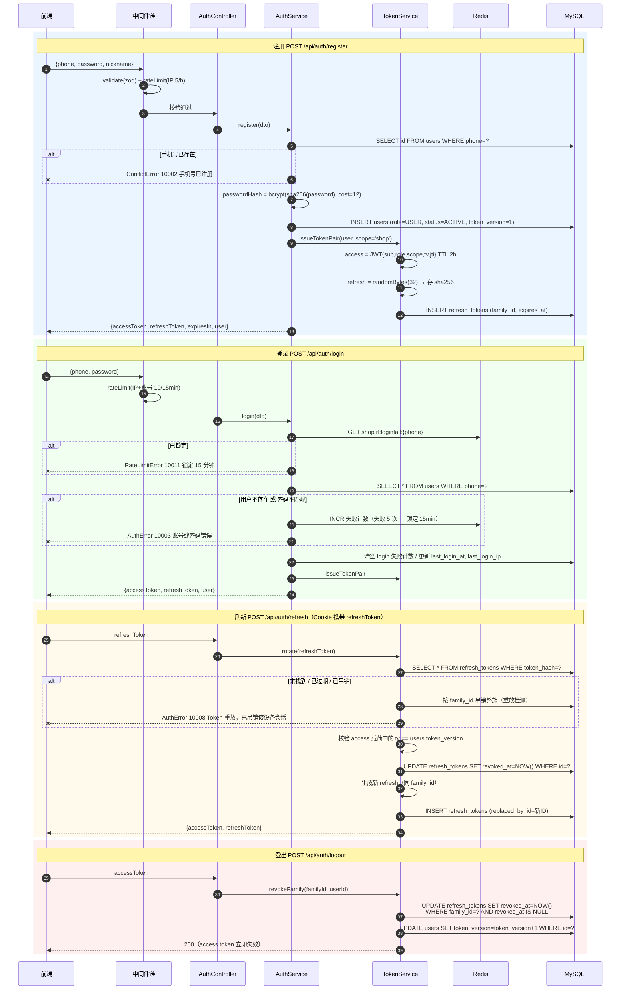
```mermaid
sequenceDiagram
    autonumber
    participant C as 前端
    participant MW as 中间件链
    participant CT as AuthController
    participant SV as AuthService
    participant TS as TokenService
    participant RD as Redis
    participant DB as MySQL

    rect rgb(235, 245, 255)
    note over C,DB: 注册 POST /api/auth/register
    C->>MW: {phone, password, nickname}
    MW->>MW: validate(zod) + rateLimit(IP 5/h)
    MW->>CT: 校验通过
    CT->>SV: register(dto)
    SV->>DB: SELECT id FROM users WHERE phone=?
    alt 手机号已存在
        SV--xC: ConflictError 10002 手机号已注册
    end
    SV->>SV: passwordHash = bcrypt(sha256(password), cost=12)
    SV->>DB: INSERT users (role=USER, status=ACTIVE, token_version=1)
    SV->>TS: issueTokenPair(user, scope='shop')
    TS->>TS: access = JWT{sub,role,scope,tv,jti} TTL 2h
    TS->>TS: refresh = randomBytes(32) → 存 sha256
    TS->>DB: INSERT refresh_tokens (family_id, expires_at)
    SV-->>C: {accessToken, refreshToken, expiresIn, user}
    end

    rect rgb(240, 255, 240)
    note over C,DB: 登录 POST /api/auth/login
    C->>MW: {phone, password}
    MW->>MW: rateLimit(IP+账号 10/15min)
    CT->>SV: login(dto)
    SV->>RD: GET shop:rl:loginfail:{phone}
    alt 已锁定
        SV--xC: RateLimitError 10011 锁定 15 分钟
    end
    SV->>DB: SELECT * FROM users WHERE phone=?
    alt 用户不存在 或 密码不匹配
        SV->>RD: INCR 失败计数（失败 5 次 → 锁定 15min）
        SV--xC: AuthError 10003 账号或密码错误
    end
    SV->>DB: 清空 login 失败计数 / 更新 last_login_at, last_login_ip
    SV->>TS: issueTokenPair
    SV-->>C: {accessToken, refreshToken, user}
    end

    rect rgb(255, 250, 235)
    note over C,DB: 刷新 POST /api/auth/refresh（Cookie 携带 refreshToken）
    C->>CT: refreshToken
    CT->>TS: rotate(refreshToken)
    TS->>DB: SELECT * FROM refresh_tokens WHERE token_hash=?
    alt 未找到 / 已过期 / 已吊销
        TS->>DB: 按 family_id 吊销整族（重放检测）
        TS--xC: AuthError 10008 Token 重放，已吊销该设备会话
    end
    TS->>TS: 校验 access 载荷中的 tv == users.token_version
    TS->>DB: UPDATE refresh_tokens SET revoked_at=NOW() WHERE id=?
    TS->>TS: 生成新 refresh（同 family_id）
    TS->>DB: INSERT refresh_tokens (replaced_by_id=新ID)
    TS-->>C: {accessToken, refreshToken}
    end

    rect rgb(255, 240, 240)
    note over C,DB: 登出 POST /api/auth/logout
    C->>CT: accessToken
    CT->>TS: revokeFamily(familyId, userId)
    TS->>DB: UPDATE refresh_tokens SET revoked_at=NOW()<br/>WHERE family_id=? AND revoked_at IS NULL
    TS->>DB: UPDATE users SET token_version=token_version+1 WHERE id=?
    TS-->>C: 200（access token 立即失效）
    end
```

### F1.2 关键规则

| 项 | 规则 |
| --- | --- |
| 密码存储 | `bcrypt(sha256(password), cost=12)`（sha256 前置规避 bcrypt 72 字节截断） |
| 登录失败提示 | 账号不存在与密码错误统一返回「账号或密码错误」，防账号枚举 |
| 失败锁定 | 连续失败 5 次 → 锁 15 分钟（Redis 计数 + `admin_users.locked_until` 用于后台） |
| Access Token | TTL 2h，载荷含 `tv`（tokenVersion）；校验时比对 `users.token_version` |
| Refresh Token | TTL 7d，**只存 sha256 哈希**；轮换时旧记录写 `revoked_at` 并指向新记录 |
| 重放检测 | 用已吊销的 refresh token 再刷新 → 判定重放 → 吊销整个 `family_id` |
| 强制下线 | 后台禁用用户 → `token_version++` → 该用户所有已签发 access token 立即失效 |
| 后台隔离 | 后台登录走 `/admin/auth/login`，签发 `scope='admin'` 的 token（独立 secret）；`adminOnly` 中间件拒绝 `scope='shop'` 的 token（错误码 403） |
| refresh_token 表复用 | C 端与后台共用表，`subject_type` 区分，`user_id` / `admin_id` 二选一 |

### F1.3 事务边界与失败处理

| 操作 | 事务范围 | 失败处理 |
| --- | --- | --- |
| 注册 | 单表 `INSERT users` + `INSERT refresh_tokens`（同事务，保证注册后即有会话） | 手机号重复 → `10002`；其余回滚 |
| 登录 | 无事务（`UPDATE users.last_login_at` 失败不影响登录成功，仅记 warn 日志） | — |
| 刷新 | 🔒 单事务：`UPDATE 旧记录 revoked` + `INSERT 新记录` 🔓 | 并发刷新：唯一键 `token_hash` + 条件更新 `WHERE revoked_at IS NULL`，第二个请求因 `affectedRows=0` 判定为重放 |
| 登出 | 🔒 单事务：`UPDATE refresh_tokens` + `UPDATE users.token_version` 🔓 | — |

---

## F2. 收货地址管理

### F2.1 时序图（含默认地址互斥）

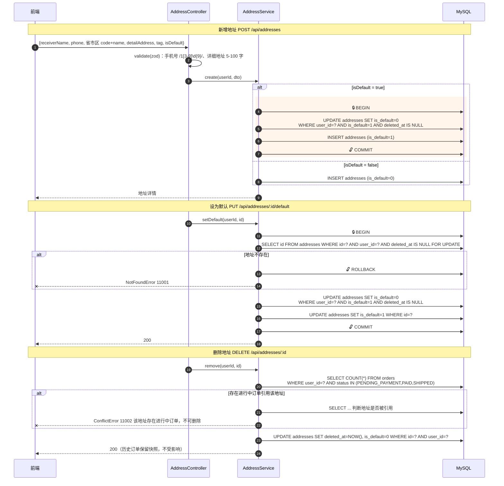
```mermaid
sequenceDiagram
    autonumber
    participant C as 前端
    participant CT as AddressController
    participant SV as AddressService
    participant DB as MySQL

    note over C,DB: 新增地址 POST /api/addresses
    C->>CT: {receiverName, phone, 省市区 code+name, detailAddress, tag, isDefault}
    CT->>CT: validate(zod)：手机号 /1[3-9]\d{9}/、详细地址 5-100 字
    CT->>SV: create(userId, dto)
    alt isDefault = true
        rect rgb(255, 245, 235)
        SV->>DB: 🔒 BEGIN
        SV->>DB: UPDATE addresses SET is_default=0<br/>WHERE user_id=? AND is_default=1 AND deleted_at IS NULL
        SV->>DB: INSERT addresses (is_default=1)
        SV->>DB: 🔓 COMMIT
        end
    else isDefault = false
        SV->>DB: INSERT addresses (is_default=0)
    end
    SV-->>C: 地址详情

    note over C,DB: 设为默认 PUT /api/addresses/:id/default
    CT->>SV: setDefault(userId, id)
    SV->>DB: 🔒 BEGIN
    SV->>DB: SELECT id FROM addresses WHERE id=? AND user_id=? AND deleted_at IS NULL FOR UPDATE
    alt 地址不存在
        SV->>DB: 🔓 ROLLBACK
        SV--xC: NotFoundError 11001
    end
    SV->>DB: UPDATE addresses SET is_default=0<br/>WHERE user_id=? AND is_default=1 AND deleted_at IS NULL
    SV->>DB: UPDATE addresses SET is_default=1 WHERE id=?
    SV->>DB: 🔓 COMMIT
    SV-->>C: 200

    note over C,DB: 删除地址 DELETE /api/addresses/:id
    CT->>SV: remove(userId, id)
    SV->>DB: SELECT COUNT(*) FROM orders<br/>WHERE user_id=? AND status IN (PENDING_PAYMENT,PAID,SHIPPED)
    alt 存在进行中订单引用该地址
        SV->>DB: SELECT ... 判断地址是否被引用
        SV--xC: ConflictError 11002 该地址存在进行中订单，不可删除
    end
    SV->>DB: UPDATE addresses SET deleted_at=NOW(), is_default=0 WHERE id=? AND user_id=?
    SV-->>C: 200（历史订单保留快照，不受影响）
```

### F2.2 关键规则

| 项 | 规则 |
| --- | --- |
| 默认地址互斥 | **同一事务内**先清零再置一；`FOR UPDATE` 锁行防并发双默认 |
| 软删除 | `deleted_at` 标记；删除时同时把 `is_default` 置 0 |
| 历史订单不受影响 | 订单保存**地址快照**（`orders.receiver_*` 7 字段），删除地址后订单详情照常展示（ADDR-04） |
| 删除保护 | 存在进行中订单（待支付/已支付/已发货）引用时拒绝删除（错误码 `11002`） |
| 列表排序 | 默认地址优先，其次按 `created_at DESC` |
| 越权 | 所有操作强制 `WHERE user_id = ?`，越权返回 `403`（`10009`） |

---

## F3. 商品与 SKU 查询

### F3.1 时序图

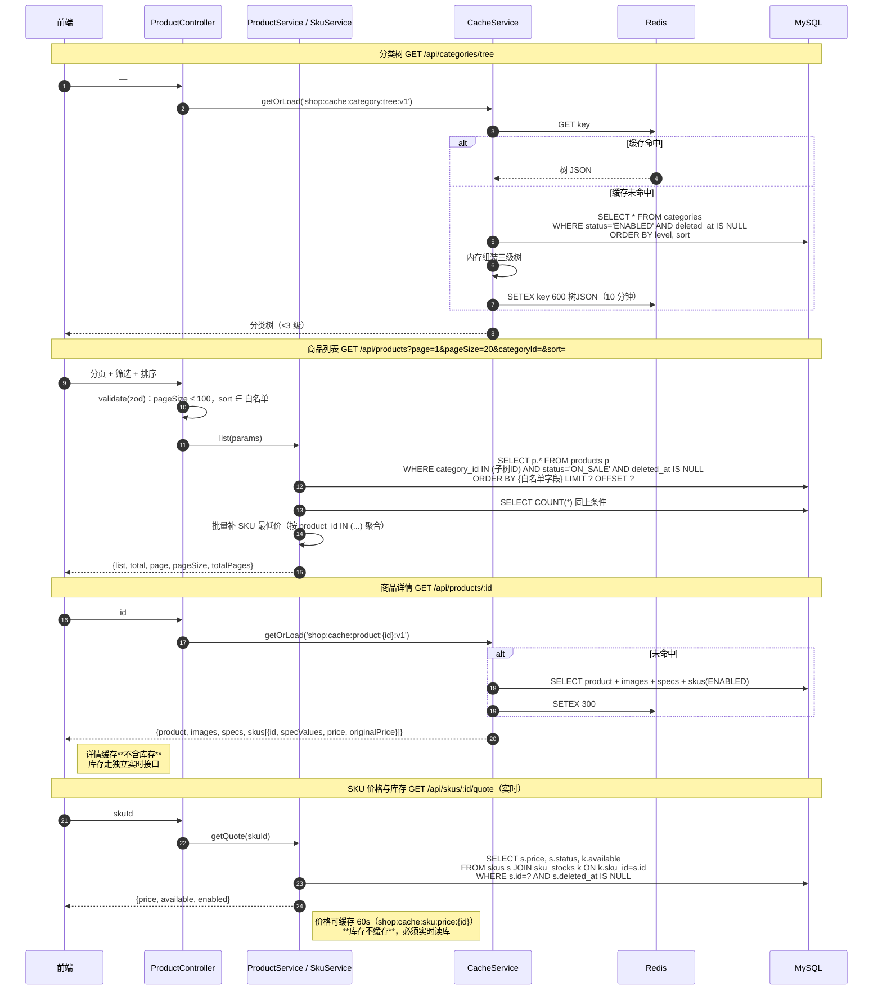
```mermaid
sequenceDiagram
    autonumber
    participant C as 前端
    participant CT as ProductController
    participant SV as ProductService / SkuService
    participant CS as CacheService
    participant RD as Redis
    participant DB as MySQL

    note over C,DB: 分类树 GET /api/categories/tree
    C->>CT: —
    CT->>CS: getOrLoad('shop:cache:category:tree:v1')
    CS->>RD: GET key
    alt 缓存命中
        RD-->>CS: 树 JSON
    else 缓存未命中
        CS->>DB: SELECT * FROM categories<br/>WHERE status='ENABLED' AND deleted_at IS NULL<br/>ORDER BY level, sort
        CS->>CS: 内存组装三级树
        CS->>RD: SETEX key 600 树JSON（10 分钟）
    end
    CS-->>C: 分类树（≤3 级）

    note over C,DB: 商品列表 GET /api/products?page=1&pageSize=20&categoryId=&sort=
    C->>CT: 分页 + 筛选 + 排序
    CT->>CT: validate(zod)：pageSize ≤ 100，sort ∈ 白名单
    CT->>SV: list(params)
    SV->>DB: SELECT p.* FROM products p<br/>WHERE category_id IN (子树ID) AND status='ON_SALE' AND deleted_at IS NULL<br/>ORDER BY {白名单字段} LIMIT ? OFFSET ?
    SV->>DB: SELECT COUNT(*) 同上条件
    SV->>SV: 批量补 SKU 最低价（按 product_id IN (...) 聚合）
    SV-->>C: {list, total, page, pageSize, totalPages}

    note over C,DB: 商品详情 GET /api/products/:id
    C->>CT: id
    CT->>CS: getOrLoad('shop:cache:product:{id}:v1')
    alt 未命中
        CS->>DB: SELECT product + images + specs + skus(ENABLED)
        CS->>RD: SETEX 300
    end
    CS-->>C: {product, images, specs, skus[{id, specValues, price, originalPrice}]}
    note right of C: 详情缓存**不含库存**<br/>库存走独立实时接口

    note over C,DB: SKU 价格与库存 GET /api/skus/:id/quote（实时）
    C->>CT: skuId
    CT->>SV: getQuote(skuId)
    SV->>DB: SELECT s.price, s.status, k.available<br/>FROM skus s JOIN sku_stocks k ON k.sku_id=s.id<br/>WHERE s.id=? AND s.deleted_at IS NULL
    SV-->>C: {price, available, enabled}
    note right of SV: 价格可缓存 60s（shop:cache:sku:price:{id}）<br/>**库存不缓存**，必须实时读库
```

### F3.2 缓存策略与失效

| 缓存对象 | Key | TTL | 失效时机 |
| --- | --- | --- | --- |
| 分类树 | `shop:cache:category:tree:v1` | 10 min | 后台增删改分类 / 改状态 / 改排序 → `DEL` |
| 商品详情 | `shop:cache:product:{id}:v1` | 5 min | 后台改商品 / 改 SKU / 上下架 / 改图集 → `DEL` |
| SKU 价格 | `shop:cache:sku:price:{id}` | 60s | SKU 改价 → `DEL`；或直接过期 |
| 库存可售数 | **不缓存** | — | 库存是权威状态，一律实时读 DB |
| 版本号 | Key 中带 `v{n}` | — | 大改版时递增 `n`，旧 key 自然过期（无需批量删） |

### F3.3 关键规则

| 项 | 规则 |
| --- | --- |
| 分类筛选 | 用 `path` 前缀匹配一次取子树（`LIKE '/1/12/%'`），避免递归查询 |
| 搜索 | 一期 `LIKE 'kw%'` 前缀匹配（`idx_deleted_name`）；P1 启用 FULLTEXT |
| 排序白名单 | `sort` 参数只接受枚举（`default` / `sales` / `price_asc` / `price_desc`），**禁止拼接原始列名**（防注入） |
| 下架商品 | `status != ON_SALE` 的商品不出现在前台列表，但已下单订单仍可查看快照（SKU-01） |
| 规格置灰 | 前端根据 `skus[].status` 与实时 `available` 计算不可达组合并置灰（SKU-05） |
| 缓存降级 | Redis 不可用时直连 DB，仅打 warn 日志，不影响可用性 |

---

## F4. 购物车

### F4.1 时序图

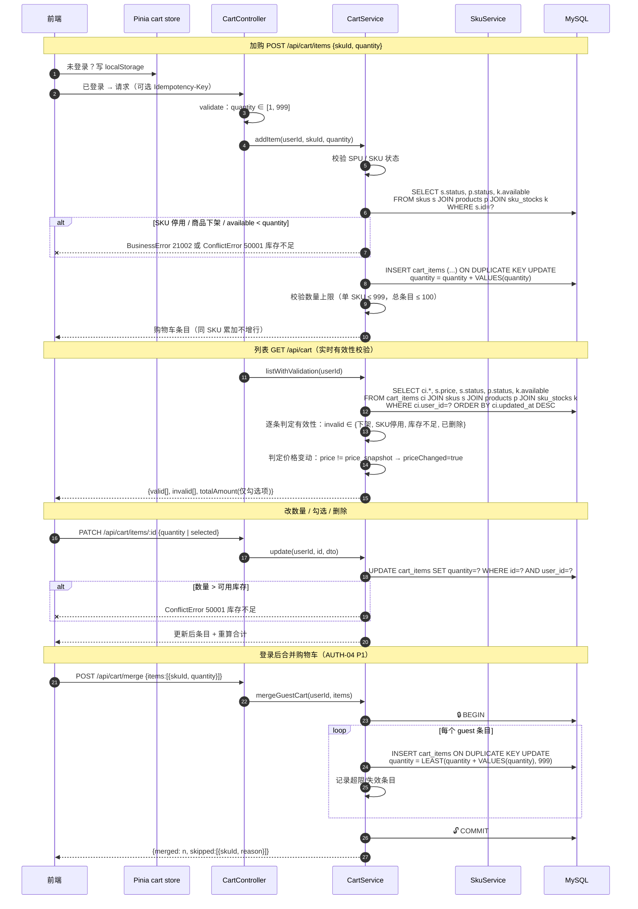
```mermaid
sequenceDiagram
    autonumber
    participant C as 前端
    participant ST as Pinia cart store
    participant CT as CartController
    participant SV as CartService
    participant SS as SkuService
    participant DB as MySQL

    note over C,DB: 加购 POST /api/cart/items {skuId, quantity}
    C->>ST: 未登录？写 localStorage
    C->>CT: 已登录 → 请求（可选 Idempotency-Key）
    CT->>CT: validate：quantity ∈ [1, 999]
    CT->>SV: addItem(userId, skuId, quantity)
    SV->>SV: 校验 SPU / SKU 状态
    SV->>DB: SELECT s.status, p.status, k.available<br/>FROM skus s JOIN products p JOIN sku_stocks k<br/>WHERE s.id=?
    alt SKU 停用 / 商品下架 / available < quantity
        SV--xC: BusinessError 21002 或 ConflictError 50001 库存不足
    end
    SV->>DB: INSERT cart_items (...) ON DUPLICATE KEY UPDATE<br/>quantity = quantity + VALUES(quantity)
    SV->>SV: 校验数量上限（单 SKU ≤ 999，总条目 ≤ 100）
    SV-->>C: 购物车条目（同 SKU 累加不增行）

    note over C,DB: 列表 GET /api/cart（实时有效性校验）
    CT->>SV: listWithValidation(userId)
    SV->>DB: SELECT ci.*, s.price, s.status, p.status, k.available<br/>FROM cart_items ci JOIN skus s JOIN products p JOIN sku_stocks k<br/>WHERE ci.user_id=? ORDER BY ci.updated_at DESC
    SV->>SV: 逐条判定有效性：invalid ∈ {下架, SKU停用, 库存不足, 已删除}
    SV->>SV: 判定价格变动：price != price_snapshot → priceChanged=true
    SV-->>C: {valid[], invalid[], totalAmount(仅勾选项)}

    note over C,DB: 改数量 / 勾选 / 删除
    C->>CT: PATCH /api/cart/items/:id {quantity | selected}
    CT->>SV: update(userId, id, dto)
    SV->>DB: UPDATE cart_items SET quantity=? WHERE id=? AND user_id=?
    alt 数量 > 可用库存
        SV--xC: ConflictError 50001 库存不足
    end
    SV-->>C: 更新后条目 + 重算合计

    note over C,DB: 登录后合并购物车（AUTH-04 P1）
    C->>CT: POST /api/cart/merge {items:[{skuId, quantity}]}
    CT->>SV: mergeGuestCart(userId, items)
    SV->>DB: 🔒 BEGIN
    loop 每个 guest 条目
        SV->>DB: INSERT cart_items ON DUPLICATE KEY UPDATE<br/>quantity = LEAST(quantity + VALUES(quantity), 999)
        SV->>SV: 记录超限/失效条目
    end
    SV->>DB: 🔓 COMMIT
    SV-->>C: {merged: n, skipped:[{skuId, reason}]}
```

### F4.2 关键规则

| 项 | 规则 |
| --- | --- |
| 唯一性 | `uk_user_sku (user_id, sku_id)` + `ON DUPLICATE KEY UPDATE` 实现「同 SKU 累加不增行」（CART-01） |
| 上限 | 单 SKU ≤ 999，总条目 ≤ 100（CART-06），超限返回 `30003` / `30004` |
| 失效判定 | 列表接口**实时**校验：商品下架 / SKU 停用 / `available < quantity` / 已删除 → 标记 `invalid`，**禁止结算**（CART-03） |
| 价格变动 | `price != price_snapshot` → `priceChanged = true`，前端显示「价格已变动」角标；**结算以后端重算价为准**（CART-04） |
| 未登录购物车 | 存 `localStorage`；登录后调用 `/api/cart/merge` 合并，同 SKU 累加（上限 999） |
| 结算二次校验 | 前端只提交**勾选且有效**的 `cartItemIds`；**后端在下单时重新校验**（不信任前端） |
| 清空 | 下单成功后删除已结算条目（在下单事务内，见 F5） |

---

## F5. 下单（**核心流程**）

> 这是全系统最关键的事务。目标：**不超卖、不重复下单、金额服务端说了算**。

### F5.1 完整时序图

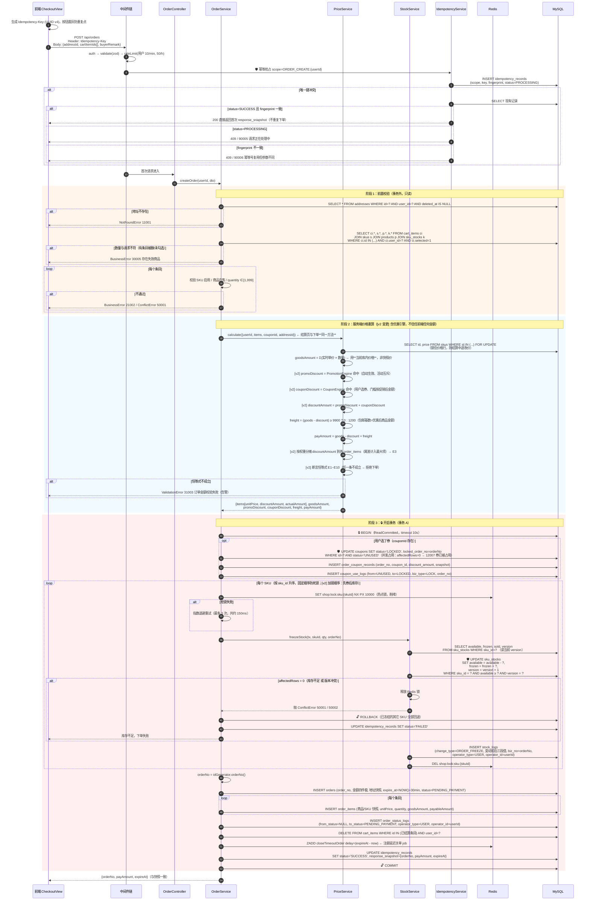
```mermaid
sequenceDiagram
    autonumber
    participant C as 前端 CheckoutView
    participant MW as 中间件链
    participant CT as OrderController
    participant OS as OrderService
    participant PS as PriceService
    participant SS as StockService
    participant IS as IdempotencyService
    participant RD as Redis
    participant DB as MySQL

    C->>C: 生成 Idempotency-Key (UUID v4)，按钮置灰防重复点
    C->>MW: POST /api/orders<br/>Header: Idempotency-Key<br/>Body: {addressId, cartItemIds[], buyerRemark}
    MW->>MW: auth → validate(zod) → rateLimit(用户 10/min, 50/h)
    MW->>IS: 🛡 幂等抢占 scope=ORDER_CREATE:{userId}
    IS->>DB: INSERT idempotency_records<br/>(scope, key, fingerprint, status=PROCESSING)
    alt 唯一键冲突
        IS->>DB: SELECT 现有记录
        alt status=SUCCESS 且 fingerprint 一致
            IS-->>C: 200 直接返回首次 response_snapshot（不重复下单）
        else status=PROCESSING
            IS--xC: 409 / 90005 请求正在处理中
        else fingerprint 不一致
            IS--xC: 409 / 90006 幂等号复用但参数不同
        end
    end

    MW->>CT: 首次请求进入
    CT->>OS: createOrder(userId, dto)

    rect rgb(255, 245, 235)
    note over OS,DB: 阶段 1：前置校验（事务外，只读）
    OS->>DB: SELECT * FROM addresses WHERE id=? AND user_id=? AND deleted_at IS NULL
    alt 地址不存在
        OS--xC: NotFoundError 11001
    end
    OS->>DB: SELECT ci.*, s.*, p.*, k.* FROM cart_items ci<br/>JOIN skus s JOIN products p JOIN sku_stocks k<br/>WHERE ci.id IN (...) AND ci.user_id=? AND ci.selected=1
    alt 数量与请求不符（有条目被删/未勾选）
        OS--xC: BusinessError 30005 存在失效商品
    end
    loop 每个条目
        OS->>OS: 校验 SKU 启用 / 商品在售 / quantity ∈ [1,999]
        alt 不通过
            OS--xC: BusinessError 21002 / ConflictError 50001
        end
    end
    end

    rect rgb(240, 250, 255)
    note over OS,DB: 阶段 2：服务端价格重算（[v2 变更] 含优惠引擎，不信任前端任何金额）
    OS->>PS: calculate({userId, items, couponId, addressId})  ← 结算页与下单**同一方法**
    PS->>DB: SELECT id, price FROM skus WHERE id IN (...) FOR UPDATE<br/>（锁住价格行，防结算中途改价）
    PS->>PS: goodsAmount = Σ(实时单价 × 数量)  ← 用**当前库内价格**，非快照价
    PS->>PS: [v2] promoDiscount = PromotionEngine 命中（自动生效、活动互斥）
    PS->>PS: [v2] couponDiscount = CouponEngine 命中（用户选券、门槛按促销后金额）
    PS->>PS: [v2] discountAmount = promoDiscount + couponDiscount
    PS->>PS: freight = (goods - discount) ≥ 9900 ? 0 : 1200（包邮基数=优惠后商品金额）
    PS->>PS: payAmount = goods - discount + freight
    PS->>PS: [v2] 按权重分摊 discountAmount 到各 order_items（尾差计入最大项）→ E3
    PS->>PS: [v2] 断言恒等式 E1~E10（任一条不成立 → 拒绝下单）
    alt 恒等式不成立
        PS--xC: ValidationError 31003 订单金额校验失败（告警）
    end
    PS-->>OS: {items[unitPrice, discountAmount, actualAmount], goodsAmount,<br/>promoDiscount, couponDiscount, freight, payAmount}
    end

    rect rgb(255, 240, 240)
    note over OS,DB: 阶段 3：🔒 开启事务（事务 A）
    OS->>DB: 🔒 BEGIN（ReadCommitted，timeout 10s）

    opt 用户选了券（couponId 存在）
        OS->>DB: 🛡 UPDATE coupons SET status='LOCKED', locked_order_no=orderNo<br/>WHERE id=? AND status='UNUSED'（并发占用：affectedRows=0 → 12007 券已被占用）
        OS->>DB: INSERT order_coupon_records (order_no, coupon_id, discount_amount, snapshot)
        OS->>DB: INSERT coupon_use_logs (from=UNUSED, to=LOCKED, biz_type=LOCK, order_no)
    end

    loop 每个 SKU（按 sku_id 升序，固定顺序防死锁；[v2] 加锁顺序：先券后库存）
        OS->>RD: SET shop:lock:sku:{skuId} NX PX 10000（热点锁，削峰）
        alt 抢锁失败
            OS->>OS: 指数退避重试（最多 3 次，共约 150ms）
        end
        OS->>SS: freezeStock(tx, skuId, qty, orderNo)
        SS->>DB: SELECT available, frozen, sold, version<br/>FROM sku_stocks WHERE sku_id=? （读当前 version）
        SS->>DB: 🛡 UPDATE sku_stocks<br/>SET available = available - ?,<br/>    frozen    = frozen + ?,<br/>    version   = version + 1<br/>WHERE sku_id = ? AND available ≥ ? AND version = ?
        alt affectedRows = 0（库存不足 或 版本冲突）
            SS->>SS: 释放 Redis 锁
            SS--xOS: 抛 ConflictError 50001 / 50002
            OS->>DB: 🔓 ROLLBACK（已冻结的其它 SKU 全部回退）
            OS->>DB: UPDATE idempotency_records SET status='FAILED'
            OS--xC: 库存不足，下单失败
        end
        SS->>DB: INSERT stock_logs<br/>(change_type=ORDER_FREEZE, 变动前后三段值, biz_no=orderNo,<br/>operator_type=USER, operator_id=userId)
        SS->>RD: DEL shop:lock:sku:{skuId}
    end

    OS->>OS: orderNo = idGenerator.orderNo()
    OS->>DB: INSERT orders (order_no, 金额四件套, 地址快照, expire_at=NOW()+30min, status=PENDING_PAYMENT)
    loop 每个条目
        OS->>DB: INSERT order_items (商品/SKU 快照, unitPrice, quantity, goodsAmount, payableAmount)
    end
    OS->>DB: INSERT order_status_logs<br/>(from_status=NULL, to_status=PENDING_PAYMENT, operator_type=USER, operator_id=userId)
    OS->>DB: DELETE FROM cart_items WHERE id IN (已结算条目) AND user_id=?
    OS->>RD: ZADD closeTimeoutOrder delay=(expireAt - now)  ← 注册延迟关单 job
    OS->>DB: UPDATE idempotency_records<br/>SET status='SUCCESS', response_snapshot={orderNo, payAmount, expireAt}
    OS->>DB: 🔓 COMMIT
    end

    OS-->>C: {orderNo, payAmount, expireAt}（与快照一致）
```

### F5.2 CAS 库存更新的三种手段如何配合

```sql
-- 权威手段：条件更新（CAS）+ 乐观锁 version，一次 SQL 完成判定与扣减
UPDATE sku_stocks
   SET available = available - ?,
       frozen    = frozen    + ?,
       version   = version   + 1
 WHERE sku_id      = ?
   AND available  >= ?
   AND version     = ?;
-- affectedRows = 1 → 成功；= 0 → 库存不足或并发冲突
```

| 手段 | 作用 | 是否权威 | 说明 |
| --- | --- | --- | --- |
| ① Redis 分布式锁 `shop:lock:sku:{skuId}` | **削峰排队**，把 N 个并发请求串行化，避免大量 CAS 同时失败造成重试风暴 | ❌ 否 | 锁只影响「谁先抢到」，**锁失效不会超卖**（判定仍在 DB）；TTL 10s + 自动续约 + `DEL` 用 Lua 校验 value 防误删 |
| ② CAS 条件更新 `WHERE available >= ?` | **权威判定**，防超卖的最后一道闸门 | ✅ 是 | 单条 SQL 原子完成「判定 + 扣减」，无任何读改写窗口 |
| ③ 乐观锁 `version` | 保护**先读后写**场景（后台手工调整、盘点修正），防 ABA 与并发覆盖 | ✅ 是 | 与 ② 写在同一条 `WHERE` 里；纯扣减场景 ② 已足够，③ 是额外保险 |
| ④ `CHECK (available >= 0)` 约束 | 数据库层兜底 | ✅ 是 | 捕获逻辑漏洞，触发告警（不应被触发，触发即 Bug） |
| ⑤ 定时巡检 `scanStockAnomaly` | 校验 `total = available + frozen + sold` 恒等式 | ✅ 是 | 发现不平立即告警 |

**为什么三者要配合（而不是只用一个）**

```
只用 CAS      → 高并发下 90% 请求 CAS 失败 → 大量重试 → DB 压力与响应延迟飙升
只用 Redis 锁 → Redis 故障/主从切换丢锁 → 超卖（违反「权威状态在 DB」铁律）
只用 version  → 等价于 CAS，但少了 available >= n 的语义，需应用层判断，多一次往返
三者配合     → 锁把并发请求排队（少量请求进入 CAS）→ CAS 做权威判定 → version 兜底读改写
```

### F5.3 事务边界与回滚点

| 阶段 | 是否在事务内 | 失败后果 |
| --- | --- | --- |
| 幂等抢占 | ✅ 与业务同事务 | 业务失败 → 幂等记录一并回滚 → 下次可用同 Key 重试 |
| 地址 / 购物车 / SKU 校验 | ❌ 事务外（只读） | 直接返回错误，无副作用 |
| 价格重算（`SELECT ... FOR UPDATE` 锁 SKU 价） | ⚠️ **事务外但加锁** → 必须在加锁后立即开启事务 | 保证「重算 → 冻结」之间价格不被改 |
| 🔒 **事务 A 开始** | — | — |
| 库存 CAS + 库存流水 | ✅ | ↩️ 任一 SKU 失败 → 整事务回滚，已冻结的其它 SKU 自动回退 |
| 创建订单 + 订单行 | ✅ | ↩️ 回滚 |
| 写订单轨迹 | ✅ | ↩️ 回滚 |
| 删购物车条目 | ✅ | ↩️ 回滚（购物车条目保留） |
| 注册延迟关单 job | ❌ **事务提交后**异步 | 注册失败仅 warn，靠 cron 兜底扫描补偿 |
| 写幂等响应快照 | ✅（提交前） | ↩️ 回滚 |
| 🔓 **事务提交** | — | 提交后库存才真正冻结 |

**死锁预防**：多 SKU 冻结严格按 `sku_id` **升序**处理，保证不同订单对同一批 SKU 的加锁顺序一致。

### F5.4 幂等保证

| 层 | 机制 |
| --- | --- |
| 前端 | 提交后按钮置灰；`Idempotency-Key` 在**同一次结算流程内固定不变**（重新进入结算页才重新生成） |
| 网关 | 幂等中间件：唯一索引 `(scope, idempotency_key)` 抢占 |
| 业务 | 同一 Key 重复提交 → 返回首次 `response_snapshot`（**同一个 `orderNo`，不会生成两笔订单**） |

---

### F5.5 [v2 变更] 优惠券占用与优惠计算（一期新增）

> 优惠券上线后，下单事务 A 不只是「价格 + 库存 + 建单」，还要在**同一个事务**里占用券并冻结促销库存。规则全部来自 `02-architecture.md` §11.4 与 `03-database.md` §3.8。

| 项 | 规则 |
| --- | --- |
| 优惠引擎唯一入口 | 结算页预览与下单**必须调用同一个 `PriceService.calculate`**；前端只传 `skuId`/`quantity`/`couponId`，金额一律服务端算（防价格篡改与「预览价≠实付价」） |
| 券占用时机 | `UNUSED → LOCKED` **必须在事务 A 内**（与建单一同提交/回滚），杜绝「订单建好券没锁」导致的一券多用窗口 |
| 先券后库存 | 多 SKU 场景下加锁顺序固定为 **先券（一行记录）后库存**（库存内部再按 `sku_id` 升序），避免与其他事务交叉死锁 |
| 券核销时机 | 下单只 `LOCKED`，**支付成功事务 B 内才 `LOCKED → USED`**（见 F6.6）；取消/超时关单事务 D 内 `LOCKED → UNUSED`（解冻） |
| 整单退款返券 | 事务 C 内 `USED → UNUSED`（`RESTORE`），写入 `order_coupon_records.restored_at`（见 F9.3） |
| 优惠必须到行 | `discount_amount` 必须完整分摊到 `order_items`（E3）；部分退款时按行退已分摊优惠，而非按原价退（E9） |
| 金额恒等式 | `pay_amount = goods_amount - discount_amount + freight_amount`（E4），取消混合支付后无余额抵扣项；全链路在 `calculate` 内逐条 `assert` |

---

## F6. 支付与资金流水（**核心流程**）

> 目标：**钱到了账上，订单状态与库存必须同步推进；重复回调不入账两次**。

### F6.1 完整时序图（[v2 变更] 异步回调 + 渠道路由 + 余额分支）

> v1 的同步入账链路在接入微信支付后作废（微信要求 5s 内应答，入账事务无法保证）。v2 统一为**异步**：验签 → 落 `integration_call_logs` → 投递 BullMQ `payment-callback` → 立即应答；Worker 再开事务入账（见 `02-architecture.md` §10）。**余额支付是例外**——它是本地账务操作，无外部回调，直接在本请求内走事务 B' 完成（见 F15）。

**A. 创建支付单（同步，仅建单 + 路由，不做入账）**

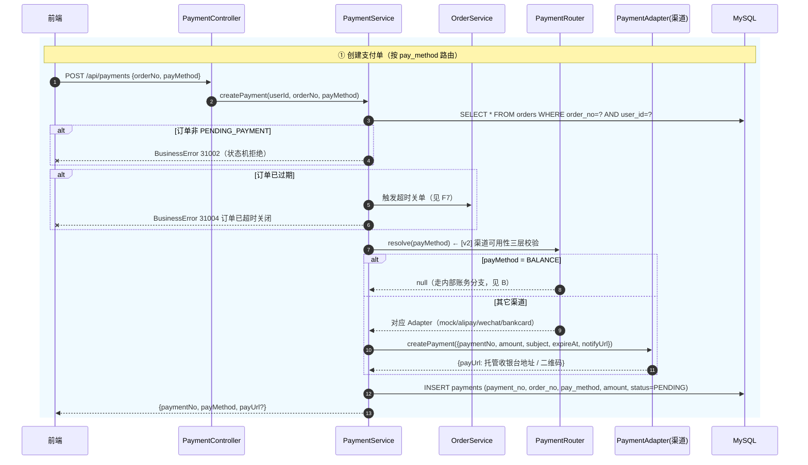
```mermaid
sequenceDiagram
    autonumber
    participant C as 前端
    participant PC as PaymentController
    participant PS as PaymentService
    participant OS as OrderService
    participant RT as PaymentRouter
    participant PA as PaymentAdapter(渠道)
    participant DB as MySQL

    rect rgb(240, 250, 255)
    note over C,DB: ① 创建支付单（按 pay_method 路由）
    C->>PC: POST /api/payments {orderNo, payMethod}
    PC->>PS: createPayment(userId, orderNo, payMethod)
    PS->>DB: SELECT * FROM orders WHERE order_no=? AND user_id=?
    alt 订单非 PENDING_PAYMENT
        PS--xC: BusinessError 31002（状态机拒绝）
    end
    alt 订单已过期
        PS->>OS: 触发超时关单（见 F7）
        PS--xC: BusinessError 31004 订单已超时关闭
    end
    PS->>RT: resolve(payMethod)  ← [v2] 渠道可用性三层校验
    alt payMethod = BALANCE
        RT-->>PS: null（走内部账务分支，见 B）
    else 其它渠道
        RT-->>PS: 对应 Adapter（mock/alipay/wechat/bankcard）
        PS->>PA: createPayment({paymentNo, amount, subject, expireAt, notifyUrl})
        PA-->>PS: {payUrl: 托管收银台地址 / 二维码}
    end
    PS->>DB: INSERT payments (payment_no, order_no, pay_method, amount, status=PENDING)
    PS-->>C: {paymentNo, payMethod, payUrl?}
    end
```

**B. 余额支付（[v2 新增] 本地账务分支，无回调）**

```mermaid
sequenceDiagram
    autonumber
    participant C as 前端
    participant PC as PaymentController
    participant PS as PaymentService
    participant BS as BalanceService
    participant OS as OrderService
    participant FS as FundService
    participant SS as StockService
    participant CS as CouponService
    participant DB as MySQL

    rect rgb(235, 245, 255)
    note over C,DB: ① 用户选「余额支付」并确认
    C->>PC: POST /api/payments/{paymentNo}/balance-pay
    PC->>PS: payByBalance(userId, paymentNo)
    PS->>DB: SELECT o.*, p.* FROM orders o JOIN payments p WHERE p.payment_no=?
    PS->>BS: 校验 fund_accounts(USER_BALANCE).balance >= pay_amount
    alt 余额不足
        BS--xPS: BusinessError 60001 余额不足
    end
    PS->>DB: UPDATE payments SET status='CLOSED' WHERE order_id=? AND status='PENDING'（关旧单）
    PS->>DB: 🔒 BEGIN（事务 B'）
    PS->>DB: 🛡 UPDATE payments SET status='SUCCESS' WHERE payment_no=? AND status='PENDING'
    PS->>BS: 🔒 余额扣减 + 平台结转对（见 F6.6，同事务）
    BS->>DB: [详见 F6.6] USER_BALANCE OUT + PLATFORM 结转对（tx_group_no 绑定）
    PS->>OS: 状态机 PENDING_PAYMENT → PAID + 轨迹
    PS->>SS: confirmStock（frozen → sold）+ stock_logs
    PS->>CS: 券核销 LOCKED → USED（同事务）
    CS->>DB: UPDATE coupons SET status='USED' + coupon_use_logs(USE) + used_count+1
    PS->>DB: UPDATE idempotency_records SET status='SUCCESS'
    PS->>DB: 🔓 COMMIT
    end
    PS-->>C: 支付成功（同步返回，无轮询）
    end
```

**C. 渠道支付（[v2 变更] 异步回调入账，BullMQ 驱动）**

```mermaid
sequenceDiagram
    autonumber
    participant C as 前端
    participant CH as 渠道(支付宝/微信/银行卡)
    participant CB as 回调接口 /internal/callbacks/payment/{channel}
    participant IL as integration_call_logs
    participant MQ as BullMQ payment-callback
    participant WK as Worker(消费)
    participant IS as IdempotencyService
    participant PS as PaymentService
    participant OS as OrderService
    participant FS as FundService
    participant SS as StockService
    participant CS as CouponService
    participant DB as MySQL

    rect rgb(255, 250, 235)
    note over C,CH: ② 用户在渠道收银台完成支付
    C->>CH: 跳转托管收银台 / 扫码
    CH->>CB: POST 回调（含 channelTradeNo, amount, sign）
    CB->>CB: rateLimit + 保留 rawBody（敏感字段脱敏）
    CB->>CB: verifyCallback（失败 → 401 + 安全告警，渠道重发）
    CB->>IL: INSERT integration_call_logs（原始报文）
    CB->>MQ: add(payment-callback, {channel, channelTxNo}, jobId=channel:channelTxNo)
    CB-->>CH: 200 立即应答（目标 < 200ms，满足微信 5s 约束）
    end

    rect rgb(240, 255, 240)
    note over WK,DB: ③ Worker 异步入账（与真实渠道完全一致，mock 也走此链路）
    MQ->>WK: 投递 job
    WK->>IS: 🛡 幂等三重：jobId 去重 → idempotency_records 抢占 → 支付单状态机
    WK->>PS: handleCallback(notify)
    PS->>DB: SELECT p.*, o.* FROM payments p JOIN orders o WHERE p.payment_no=?
    alt 🛡 payments.status = 'SUCCESS'（业务状态机，第二重保险）
        PS-->>WK: 直接 ack（不重复入账）
    end
    alt 金额不符（notify.amount != payments.amount）
        PS->>DB: notify_count+1 + raw_notify + **告警**（疑似篡改）
        PS--xC: ConflictError 40002 金额不一致
    end
    PS->>DB: 🔒 BEGIN（事务 B）
    PS->>DB: 🛡 UPDATE payments SET status='SUCCESS' WHERE payment_no=? AND status='PENDING'
    alt affectedRows=0（并发/重复）
        PS->>DB: 🔓 ROLLBACK; WK-->>MQ: ack（幂等）
    end
    PS->>OS: 状态机 PENDING_PAYMENT → PAID + 轨迹
    PS->>FS: record ORDER_PAY IN（PLATFORM 账户，is_liability=false）
    PS->>SS: confirmStock（frozen → sold）+ stock_logs
    PS->>CS: 券核销 LOCKED → USED（同事务）
    PS->>DB: UPDATE idempotency_records SET status='SUCCESS'
    PS->>DB: 🔓 COMMIT
    end
    WK->>WK: 事务外触发 notify（短信/客服，失败仅告警）
    WK-->>MQ: ack（渠道停止重发）
    end
```

### F6.2 余额快照 `before_balance` / `after_balance` 的计算方案

> 需求：每条流水记录变动前后余额，支持逐笔推演（FUND-01 / 记账铁律 3）。

```ts
// services/FundService.ts（关键骨架，非完整实现）
await prisma.$transaction(async (tx) => {
  // ① 锁账户行：串行化同一账户的全部记账，保证余额快照连续
  const [acc] = await tx.$queryRaw<{ id: bigint; balance: bigint; version: number }[]>`
    SELECT id, balance, version FROM fund_accounts
     WHERE account_no = ${accountNo} FOR UPDATE`;

  const before = acc.balance;
  const after  = direction === 'IN' ? before + amount : before - amount;
  if (after < 0n) throw new BusinessError(60001, '余额不足');

  // ② 写流水（幂等键：业务类型 + 业务单号）
  await tx.fundTransaction.create({ data: { txNo, accountId: acc.id, bizType, direction,
    amount, beforeBalance: before, afterBalance: after, orderNo, paymentNo, refundNo,
    operatorType, operatorId, idempotencyKey: `${bizType}:${bizNo}`, remark } });

  // ③ 更新账户余额
  await tx.fundAccount.update({ where: { id: acc.id },
    data: { balance: after,
            totalIn:  direction === 'IN'  ? { increment: amount } : undefined,
            totalOut: direction === 'OUT' ? { increment: amount } : undefined,
            version:  { increment: 1 } } });
}, { isolationLevel: 'ReadCommitted', timeout: 10_000 });
```

**三种方案对比与取舍**

| 方案 | 做法 | 优点 | 缺点 | 结论 |
| --- | --- | --- | --- | --- |
| **A. 账户行锁 + 同事务串行记账**（**选用**） | `SELECT ... FOR UPDATE` 锁账户 → 读余额 → 写流水 → 更新余额，全在事务 B 内 | ① 余额严格连续，无空洞；② `before/after` 精确可推演；③ 实现简单，无需补偿 | 同一账户的记账**串行**：平台单账户下所有支付回调排队 | ✅ 一期采用 |
| B. 流水先行、余额异步汇总 | 写流水时 `before/after` 填占位（如 -1），由定时任务回填 | 写流水无锁，吞吐高 | ① 违反 FUND-01「必须记录变动前后余额」；② 对账有延迟窗口；③ 需额外补偿与幂等 | ❌ 不采用 |
| C. 不存快照，查询时用窗口函数计算 | 只存 `amount`/`direction`，查询用 `SUM() OVER (ORDER BY id)` 推演 | 无写入竞争 | ① 客户明确要求字段；② 历史数据过滤（如查某订单）会算错；③ 查询成本高 | ❌ 不满足需求 |

**方案 A 的容量评估与扩容路径**

| 维度 | 评估 |
| --- | --- |
| 单账户串行 TPS | 行锁持有时间 ≈ 事务 B 总耗时（订单状态 + 库存确认 + 记账），实测目标 < 20ms → 理论 500~1000 TPS/账户；**一期支付回调量远低于此** |
| 若成为瓶颈 | ① **按 `account_no` 拆子账户**（如 `ACC_PLATFORM_CASH_00` ~ `_15`），按订单号哈希路由，串行度降为 1/16；② 缩短事务（把库存确认拆到提交后异步）；③ 二期引入「批量合并提交」 |
| **明确禁止** | ❌ 用 Redis 预扣余额再异步落库 —— 违反「权威状态在 DB」，Redis 故障会造成资损且难对账 |

**并发下的正确性保证**

1. `FOR UPDATE` 使同一账户的记账**严格串行**，`before_balance` 必然等于上一条流水的 `after_balance`。
2. `uk_biz_idem (biz_type, idempotency_key)` 唯一索引防止同一业务单号重复记账（即便事务 B 被重试）。
3. `CHECK (amount > 0 AND before_balance >= 0 AND after_balance >= 0)` 兜底。
4. 事务 B 内顺序固定：**先锁账户 → 再写流水 → 最后更新余额**，避免与其它流程形成死锁环。

### F6.3 回调幂等：**双重保险**

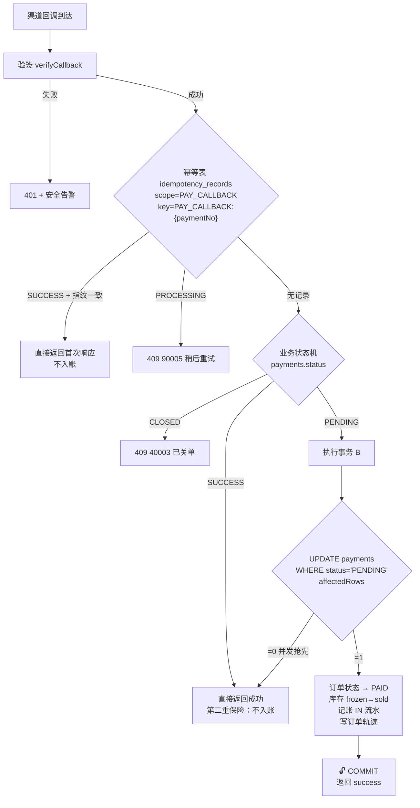
```mermaid
flowchart TD
    A["渠道回调到达"] --> B["验签 verifyCallback"]
    B -->|失败| B1["401 + 安全告警"]
    B -->|成功| C{"幂等表 idempotency_records<br/>scope=PAY_CALLBACK<br/>key=PAY_CALLBACK:{paymentNo}"}
    C -->|"SUCCESS + 指纹一致"| C1["直接返回首次响应<br/>不入账"]
    C -->|PROCESSING| C2["409 90005 稍后重试"]
    C -->|无记录| D{"业务状态机<br/>payments.status"}
    D -->|SUCCESS| D1["直接返回成功<br/>第二重保险：不入账"]
    D -->|CLOSED| D2["409 40003 已关单"]
    D -->|PENDING| E["执行事务 B"]
    E --> F{"UPDATE payments<br/>WHERE status='PENDING'<br/>affectedRows"}
    F -->|=0 并发抢先| D1
    F -->|=1| G["订单状态 → PAID<br/>库存 frozen→sold<br/>记账 IN 流水<br/>写订单轨迹"]
    G --> H["🔓 COMMIT<br/>返回 success"]
```

| 保险层 | 机制 | 防住的场景 |
| --- | --- | --- |
| 第一重：幂等表 | `idempotency_records.uk_scope_key` 唯一索引抢占 | 同一 `paymentNo` 的重复回调（网络重发、渠道重通知最多 8 次） |
| 第二重：业务状态机 | `UPDATE payments SET status='SUCCESS' WHERE payment_no=? AND status='PENDING'` + `affectedRows` 判定 | 幂等表被清理后（7 天过期）渠道仍有迟到的重复通知 |
| 第三重：资金流水唯一索引 | `fund_transactions.uk_biz_idem` | 事务 B 被重试时重复记账 |
| 金额校验 | `notify.amount != payments.amount` → 拒绝入账 + 告警 | 伪造/篡改回调 |

### F6.4 事务边界与回滚点

> v2 区分两条入账路径：**事务 B（渠道支付，异步）**与**事务 B'（余额支付，同步本地）**。两者共享同一套幂等与状态机约束。

| 步骤 | 事务内 | 失败处理 |
| --- | --- | --- |
| 验签（仅渠道） | ❌ | 返回 401 + 告警，渠道会重发 |
| 幂等抢占 | ✅ 与业务同事务 | 业务失败 → 回滚 → 下次可重试 |
| 读支付单 + 金额校验 | ❌（事务外只读） | 拒绝 + 告警，支付单保持 PENDING |
| 🔒 事务 B / B' | — | — |
| 支付单 → SUCCESS | ✅ | ↩️ `affectedRows=0` → 回滚 → 判定并发，返回成功 |
| 订单 → PAID + 轨迹 | ✅ | ↩️ 回滚，支付单回 PENDING，等下次回调 |
| 库存 frozen → sold + 流水 | ✅ | ↩️ 回滚（不应发生，发生即 Bug + 告警） |
| 渠道记账 ORDER_PAY IN / 余额扣减 + 结转对 | ✅ | ↩️ 回滚（见 F6.6） |
| 券核销 LOCKED → USED | ✅ | ↩️ 回滚（券回 LOCKED） |
| 🔓 提交 | — | 提交后订单才真正推进（余额分支同步返回，渠道分支等 Worker 完成） |

> **为什么不让「渠道退款/扣款成功」与「本地记账」分布式事务化？** 一期采用**最大努力通知 + 对账补偿**：本地事务 B 原子完成，若提交后响应渠道失败，渠道会重发，靠幂等保证只入账一次。极端情况下的差异由 `dailyReconcile` job 检出并告警（FUND-08，P2）。余额分支（B'）无外部调用，天然无此问题。

### F6.5 [v2 新增] 支付渠道路由

四个真实渠道 + mock 并存后，`PaymentService` **不直接依赖任何具体渠道**，由 `PaymentRouter` 按 `pay_method` 分发（接口见 `02-architecture.md` §6.6）：

```ts
// integrations/payment/PaymentRouter.ts
type PayMethod = 'BALANCE' | 'ALIPAY' | 'WECHAT' | 'BANKCARD' | 'MOCK';
class PaymentRouter {
  resolve(method: PayMethod): PaymentAdapter | null {
    if (method === 'BALANCE') return null;   // 内部账务分支，不走适配器
    return this.factory.get(config.adapter.payment[method].provider);
  }
}
```

| 项 | 约定 |
| --- | --- |
| 余额支付的定位 | **不是第三方渠道**，不走适配器、不产生外部 HTTP、无回调；在支付请求内直接扣减 `fund_accounts` 并记流水（见 F6.6 / F15） |
| 渠道可用性三层校验 | ① `payment_methods.enabled=true`；② 配置完整（启动 fail-fast 已校验）；③ 余额支付额外校验 `balance >= pay_amount` |
| 单一支付 | **v1.1 取消混合支付**：`pay_method` 单值，路由结果唯一（一笔订单只走一条路径） |
| 降级 | 某渠道适配器初始化失败 → 该渠道自动置不可用并告警，不影响其他渠道；**禁止静默 fallback 到 mock**（`NODE_ENV=production` 下 mock 强制不可启用，见 §6.7） |
| 银行卡 | 走聚合服务商 `BankCardAdapter`（托管收银台，`payUrl` 跳转），卡号/CVV/有效期/密码**绝不落库与日志**（§6.5.6 合规红线） |

### F6.6 [v2 新增] 余额支付内部记账（事务 B'，含负债结转对）

> 用户用余额支付时，**没有任何现金进入平台账户**（钱在充值时已进账，那时是负债）。为在账上体现「卖出货 = 收入」，必须写**结转对**。完整论证见 `03-database.md` §3.6.4（方案 A+）。

**余额支付 200 元订单（余额由其它渠道充值累积）的记账（同 `tx_group_no`）**

| # | 账户 | `biz_type` | 方向 | 金额（分） | `is_liability` | 对手方 |
| --- | --- | --- | --- | --- | --- | --- |
| 1 | USER_BALANCE | `BALANCE_CONSUME` | OUT | 20000 | false | 平台账户 |
| 2 | PLATFORM_CASH | `LIABILITY_SETTLE_IN` | **IN** | 20000 | **false**（收入 +200） | 用户余额账户 |
| 3 | PLATFORM_CASH | `LIABILITY_SETTLE_OUT` | **OUT** | 20000 | **true**（负债 −200） | 用户余额账户 |

**写入铁律（违反即触发 `CHECK` 失败或账目漂移）**

1. **结转对成对、同 `tx_group_no`**：`LIABILITY_SETTLE_IN` 与 `LIABILITY_SETTLE_OUT` 金额相等、方向相反。
2. **先 IN 后 OUT**：先写 `LIABILITY_SETTLE_IN`（余额 +N），再写 `LIABILITY_SETTLE_OUT`（余额 −N）。中间态为 +N，恒安全；反之在平台余额 < N 时触发 `CHECK(balance>=0)` 致事务失败。
3. **`is_liability` 语义固定**：`LIABILITY_SETTLE_IN → false`（收入）、`LIABILITY_SETTLE_OUT → true`（负债）、`BALANCE_CONSUME → false`（用户余额账户本身是负债载体，不再嵌套标记）。
4. **锁顺序**：先锁 `USER_BALANCE` 账户行 → 再锁 `PLATFORM_CASH` 账户行（与渠道支付、充值、退款全局一致，防死锁）。
5. **收入恒等式**：`L3 = Σ PLATFORM 流水中 is_liability=false 的净额` 即真实收入；本例 = 20000 = 用户消费的 200 元 ✅。

### F6.7 [v2 新增] 异步回调链路（BullMQ，关键路径）

> 取消同步入账的核心原因：微信支付要求商户 **5 秒内**返回应答，而我们的入账事务跨多表写入无法保证 5s 内完成；一次超时即引发渠道重复回调，是资金重复入账的高危组合。统一异步后 mock/支付宝/微信/银行卡**只有一条代码路径**（见 `02-architecture.md` §10）。

```
渠道 POST 回调
  ↓  ① 验签（失败立即 400，不入队）
  ↓  ② 落 integration_call_logs（原始报文，敏感字段脱敏）
  ↓  ③ 投递 payment-callback 队列（jobId = 渠道交易号，天然去重）
  ↓  ④ 立即返回渠道成功应答（目标 < 200ms）
      ─────────── 以上同步，以下异步 ───────────
Worker 消费
  ↓  ⑤ 幂等三重保险：jobId 去重 → idempotency_records 抢占 → 支付单状态机校验
  ↓  ⑥ 开事务 B：订单状态 / 库存 frozen→sold / fund_transactions / 券核销 / 状态日志
  ↓  ⑦ 提交 → 事务外触发通知
```

| 项 | 做法 |
| --- | --- |
| jobId 去重 | `jobId = ${channel}:${channelTxNo}`，BullMQ 对相同 jobId 天然去重（第一道，但非唯一防线） |
| 幂等权威源 | 数据库：`idempotency_records`（scope=`PAY:{orderNo}`）+ 支付单状态机 + `fund_transactions` 唯一索引；Redis/队列只削峰 |
| 死信处理 | 超过最大重试进 `failed` 并**告警 + 落 `integration_call_logs`**，后台提供「异常回调重放」入口（`fund:reconcile` 权限） |
| 多实例防重 | BullMQ 基于 Redis，同 job 只被一个 Worker 消费；delayed job 同理 |
| 部署 | Worker 与 API 进程分离启动（`npm run start:worker`），避免长任务拖慢 API |

---

## F7. 超时自动关单

### F7.1 时序图

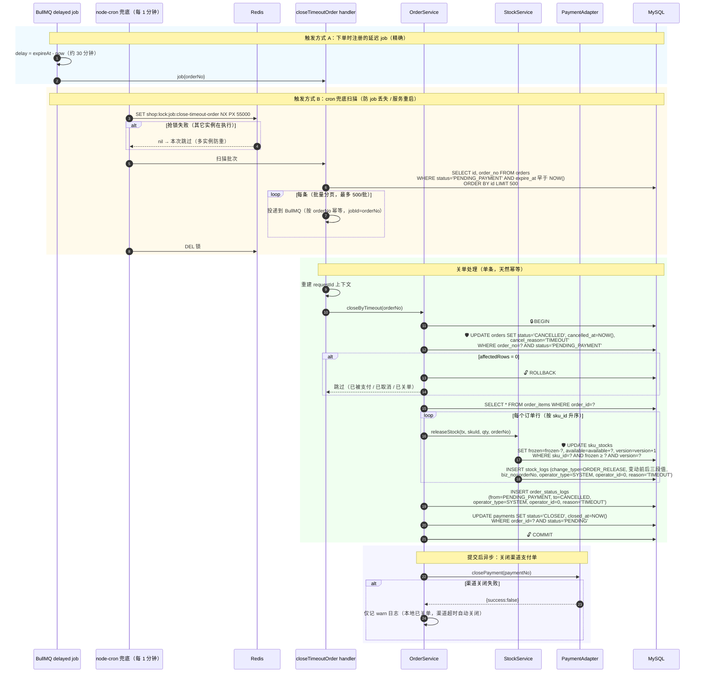
```mermaid
sequenceDiagram
    autonumber
    participant BJ as BullMQ delayed job
    participant CR as node-cron 兜底（每 1 分钟）
    participant RD as Redis
    participant H as closeTimeoutOrder handler
    participant OS as OrderService
    participant SS as StockService
    participant PA as PaymentAdapter
    participant DB as MySQL

    rect rgb(240, 250, 255)
    note over BJ,DB: 触发方式 A：下单时注册的延迟 job（精确）
    BJ->>BJ: delay = expireAt - now（约 30 分钟）
    BJ->>H: job{orderNo}
    end

    rect rgb(255, 250, 235)
    note over BJ,DB: 触发方式 B：cron 兜底扫描（防 job 丢失 / 服务重启）
    CR->>RD: SET shop:lock:job:close-timeout-order NX PX 55000
    alt 抢锁失败（其它实例在执行）
        RD-->>CR: nil → 本次跳过（多实例防重）
    end
    CR->>H: 扫描批次
    H->>DB: SELECT id, order_no FROM orders<br/>WHERE status='PENDING_PAYMENT' AND expire_at 早于 NOW()<br/>ORDER BY id LIMIT 500
    loop 每条（批量分页，最多 500/批）
        H->>H: 投递到 BullMQ（按 orderNo 幂等，jobId=orderNo）
    end
    CR->>RD: DEL 锁
    end

    rect rgb(240, 255, 240)
    note over H,DB: 关单处理（单条，天然幂等）
    H->>H: 重建 requestId 上下文
    H->>OS: closeByTimeout(orderNo)
    OS->>DB: 🔒 BEGIN
    OS->>DB: 🛡 UPDATE orders SET status='CANCELLED', cancelled_at=NOW(),<br/>cancel_reason='TIMEOUT'<br/>WHERE order_no=? AND status='PENDING_PAYMENT'
    alt affectedRows = 0
        OS->>DB: 🔓 ROLLBACK
        OS-->>H: 跳过（已被支付 / 已取消 / 已关单）
    end
    OS->>DB: SELECT * FROM order_items WHERE order_id=?
    loop 每个订单行（按 sku_id 升序）
        OS->>SS: releaseStock(tx, skuId, qty, orderNo)
        SS->>DB: 🛡 UPDATE sku_stocks<br/>SET frozen=frozen-?, available=available+?, version=version+1<br/>WHERE sku_id=? AND frozen ≥ ? AND version=?
        SS->>DB: INSERT stock_logs (change_type=ORDER_RELEASE, 变动前后三段值,<br/>biz_no=orderNo, operator_type=SYSTEM, operator_id=0, reason='TIMEOUT')
    end
    OS->>DB: INSERT order_status_logs<br/>(from=PENDING_PAYMENT, to=CANCELLED,<br/>operator_type=SYSTEM, operator_id=0, reason='TIMEOUT')
    OS->>DB: UPDATE payments SET status='CLOSED', closed_at=NOW()<br/>WHERE order_id=? AND status='PENDING'
    OS->>DB: 🔓 COMMIT
    end

    rect rgb(245, 245, 255)
    note over OS,PA: 提交后异步：关闭渠道支付单
    OS->>PA: closePayment(paymentNo)
    alt 渠道关闭失败
        PA-->>OS: {success:false}
        OS->>OS: 仅记 warn 日志（本地已关单，渠道超时自动关闭）
    end
    end
```

### F7.2 定时任务实现方式与多实例防重

| 项 | 方案 |
| --- | --- |
| 主触发 | **BullMQ delayed job**：下单成功后 `queue.add('closeTimeoutOrder', {orderNo}, { delay: expireAt - now, jobId: orderNo })`；`jobId` 保证同一订单只有一个 job |
| 兜底 | **node-cron 每 1 分钟**扫描 `status='PENDING_PAYMENT' AND expire_at < NOW()`，`LIMIT 500` 分页，走 `idx_status_expire` 索引 |
| 多实例防重（cron） | Redis 分布式锁 `SET shop:lock:job:close-timeout-order NX PX 55000`，抢不到则跳过；锁 TTL 55s < 执行间隔 60s |
| 多实例防重（BullMQ） | BullMQ 天然保证一个 job 只被一个 worker 领取 |
| 服务重启补偿 | `jobs/bootstrap.ts` 在应用启动后立即执行一次全量补偿扫描 |
| 人工兜底 | 后台提供「手动触发关单」按钮（调用同一 handler） |
| 幂等 | **状态条件更新**（`WHERE status='PENDING_PAYMENT'`）+ `affectedRows` 判定；重复执行不会重复释放库存 |

**其他 Job 一览**

| Job | 触发 | 扫描条件 | 索引 | 防重 |
| --- | --- | --- | --- | --- |
| `closeTimeoutOrder` | delayed + cron 1min | `status='PENDING_PAYMENT' AND expire_at < NOW()` | `idx_status_expire` | 状态条件更新 + Redis 锁 |
| `autoConfirmReceipt` | cron 1h | `status='SHIPPED' AND auto_confirm_at < NOW()` | `idx_status_autoconfirm` | 同上 |
| `retryRefund` | cron 5min | `refunds.status='FAILED' AND next_retry_at < NOW()` | `idx_status_nextretry` | 同上 + 重试上限 5 次 |
| `cleanupIdempotency` | cron 1h | `idempotency_records.expire_at < NOW()` | `idx_expire` | 批量删除，天然幂等 |
| `cleanupRefreshToken` | cron 1d | `refresh_tokens.expires_at < NOW()` | `idx_expires` | 同上 |
| `scanStockAnomaly` | cron 10min | `sku_stocks` 恒等式与负数巡检 | `idx_available` | 只读 + 告警 |
| `dailyReconcile` | cron 每日 02:00 | 全量对账（P2） | — | Redis 锁选主 |

---

## F8. 取消订单

### F8.1 时序图

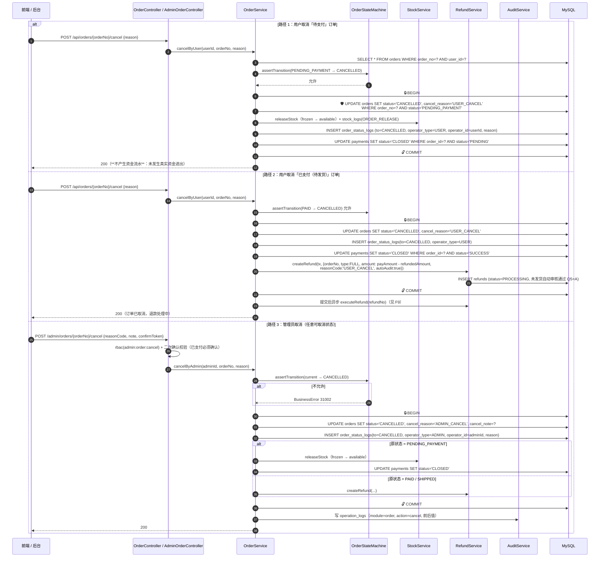
```mermaid
sequenceDiagram
    autonumber
    participant C as 前端 / 后台
    participant CT as OrderController / AdminOrderController
    participant OS as OrderService
    participant SM as OrderStateMachine
    participant SS as StockService
    participant RS as RefundService
    participant AL as AuditService
    participant DB as MySQL

    alt 路径 1：用户取消「待支付」订单
        C->>CT: POST /api/orders/{orderNo}/cancel {reason}
        CT->>OS: cancelByUser(userId, orderNo, reason)
        OS->>DB: SELECT * FROM orders WHERE order_no=? AND user_id=?
        OS->>SM: assertTransition(PENDING_PAYMENT → CANCELLED)
        SM-->>OS: 允许
        OS->>DB: 🔒 BEGIN
        OS->>DB: 🛡 UPDATE orders SET status='CANCELLED', cancel_reason='USER_CANCEL'<br/>WHERE order_no=? AND status='PENDING_PAYMENT'
        OS->>SS: releaseStock（frozen → available）+ stock_logs(ORDER_RELEASE)
        OS->>DB: INSERT order_status_logs (to=CANCELLED, operator_type=USER, operator_id=userId, reason)
        OS->>DB: UPDATE payments SET status='CLOSED' WHERE order_id=? AND status='PENDING'
        OS->>DB: 🔓 COMMIT
        OS-->>C: 200（**不产生资金流水**：未发生真实资金进出）
    else 路径 2：用户取消「已支付（待发货）」订单
        C->>CT: POST /api/orders/{orderNo}/cancel {reason}
        CT->>OS: cancelByUser(userId, orderNo, reason)
        OS->>SM: assertTransition(PAID → CANCELLED) 允许
        OS->>DB: 🔒 BEGIN
        OS->>DB: UPDATE orders SET status='CANCELLED', cancel_reason='USER_CANCEL'
        OS->>DB: INSERT order_status_logs(to=CANCELLED, operator_type=USER)
        OS->>DB: UPDATE payments SET status='CLOSED' WHERE order_id=? AND status='SUCCESS'
        OS->>RS: createRefund(tx, {orderNo, type:FULL, amount: payAmount - refundedAmount,<br/>reasonCode:'USER_CANCEL', autoAudit:true})
        RS->>DB: INSERT refunds (status=PROCESSING, 未发货自动审核通过 Q5=A)
        OS->>DB: 🔓 COMMIT
        OS->>RS: 提交后异步 executeRefund(refundNo)（见 F9）
        OS-->>C: 200（订单已取消，退款处理中）
    else 路径 3：管理员取消（任意可取消状态）
        C->>CT: POST /admin/orders/{orderNo}/cancel {reasonCode, note, confirmToken}
        CT->>CT: rbac(admin:order:cancel) + 二次确认校验（已支付必须确认）
        CT->>OS: cancelByAdmin(adminId, orderNo, reason)
        OS->>SM: assertTransition(current → CANCELLED)
        alt 不允许
            SM--xOS: BusinessError 31002
        end
        OS->>DB: 🔒 BEGIN
        OS->>DB: UPDATE orders SET status='CANCELLED', cancel_reason='ADMIN_CANCEL', cancel_note=?
        OS->>DB: INSERT order_status_logs(to=CANCELLED, operator_type=ADMIN, operator_id=adminId, reason)
        alt 原状态 = PENDING_PAYMENT
            OS->>SS: releaseStock（frozen → available）
            OS->>DB: UPDATE payments SET status='CLOSED'
        else 原状态 = PAID / SHIPPED
            OS->>RS: createRefund(...)
        end
        OS->>DB: 🔓 COMMIT
        OS->>AL: 写 operation_logs（module=order, action=cancel, 前后值）
        OS-->>C: 200
    end
```

### F8.2 取消矩阵与库存/资金处理

| 原状态 | 谁可取消 | 库存处理 | 资金流水 | 退款单 |
| --- | --- | --- | --- | --- |
| `PENDING_PAYMENT` | 用户 / 管理员 / 超时 | `frozen → available`（`ORDER_RELEASE`） | **无**（未产生资金进出） | 无 |
| `PAID` | 用户（取消即退款）/ 管理员 | `frozen → available`（`ORDER_RELEASE`） | 退款成功时写 `ORDER_CANCEL_REFUND`（OUT） | 自动生成，未发货**自动审核通过** |
| `SHIPPED` | 管理员（拦截发货）；用户仅可申请退款 | 退款成功后 `sold → available`（`REFUND_RETURN`） | 退款成功时写 OUT | 需人工审核 |
| `COMPLETED` | 仅售后期内管理员 | 仅退货退款场景回仓 | 退款成功时写 OUT | 需人工审核 |
| `CANCELLED` / `REFUNDING` / `REFUNDED` | ❌ | — | — | — |

**关键规则（PRD 6.4 补充规则）**
1. 待支付取消**不产生资金流水**，但**必须**产生订单轨迹 + 库存流水。
2. 已支付取消/退款**必须**产生一条 `OUT` 流水，且退款金额 ≤ `pay_amount - refunded_amount`（防重复退款）。
3. 退款**必须**走支付适配器，禁止直接改订单状态而不走退款流程。
4. **[v2 变更] 退款路由由 `pay_method` 决定**：余额支付（`BALANCE`）→ 退回用户余额账户（本地账务分支，无外部调用）；渠道支付 → 原路退回（支付宝/微信/银行卡适配器）。取消混合支付后退款单源、无跨来源拆分（见 F9.3 / F15）。

---

## F9. 退款

### F9.1 时序图

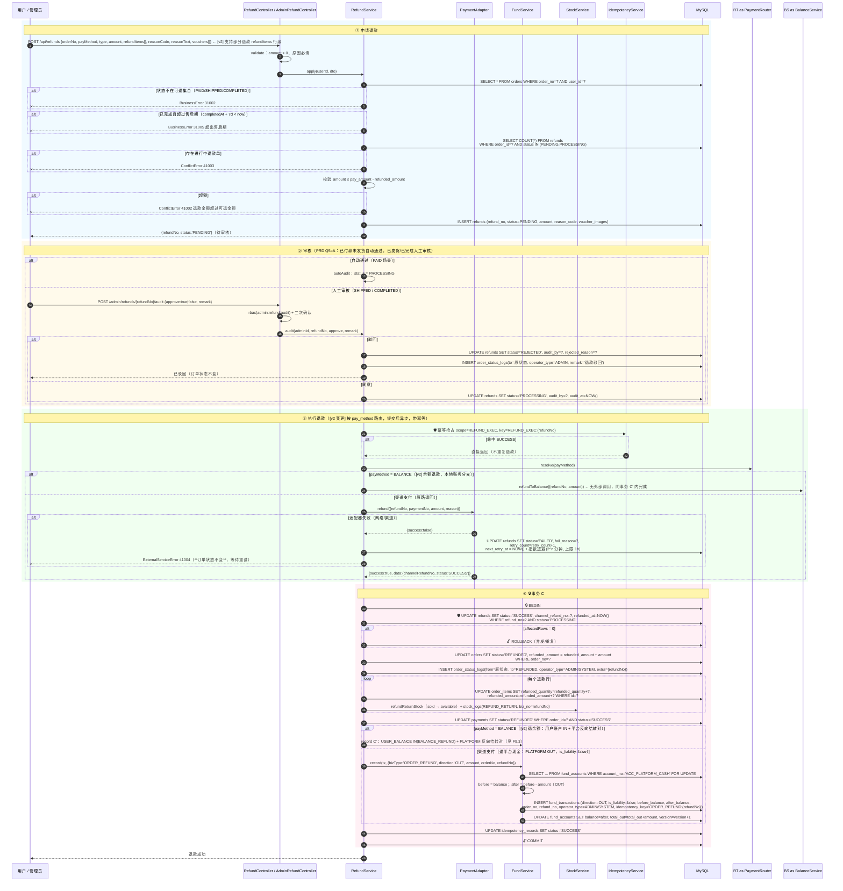
```mermaid
sequenceDiagram
    autonumber
    participant C as 用户 / 管理员
    participant CT as RefundController / AdminRefundController
    participant RS as RefundService
    participant PA as PaymentAdapter
    participant FS as FundService
    participant SS as StockService
    participant IS as IdempotencyService
    participant DB as MySQL

    rect rgb(240, 250, 255)
    note over C,DB: ① 申请退款
    C->>CT: POST /api/refunds {orderNo, payMethod, type, amount, refundItems[], reasonCode, reasonText, vouchers[]}  ← [v2] 支持部分退款 refundItems 行级
    CT->>CT: validate：amount > 0，原因必填
    CT->>RS: apply(userId, dto)
    RS->>DB: SELECT * FROM orders WHERE order_no=? AND user_id=?
    alt 状态不在可退集合（PAID/SHIPPED/COMPLETED）
        RS--xC: BusinessError 31002
    end
    alt 已完成且超过售后期（completedAt + 7d < now）
        RS--xC: BusinessError 31005 超出售后期
    end
    RS->>DB: SELECT COUNT(*) FROM refunds<br/>WHERE order_id=? AND status IN (PENDING,PROCESSING)
    alt 存在进行中退款单
        RS--xC: ConflictError 41003
    end
    RS->>RS: 校验 amount ≤ pay_amount - refunded_amount
    alt 超额
        RS--xC: ConflictError 41002 退款金额超过可退金额
    end
    RS->>DB: INSERT refunds (refund_no, status=PENDING, amount, reason_code, voucher_images)
    RS-->>C: {refundNo, status:'PENDING'}（待审核）
    end

    rect rgb(255, 250, 235)
    note over C,DB: ② 审核（PRD Q5=A：已付款未发货自动通过，已发货/已完成人工审核）
    alt 自动通过（PAID 场景）
        RS->>RS: autoAudit：status = PROCESSING
    else 人工审核（SHIPPED / COMPLETED）
        C->>CT: POST /admin/refunds/{refundNo}/audit {approve:true|false, remark}
        CT->>CT: rbac(admin:refund:audit) + 二次确认
        CT->>RS: audit(adminId, refundNo, approve, remark)
        alt 驳回
            RS->>DB: UPDATE refunds SET status='REJECTED', audit_by=?, rejected_reason=?
            RS->>DB: INSERT order_status_logs(to=原状态, operator_type=ADMIN, remark='退款驳回')
            RS-->>C: 已驳回（订单状态不变）
        else 同意
            RS->>DB: UPDATE refunds SET status='PROCESSING', audit_by=?, audit_at=NOW()
        end
    end
    end

    rect rgb(240, 255, 240)
    note over C,DB: ③ 执行退款（[v2 变更] 按 pay_method 路由，提交后异步，带幂等）
    RS->>IS: 🛡 幂等抢占 scope=REFUND_EXEC, key=REFUND_EXEC:{refundNo}
    alt 命中 SUCCESS
        IS-->>RS: 直接返回（不重复退款）
    end
    RS->>RT as PaymentRouter: resolve(payMethod)
    alt payMethod = BALANCE（[v2] 余额退款，本地账务分支）
        RS->>BS as BalanceService: refundToBalance({refundNo, amount})  ← 无外部调用，同事务 C' 内完成
    else 渠道支付（原路退回）
        RS->>PA: refund({refundNo, paymentNo, amount, reason})
        alt 适配器失败（网络/渠道）
            PA-->>RS: {success:false}
            RS->>DB: UPDATE refunds SET status='FAILED', fail_reason=?,<br/>retry_count=retry_count+1,<br/>next_retry_at = NOW() + 指数退避(2^n 分钟, 上限 1h)
            RS--xC: ExternalServiceError 41004（**订单状态不变**，等待重试）
        end
        PA-->>RS: {success:true, data:{channelRefundNo, status:'SUCCESS'}}
    end
    end

    rect rgb(255, 240, 245)
    note over RS,DB: ④ 🔒 事务 C
    RS->>DB: 🔒 BEGIN
    RS->>DB: 🛡 UPDATE refunds SET status='SUCCESS', channel_refund_no=?, refunded_at=NOW()<br/>WHERE refund_no=? AND status='PROCESSING'
    alt affectedRows = 0
        RS->>DB: 🔓 ROLLBACK（并发/重复）
    end
    RS->>DB: UPDATE orders SET status='REFUNDED', refunded_amount = refunded_amount + amount<br/>WHERE order_no=?
    RS->>DB: INSERT order_status_logs(from=原状态, to=REFUNDED, operator_type=ADMIN/SYSTEM, extra={refundNo})
    loop 每个退款行
        RS->>DB: UPDATE order_items SET refunded_quantity=refunded_quantity+?,<br/>refunded_amount=refunded_amount+? WHERE id=?
        RS->>SS: refundReturnStock（sold → available）+ stock_logs(REFUND_RETURN, biz_no=refundNo)
    end
    RS->>DB: UPDATE payments SET status='REFUNDED' WHERE order_id=? AND status='SUCCESS'
    alt payMethod = BALANCE（[v2] 退余额：用户账户 IN + 平台反向结转对）
        RS->>FS: record C'：USER_BALANCE IN(BALANCE_REFUND) + PLATFORM 反向结转对（见 F9.3）
    else 渠道支付（退平台现金：PLATFORM OUT，is_liability=false）
        RS->>FS: record(tx, {bizType:'ORDER_REFUND', direction:'OUT', amount, orderNo, refundNo})
        FS->>DB: SELECT ... FROM fund_accounts WHERE account_no='ACC_PLATFORM_CASH' FOR UPDATE
        FS->>FS: before = balance；after = before - amount（OUT）
        FS->>DB: INSERT fund_transactions (direction=OUT, is_liability=false, before_balance, after_balance,<br/>order_no, refund_no, operator_type=ADMIN/SYSTEM, idempotency_key='ORDER_REFUND:{refundNo}')
        FS->>DB: UPDATE fund_accounts SET balance=after, total_out=total_out+amount, version=version+1
    end
    RS->>DB: UPDATE idempotency_records SET status='SUCCESS'
    RS->>DB: 🔓 COMMIT
    end
    RS-->>C: 退款成功
```

### F9.2 失败重试策略

| 项 | 约定 |
| --- | --- |
| 重试触发 | `retryRefund` job 每 5 分钟扫描 `status='FAILED' AND next_retry_at < NOW()` |
| 退避 | 指数退避 `2^n` 分钟（1、2、4、8、16…上限 60 分钟） |
| 重试上限 | 5 次；超过后 `status` 保持 `FAILED` 并**告警**，转人工处理 |
| 幂等 | `REFUND_EXEC:{refundNo}` 幂等键 + `UPDATE refunds WHERE status='PROCESSING'` 状态条件更新，双保险防重复退款 |
| **订单状态不变** | 适配器失败时**不修改订单状态**（PRD 6.4 补充规则 5），只记录 `fail_reason` |
| 部分退款（[v2] **提 P0**） | `type=PARTIAL`，按 `refund_items` 行级累加校验：`Σ refund_items.actualAmount ≤ pay_amount - refunded_amount`（按**已分摊优惠的实付**退，非原价，见 E9）；订单状态保持原状态不变，仅当累计退款 = 实付时才置 `REFUNDED` |
| 冲正 | 错退只能写 `REVERSAL` 反向流水（重新入账），禁止直接修改流水 |

### F9.3 [v2 变更] 按 pay_method 路由退款

> 取消混合支付后，一笔订单只用了一种 `pay_method`，退款**单源、原路**，无跨来源拆分。

| `pay_method` | 退款路径 | 记账（事务 C / C'） | 外部调用 |
| --- | --- | --- | --- |
| `BALANCE` | 退回用户余额账户 | USER_BALANCE `BALANCE_REFUND` IN + PLATFORM **反向结转对**（`LIABILITY_SETTLE_IN`→true 先写、`LIABILITY_SETTLE_OUT`→false 后写，负债增/收入减） | ❌ 无（本地账务分支，瞬时完成） |
| `ALIPAY` / `WECHAT` / `BANKCARD` | 原路退回（适配器） | PLATFORM `ORDER_REFUND` OUT，`is_liability=false`（退回的是真实现金收入） | ✅ 渠道退款 API（事务外，走 `refund-exec` 队列） |

**一致性要点**

- 余额退款的「反向结转对」使收入回退、负债回增，维持 L2/L3 恒等式不漂移（论证见 `03-database.md` §3.6.4 ⑤）。
- 整单退款（`type=FULL`）时 `order_coupon_records.restored_at` 写入、券 `USED → UNUSED`（`RESTORE`），与 F5.5 / F13 闭环。
- 部分退款不退券（一期一单一券，券按整单维度，不退不返）；仅退金额，行级 `refunded_amount` 累加。

---

## F10. 发货与确认收货

### F10.1 时序图

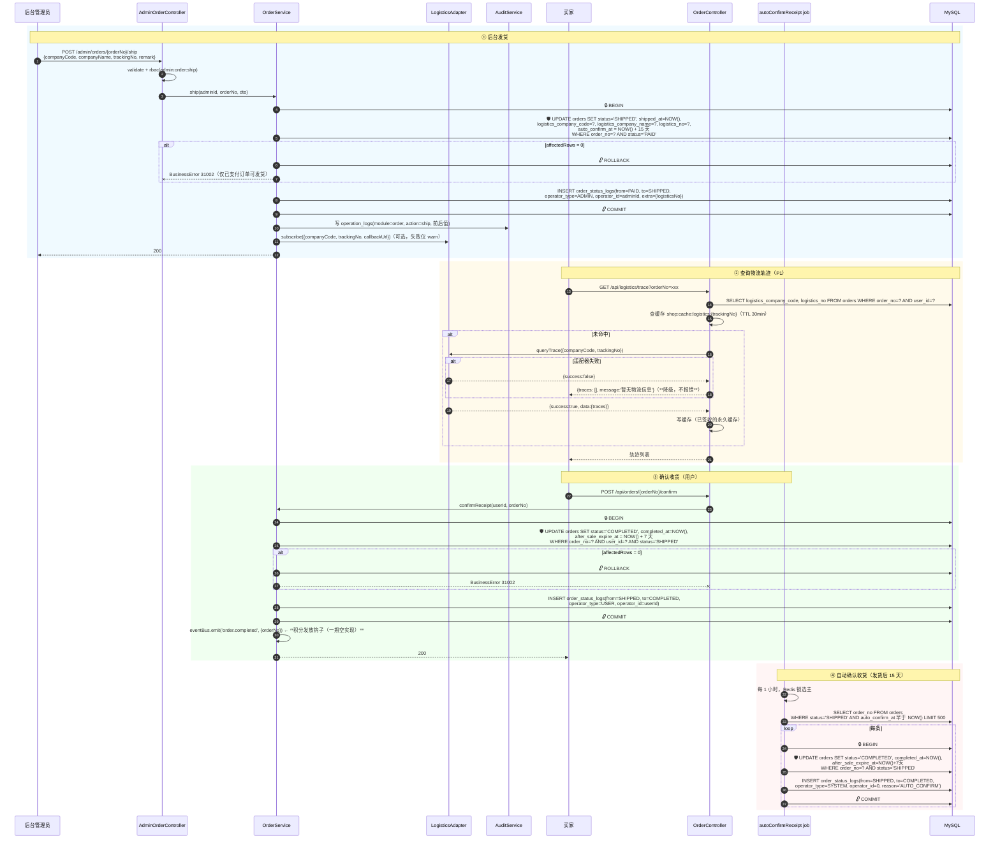
```mermaid
sequenceDiagram
    autonumber
    participant A as 后台管理员
    participant ACT as AdminOrderController
    participant OS as OrderService
    participant LA as LogisticsAdapter
    participant AL as AuditService
    participant U as 买家
    participant OCT as OrderController
    participant CR as autoConfirmReceipt job
    participant DB as MySQL

    rect rgb(240, 250, 255)
    note over A,DB: ① 后台发货
    A->>ACT: POST /admin/orders/{orderNo}/ship<br/>{companyCode, companyName, trackingNo, remark}
    ACT->>ACT: validate + rbac(admin:order:ship)
    ACT->>OS: ship(adminId, orderNo, dto)
    OS->>DB: 🔒 BEGIN
    OS->>DB: 🛡 UPDATE orders SET status='SHIPPED', shipped_at=NOW(),<br/>logistics_company_code=?, logistics_company_name=?, logistics_no=?,<br/>auto_confirm_at = NOW() + 15 天<br/>WHERE order_no=? AND status='PAID'
    alt affectedRows = 0
        OS->>DB: 🔓 ROLLBACK
        OS--xACT: BusinessError 31002（仅已支付订单可发货）
    end
    OS->>DB: INSERT order_status_logs(from=PAID, to=SHIPPED,<br/>operator_type=ADMIN, operator_id=adminId, extra={logisticsNo})
    OS->>DB: 🔓 COMMIT
    OS->>AL: 写 operation_logs(module=order, action=ship, 前后值)
    OS->>LA: subscribe({companyCode, trackingNo, callbackUrl})（可选，失败仅 warn）
    OS-->>A: 200
    end

    rect rgb(255, 250, 235)
    note over U,DB: ② 查询物流轨迹（P1）
    U->>OCT: GET /api/logistics/trace?orderNo=xxx
    OCT->>DB: SELECT logistics_company_code, logistics_no FROM orders WHERE order_no=? AND user_id=?
    OCT->>OCT: 查缓存 shop:cache:logistics:{trackingNo}（TTL 30min）
    alt 未命中
        OCT->>LA: queryTrace({companyCode, trackingNo})
        alt 适配器失败
            LA-->>OCT: {success:false}
            OCT-->>U: {traces: [], message:'暂无物流信息'}（**降级，不报错**）
        end
        LA-->>OCT: {success:true, data:{traces}}
        OCT->>OCT: 写缓存（已签收的永久缓存）
    end
    OCT-->>U: 轨迹列表
    end

    rect rgb(240, 255, 240)
    note over U,CR: ③ 确认收货（用户）
    U->>OCT: POST /api/orders/{orderNo}/confirm
    OCT->>OS: confirmReceipt(userId, orderNo)
    OS->>DB: 🔒 BEGIN
    OS->>DB: 🛡 UPDATE orders SET status='COMPLETED', completed_at=NOW(),<br/>after_sale_expire_at = NOW() + 7 天<br/>WHERE order_no=? AND user_id=? AND status='SHIPPED'
    alt affectedRows = 0
        OS->>DB: 🔓 ROLLBACK
        OS--xOCT: BusinessError 31002
    end
    OS->>DB: INSERT order_status_logs(from=SHIPPED, to=COMPLETED,<br/>operator_type=USER, operator_id=userId)
    OS->>DB: 🔓 COMMIT
    OS->>OS: eventBus.emit('order.completed', {orderNo})  ← **积分发放钩子（一期空实现）**
    OS-->>U: 200
    end

    rect rgb(255, 245, 245)
    note over CR,DB: ④ 自动确认收货（发货后 15 天）
    CR->>CR: 每 1 小时，Redis 锁选主
    CR->>DB: SELECT order_no FROM orders<br/>WHERE status='SHIPPED' AND auto_confirm_at 早于 NOW() LIMIT 500
    loop 每条
        CR->>DB: 🔒 BEGIN
        CR->>DB: 🛡 UPDATE orders SET status='COMPLETED', completed_at=NOW(),<br/>after_sale_expire_at=NOW()+7天<br/>WHERE order_no=? AND status='SHIPPED'
        CR->>DB: INSERT order_status_logs(from=SHIPPED, to=COMPLETED,<br/>operator_type=SYSTEM, operator_id=0, reason='AUTO_CONFIRM')
        CR->>DB: 🔓 COMMIT
    end
    end
```

### F10.2 关键规则

| 项 | 规则 |
| --- | --- |
| 发货条件 | 仅 `PAID` 可发货；发货写入物流公司编码/名称/运单号 + `auto_confirm_at = shipped_at + 15 天` |
| 确认收货条件 | 仅 `SHIPPED` 可确认；完成后 `after_sale_expire_at = completed_at + 7 天`（售后期） |
| 积分钩子 | 确认收货后 `eventBus.emit('order.completed')`，**一期为空监听器**（二阶段在此发放积分，见 `02-architecture.md` §8） |
| 物流降级 | 适配器失败 → 返回空轨迹，**不阻断订单流程**（INTG-06） |
| 越权 | C 端确认收货强制 `WHERE user_id = ?` |
| 幂等 | 全部依赖状态条件更新 + `affectedRows` 判定 |

---

## F11. 资金对账还原

> **验收标准**：输入任意一个订单号，可还原该订单的全部资金流水 + 支付/退款单 + 订单轨迹，串成完整时间线，并验证「实付 = IN 之和 - OUT 之和」。

### F11.1 时序图

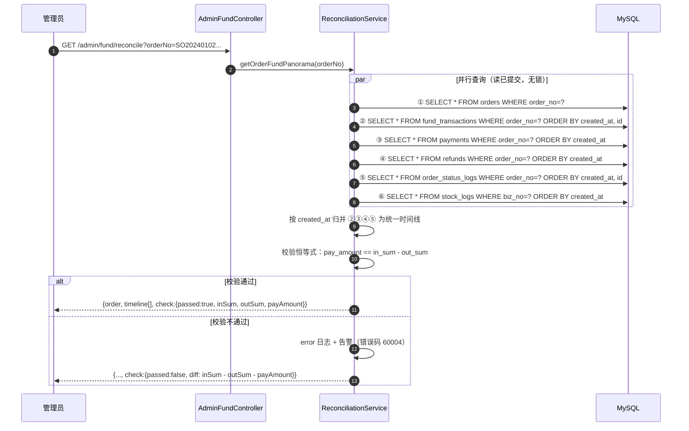
```mermaid
sequenceDiagram
    autonumber
    participant A as 管理员
    participant CT as AdminFundController
    participant SV as ReconciliationService
    participant DB as MySQL

    A->>CT: GET /admin/fund/reconcile?orderNo=SO20240102...
    CT->>SV: getOrderFundPanorama(orderNo)
    par 并行查询（读已提交，无锁）
        SV->>DB: ① SELECT * FROM orders WHERE order_no=?
        SV->>DB: ② SELECT * FROM fund_transactions WHERE order_no=? ORDER BY created_at, id
        SV->>DB: ③ SELECT * FROM payments WHERE order_no=? ORDER BY created_at
        SV->>DB: ④ SELECT * FROM refunds WHERE order_no=? ORDER BY created_at
        SV->>DB: ⑤ SELECT * FROM order_status_logs WHERE order_no=? ORDER BY created_at, id
        SV->>DB: ⑥ SELECT * FROM stock_logs WHERE biz_no=? ORDER BY created_at
    end
    SV->>SV: 按 created_at 归并 ②③④⑤ 为统一时间线
    SV->>SV: 校验恒等式：pay_amount == in_sum - out_sum
    alt 校验通过
        SV-->>A: {order, timeline[], check:{passed:true, inSum, outSum, payAmount}}
    else 校验不通过
        SV->>SV: error 日志 + 告警（错误码 60004）
        SV-->>A: {..., check:{passed:false, diff: inSum - outSum - payAmount}}
    end
```

### F11.2 对账查询示例（SQL）

```sql
-- ============================================================
-- 输入：订单号 @orderNo = 'SO202401021234567890'
-- ============================================================

-- ① 订单主体
SELECT order_no, user_id, status,
       goods_amount, freight_amount, discount_amount, point_deduct_amount,
       pay_amount, refunded_amount,
       created_at, paid_at, shipped_at, completed_at, cancelled_at
  FROM orders
 WHERE order_no = @orderNo;

-- ② 资金流水（对账核心，走 idx_order_no_created）
SELECT tx_no, biz_type, direction, amount,
       before_balance, after_balance,
       payment_no, refund_no, related_tx_no,
       operator_type, operator_id, operator_name, remark, created_at
  FROM fund_transactions
 WHERE order_no = @orderNo
 ORDER BY created_at ASC, id ASC;

-- ③ 支付单
SELECT payment_no, channel, amount, status, channel_trade_no,
       fee_amount, notify_count, paid_at, closed_at, created_at
  FROM payments
 WHERE order_no = @orderNo
 ORDER BY created_at ASC;

-- ④ 退款单
SELECT refund_no, type, amount, status, reason_code, reason_text,
       channel_refund_no, audit_by, audit_at, refunded_at, fail_reason, retry_count
  FROM refunds
 WHERE order_no = @orderNo
 ORDER BY created_at ASC;

-- ⑤ 订单状态轨迹
SELECT from_status, to_status, operator_type, operator_id, operator_name,
       reason, remark, extra, created_at
  FROM order_status_logs
 WHERE order_no = @orderNo
 ORDER BY created_at ASC, id ASC;

-- ⑥ 库存流水（该订单引起的库存变动）
SELECT sku_id, change_type, change_qty,
       before_available, after_available,
       before_frozen,    after_frozen,
       before_sold,      after_sold,
       operator_type, operator_id, reason, created_at
  FROM stock_logs
 WHERE biz_no = @orderNo
 ORDER BY created_at ASC;

-- ============================================================
-- ⑦ 对账校验：实付 = IN 之和 - OUT 之和
-- ============================================================
SELECT
  o.pay_amount                                        AS pay_amount,
  COALESCE(SUM(CASE WHEN f.direction = 'IN'  THEN f.amount ELSE 0 END), 0) AS in_sum,
  COALESCE(SUM(CASE WHEN f.direction = 'OUT' THEN f.amount ELSE 0 END), 0) AS out_sum,
  o.pay_amount
    - (COALESCE(SUM(CASE WHEN f.direction = 'IN'  THEN f.amount ELSE 0 END), 0)
     - COALESCE(SUM(CASE WHEN f.direction = 'OUT' THEN f.amount ELSE 0 END), 0)) AS diff
FROM orders o
LEFT JOIN fund_transactions f
       ON f.order_no = o.order_no
      AND f.biz_type IN ('ORDER_PAY','FREIGHT_ADD',
                         'ORDER_REFUND','ORDER_REFUND_PART','ORDER_CANCEL_REFUND','FREIGHT_REFUND')
WHERE o.order_no = @orderNo
GROUP BY o.order_no, o.pay_amount;
-- ✅ 断言：diff = 0

-- ============================================================
-- ⑧ 余额快照连续性校验（逐笔推演）
-- ============================================================
SELECT tx_no, biz_type, direction, amount, before_balance, after_balance,
       CASE direction WHEN 'IN'  THEN before_balance + amount
                      WHEN 'OUT' THEN before_balance - amount END AS expect_after,
       CASE WHEN (CASE direction WHEN 'IN'  THEN before_balance + amount
                                 WHEN 'OUT' THEN before_balance - amount END) = after_balance
            THEN 'OK' ELSE 'BROKEN' END AS check_result
  FROM fund_transactions
 WHERE account_id = (SELECT id FROM fund_accounts WHERE account_no = 'ACC_PLATFORM_CASH')
 ORDER BY id ASC;
-- ✅ 断言：无 BROKEN 行；且相邻行 after_balance(i) = before_balance(i+1)

-- ============================================================
-- ⑨ 账户余额 = 流水净额 校验
-- ============================================================
SELECT a.balance AS account_balance,
       COALESCE(SUM(CASE WHEN f.direction='IN'  THEN f.amount ELSE 0 END),0)
     - COALESCE(SUM(CASE WHEN f.direction='OUT' THEN f.amount ELSE 0 END),0) AS net_amount
  FROM fund_accounts a
  LEFT JOIN fund_transactions f ON f.account_id = a.id
 WHERE a.account_no = 'ACC_PLATFORM_CASH'
 GROUP BY a.id, a.balance;
-- ✅ 断言：account_balance = net_amount
```

### F11.3 Prisma 查询示例

```ts
// services/ReconciliationService.ts（关键片段）
async getOrderFundPanorama(orderNo: string) {
  const [order, transactions, payments, refunds, statusLogs, stockLogs] = await Promise.all([
    prisma.order.findUnique({ where: { orderNo } }),
    prisma.fundTransaction.findMany({ where: { orderNo }, orderBy: [{ createdAt: 'asc' }, { id: 'asc' }] }),
    prisma.payment.findMany({ where: { orderNo }, orderBy: { createdAt: 'asc' } }),
    prisma.refund.findMany({ where: { orderNo }, orderBy: { createdAt: 'asc' } }),
    prisma.orderStatusLog.findMany({ where: { orderNo }, orderBy: [{ createdAt: 'asc' }, { id: 'asc' }] }),
    prisma.stockLog.findMany({ where: { bizNo: orderNo }, orderBy: { createdAt: 'asc' } }),
  ]);
  if (!order) throw new NotFoundError(31001, '订单不存在');

  // 参与对账的业务类型（排除手续费，手续费单独统计）
  const RECON_BIZ: FundBizType[] = [
    'ORDER_PAY', 'FREIGHT_ADD',
    'ORDER_REFUND', 'ORDER_REFUND_PART', 'ORDER_CANCEL_REFUND', 'FREIGHT_REFUND',
  ];
  const sumBy = (d: FundDirection) => transactions
    .filter(t => RECON_BIZ.includes(t.bizType) && t.direction === d)
    .reduce((acc, t) => acc + t.amount, 0n);            // bigint 累加，精确

  const inSum = sumBy('IN');
  const outSum = sumBy('OUT');
  const diff = order.payAmount - (inSum - outSum);       // bigint

  // 归并时间线
  const timeline = [
    ...transactions.map(t => ({ at: t.createdAt, kind: 'FUND' as const,
      title: `${t.direction === 'IN' ? '入账' : '出账'} ${t.bizType}`, amount: t.amount,
      direction: t.direction, before: t.beforeBalance, after: t.afterBalance, ref: t.paymentNo ?? t.refundNo,
      operator: `${t.operatorType}#${t.operatorId}` })),
    ...statusLogs.map(l => ({ at: l.createdAt, kind: 'STATUS' as const,
      title: `${l.fromStatus ?? '创建'} → ${l.toStatus}`, reason: l.reason,
      operator: `${l.operatorType}#${l.operatorId}` })),
    ...payments.map(p => ({ at: p.createdAt, kind: 'PAYMENT' as const,
      title: `支付单 ${p.status}`, amount: p.amount, ref: p.paymentNo, channel: p.channel })),
    ...refunds.map(r => ({ at: r.createdAt, kind: 'REFUND' as const,
      title: `退款单 ${r.status}`, amount: r.amount, ref: r.refundNo, reason: r.reasonCode })),
  ].sort((a, b) => a.at.getTime() - b.at.getTime());

  if (diff !== 0n) {
    logger.error({ msg: 'fund.reconcile.mismatch', bizNos: { orderNo },
      ctx: { payAmount: order.payAmount, inSum, outSum, diff } });   // 触发告警
  }

  return {
    order, timeline,
    check: { passed: diff === 0n, payAmount: order.payAmount, inSum, outSum, diff },
  };
}
```

### F11.4 对账校验项清单

| # | 校验项 | 断言 | 频率 | 失败处置 |
| --- | --- | --- | --- | --- |
| 1 | 单笔订单资金平衡 | `pay_amount = Σ(IN) - Σ(OUT)` | 实时（查询时） | error 日志 + 告警（`60004`） |
| 2 | 余额快照连续 | `after(i) = before(i+1)`，且 `after = before ± amount` | 每日 | 告警 + 人工排查 |
| 3 | 账户余额 = 流水净额 | `fund_accounts.balance = Σ(IN) - Σ(OUT)` | 每日 | 告警 |
| 4 | 退款不超额 | `refunded_amount ≤ pay_amount` | 实时（DB CHECK + 应用层） | 拒绝退款 |
| 5 | 库存恒等式 | `total = available + frozen + sold` 且三者 ≥ 0 | 每 10 分钟 | 告警 |
| 6 | 订单轨迹完整 | 每次状态变更必有 1 条轨迹 | 每日 | 告警 |
| 7 | 支付单与流水配对 | 每个 `SUCCESS` 支付单必有 1 条 `ORDER_PAY` 流水 | 每日 | 告警 |
| 8 | 无孤儿冻结库存 | `frozen` 占用只应来自 `PENDING_PAYMENT` 订单（支付后 frozen→sold，取消/超时后释放）；其它状态的订单不应仍持有冻结 | 每日 | 告警（人工核对，必要时写 `MANUAL_CHECK` 修正流水） |

### F11.5 [v2 变更] 两种对账视图：用户余额账户 + 平台账户

> 引入用户余额账户后，对账不能只看「平台现金」。必须分别从**用户视角**（我的余额对不对）和**平台视角**（收入与负债清不清）两个维度核对，二者通过 `tx_group_no` / `counterparty_account_id` 勾稽（论证见 `03-database.md` §3.6.4）。

**视图一：用户余额账户对账（按用户）**

```sql
-- 某用户余额账户：余额 = 流水净额，且快照连续
SELECT a.user_id, a.balance AS account_balance,
       COALESCE(SUM(CASE WHEN f.direction='IN'  THEN f.amount ELSE 0 END),0)
     - COALESCE(SUM(CASE WHEN f.direction='OUT' THEN f.amount ELSE 0 END),0) AS net_amount
  FROM fund_accounts a
  LEFT JOIN fund_transactions f ON f.account_id = a.id
 WHERE a.account_type = 'USER_BALANCE' AND a.user_id = @userId
 GROUP BY a.id, a.user_id, a.balance;
-- ✅ 断言：account_balance = net_amount，且 net_amount ≥ 0
```

**视图二：平台账户对账（收入 vs 负债，is_liability 分层）**

```sql
-- 平台账户：真实收入（is_liability=false）与 代管负债（is_liability=true）分离汇总
SELECT
  COALESCE(SUM(CASE WHEN f.is_liability = 0 AND f.direction='IN'  THEN f.amount ELSE 0 END),0)
- COALESCE(SUM(CASE WHEN f.is_liability = 0 AND f.direction='OUT' THEN f.amount ELSE 0 END),0) AS net_income,
  COALESCE(SUM(CASE WHEN f.is_liability = 1 AND f.direction='IN'  THEN f.amount ELSE 0 END),0)
- COALESCE(SUM(CASE WHEN f.is_liability = 1 AND f.direction='OUT' THEN f.amount ELSE 0 END),0) AS net_liability
  FROM fund_accounts a
  JOIN fund_transactions f ON f.account_id = a.id
 WHERE a.account_no = 'ACC_PLATFORM_CASH';
-- ✅ L3：net_income = 真实收入；L2：Σ 全体用户余额 = -net_liability（负债总额）
```

| 勾稽关系 | 含义 | 失败处置 |
| --- | --- | --- |
| 平台余额 = 全部 IN − 全部 OUT（含负债） | L1：平台账户持有现金 + 代管用户钱 | 告警 |
| `Σ 全体用户余额 == −平台 net_liability` | L2：余额总额 = 平台负债总额 | 告警（定位漏写流水） |
| `net_income == Σ 结转对 IN(收入)` | L3：收入口径干净、不被负债污染 | 告警 |

---

## F12. 订单状态机总图

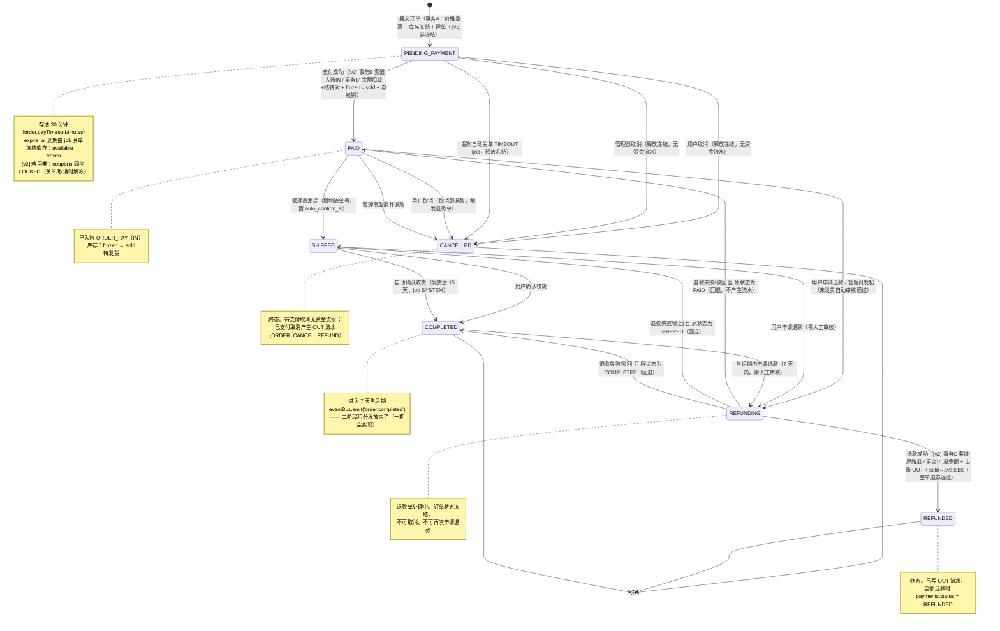
```mermaid
stateDiagram-v2
    [*] --> PENDING_PAYMENT : 提交订单（事务A：价格重算 + 库存冻结 + 建单 + [v2] 券冻结）

    PENDING_PAYMENT --> PAID : 支付成功（[v2] 事务B 渠道入账IN / 事务B' 余额扣减+结转对 + frozen→sold + 券核销）
    PENDING_PAYMENT --> CANCELLED : 用户取消（释放冻结，无资金流水）
    PENDING_PAYMENT --> CANCELLED : 管理员取消（释放冻结，无资金流水）
    PENDING_PAYMENT --> CANCELLED : 超时自动关单 TIMEOUT（job，释放冻结）

    PAID --> SHIPPED : 管理员发货（填物流单号，置 auto_confirm_at）
    PAID --> CANCELLED : 用户取消（取消即退款，触发退款单）
    PAID --> CANCELLED : 管理员取消并退款
    PAID --> REFUNDING : 用户申请退款 / 管理员发起（未发货自动审核通过）

    SHIPPED --> COMPLETED : 用户确认收货
    SHIPPED --> COMPLETED : 自动确认收货（发货后 15 天，job SYSTEM）
    SHIPPED --> REFUNDING : 用户申请退款（需人工审核）

    COMPLETED --> REFUNDING : 售后期内申请退款（7 天内，需人工审核）

    REFUNDING --> REFUNDED : 退款成功（[v2] 事务C 渠道原路退 / 事务C' 退余额 + 出账 OUT + sold→available + 整单退券返还）
    REFUNDING --> PAID : 退款失败/驳回 且 原状态为 PAID（回退，不产生流水）
    REFUNDING --> SHIPPED : 退款失败/驳回 且 原状态为 SHIPPED（回退）
    REFUNDING --> COMPLETED : 退款失败/驳回 且 原状态为 COMPLETED（回退）

    CANCELLED --> [*]
    REFUNDED --> [*]
    COMPLETED --> [*]

    note right of PENDING_PAYMENT
        存活 30 分钟（order.payTimeoutMinutes）
        expire_at 到期由 job 关单
        冻结库存：available → frozen
        [v2] 若用券：coupons 同步 LOCKED（关单/取消时解冻）
    end note

    note right of PAID
        已入账 ORDER_PAY（IN）
        库存：frozen → sold
        待发货
    end note

    note right of CANCELLED
        终态。待支付取消无资金流水；
        已支付取消产生 OUT 流水（ORDER_CANCEL_REFUND）
    end note

    note right of REFUNDING
        退款单处理中。订单状态冻结，
        不可取消、不可再次申请退款
    end note

    note right of REFUNDED
        终态。已写 OUT 流水，
        全额退款时 payments.status = REFUNDED
    end note

    note right of COMPLETED
        进入 7 天售后期
        eventBus.emit('order.completed')
        —— 二阶段积分发放钩子（一期空实现）
    end note
```

> **[v2 变更] 券与余额联动**：订单状态机本身不变（仍为 7 态），但每次跃迁的同事务副作用扩展：
> - `PENDING_PAYMENT → PAID`：除原入账/库存外，[v2] 还需 `coupons.LOCKED → USED`（券核销）与（余额支付时）平台结转对；
> - `PAID/* → CANCELLED`（关单/取消）：[v2] 还需 `coupons.LOCKED → UNUSED`（解冻，过期券置 `EXPIRED`）；
> - `REFUNDING → REFUNDED`：除原出账/回仓外，[v2] 整单退款需 `coupons.USED → UNUSED`（返还），余额退款走 C' 本地分支。
> 这些副作用一律写在对应的事务 B/B'/C/C' 内（见 F6 / F9 / F15），状态机只负责订单态，不负责券/资金——职责边界见 `03-database.md` §3.8 券状态机表。

### F12.1 状态跃迁白名单表（`OrderStateMachine`）

| 从 ↓ / 到 → | PENDING_PAYMENT | PAID | SHIPPED | COMPLETED | CANCELLED | REFUNDING | REFUNDED |
| --- | --- | --- | --- | --- | --- | --- | --- |
| **PENDING_PAYMENT** | — | ✅ 支付回调 | ❌ | ❌ | ✅ 取消/超时 | ❌ | ❌ |
| **PAID** | ❌ | — | ✅ 发货 | ❌ | ✅ 取消并退款 | ✅ 申请退款 | ❌ |
| **SHIPPED** | ❌ | ❌ | — | ✅ 确认收货/自动 | ❌ | ✅ 申请退款 | ❌ |
| **COMPLETED** | ❌ | ❌ | ❌ | — | ❌ | ✅ 售后期内 | ❌ |
| **CANCELLED** | ❌ | ❌ | ❌ | ❌ | — | ❌ | ❌ |
| **REFUNDING** | ❌ | ✅ 退款失败回退 | ✅ 退款失败回退 | ✅ 退款失败回退 | ❌ | — | ✅ 退款成功 |
| **REFUNDED** | ❌ | ❌ | ❌ | ❌ | ❌ | ❌ | — |

**实现约定**

```ts
// services/OrderStateMachine.ts（要点）
const TRANSITIONS: Record<OrderStatus, OrderStatus[]> = {
  PENDING_PAYMENT: ['PAID', 'CANCELLED'],
  PAID:            ['SHIPPED', 'CANCELLED', 'REFUNDING'],
  SHIPPED:         ['COMPLETED', 'REFUNDING'],
  COMPLETED:       ['REFUNDING'],
  CANCELLED:       [],
  REFUNDING:       ['REFUNDED', 'PAID', 'SHIPPED', 'COMPLETED'],  // 失败回退
  REFUNDED:        [],
};

// 所有状态变更必须走这里：
// ① 校验跃迁合法性（非法 → BusinessError 31002 + warn 日志）
// ② 在调用方事务内执行条件更新：UPDATE orders SET status=? WHERE order_no=? AND status=?
// ③ 校验 affectedRows === 1，否则抛 ConflictError（并发保护）
// ④ 同一事务内写 order_status_logs
```

**四条铁律**
1. 禁止任何地方直接 `prisma.order.update({ data: { status } })`，一律走 `OrderStateMachine.transition(tx, orderNo, to, ctx)`。
2. 状态更新**必须**带 `WHERE status = 期望原状态`，以 `affectedRows` 判定并发胜负。
3. 每次状态变更**必须**同事务写 `order_status_logs`（`from_status`/`to_status`/操作人/原因）。
4. `CANCELLED` 与 `REFUNDED` 为终态，不可再跃迁。

---

## F13. [v2 新增] 优惠券领取与使用

> 优惠券域表结构见 `03-database.md` §3.8。本文档只描述**流程**与**事务绑定**；金额分摊规则见 F5.5。

### F13.1 领取优惠券（事务 J）

```mermaid
sequenceDiagram
    autonumber
    participant C as 用户
    participant CT as CouponController
    participant SV as CouponService
    participant DB as MySQL
    participant IS as IdempotencyService

    rect rgb(240, 250, 255)
    note over C,DB: 领取
    C->>CT: POST /api/coupons/{templateNo}/claim
    CT->>SV: claim(userId, templateNo)
    SV->>DB: SELECT * FROM coupon_templates WHERE template_no=? AND status='PUBLISHED'
    alt 模板不存在 / 未发布 / 已结束
        SV--xC: NotFoundError / BusinessError（不可领）
    end
    SV->>SV: 校验 per_limit（每人限领）、total_count - issued_count > 0、valid 未过
    alt 超出限领 / 已领完
        SV--xC: ConflictError 12005 / 12006
    end
    SV->>IS: 🛡 幂等抢占 scope=COUPON_CLAIM, key={userId}:{templateNo}
    SV->>DB: 🔒 BEGIN（事务 J）
    SV->>DB: INSERT coupons (coupon_no, user_id, template_id, status='UNUSED', expire_at)
    SV->>DB: 🛡 UPDATE coupon_templates SET issued_count = issued_count + 1<br/>WHERE id=? AND issued_count < total_count（CAS 防超发）
    alt affectedRows = 0
        SV->>DB: 🔓 ROLLBACK; SV--xC: ConflictError 12006 已领完
    end
    SV->>DB: INSERT coupon_use_logs (from=NULL, to=UNUSED, biz_type=CLAIM)
    SV->>DB: UPDATE idempotency_records SET status='SUCCESS'
    SV->>DB: 🔓 COMMIT
    end
    SV-->>C: {couponNo, status:'UNUSED', expireAt}
    end
```

### F13.2 券状态机与事务绑定（工程师必读）

| 流转 | 触发时机 | 所属事务 | 同事务还要写 |
| --- | --- | --- | --- |
| — → `UNUSED` | 用户领取 | **事务 J（领券）** | `issued_count` CAS +1；`coupon_use_logs`(CLAIM)；幂等 |
| `UNUSED` → `LOCKED` | 提交订单 | **事务 A（创建订单）** | `order_coupon_records`；`coupon_use_logs`(LOCK)（见 F5.5） |
| `LOCKED` → `USED` | 支付成功 | **事务 B/B'（支付入账）** | `used_count` +1；`coupon_use_logs`(USE)；订单轨迹（见 F6.1 B / F6.6） |
| `LOCKED` → `UNUSED` | 取消 / 超时关单 / 余额支付失败回滚 | **事务 D（关单/取消）** | `coupon_use_logs`(UNLOCK)；库存释放（见 F7 / F8） |
| `USED` → `UNUSED` | 整单退款返还 | **事务 C/C'（退款出账）** | `order_coupon_records.restored_at`；`coupon_use_logs`(RESTORE)（见 F9.3） |
| `UNUSED` → `EXPIRED` | 定时任务 | 独立批量事务 | 仅状态 + 轨迹 |
| 任意 → `INVALIDATED` | 运营整批作废 | 独立事务 | `coupon_use_logs`(INVALIDATE) + `operation_logs` |

> **并发占券**：`UPDATE coupons SET status='LOCKED' WHERE id=? AND status='UNUSED'`，`affectedRows=0` 即已被占用 → 拒绝下单（12007）。占用与订单同事务，杜绝一券多用。

---

## F14. [v2 新增] 余额充值

> 余额是平台对用户的**负债**。充值即「用户把钱寄存到平台」，充值时现金进平台账户（负债 +），同时用户余额账户 +。表结构见 `03-database.md` §3.11。

### F14.1 充值时序图（异步，事务 I）

```mermaid
sequenceDiagram
    autonumber
    participant C as 用户
    participant CT as RechargeController
    participant RS as RechargeService
    participant RT as PaymentRouter
    participant PA as PaymentAdapter(渠道)
    participant MQ as BullMQ payment-callback
    participant WK as Worker
    participant FS as FundService
    participant DB as MySQL

    rect rgb(240, 250, 255)
    note over C,DB: ① 创建充值单（[v2] 余额不可用于充值）
    C->>CT: POST /api/recharge {amount, payMethod}（payMethod ∈ ALIPAY/WECHAT/BANKCARD，不含 BALANCE）
    CT->>RS: create(userId, amount, payMethod)
    RS->>RT: resolve(payMethod)
    RS->>DB: INSERT recharge_orders (recharge_no, amount, pay_amount=amount, status=PENDING)<br/>+ INSERT payments (biz_type=RECHARGE, recharge_id, status=PENDING)
    RS->>PA: createPayment（托管收银台 payUrl）
    RS-->>C: {rechargeNo, payUrl}
    end

    rect rgb(255, 250, 235)
    note over C,DB: ② 渠道异步回调（与 F6.1 C 完全一致）
    PA->>MQ: 回调 → payment-callback（jobId=渠道交易号）
    MQ->>WK: 消费
    WK->>DB: 🔒 BEGIN（事务 I，充值入账）
    WK->>DB: 🛡 UPDATE payments SET status='SUCCESS' WHERE ... AND status='PENDING'
    WK->>DB: UPDATE recharge_orders SET status='SUCCESS'
    WK->>FS: 充值记账（同 tx_group_no）
    WK->>DB: PLATFORM_CASH  PLATFORM_RECHARGE_IN  IN  amount  is_liability=**true**（负债+）
    WK->>DB: USER_BALANCE    BALANCE_RECHARGE      IN  amount  is_liability=false（用户余额+）
    WK->>DB: UPDATE idempotency_records SET status='SUCCESS'
    WK->>DB: 🔓 COMMIT
    end
    WK-->>C: 余额变更通知（事务外）
    end
```

### F14.2 充值记账与对账要点

| 项 | 规则 |
| --- | --- |
| 记账模型 | 同 `tx_group_no` 两条流水：PLATFORM `PLATFORM_RECHARGE_IN`(IN, is_liability=**true**) + USER_BALANCE `BALANCE_RECHARGE`(IN, false)。平台余额 +amount（现金），用户余额 +amount |
| 充值不能用余额 | 收银台充值场景不下发 `BALANCE` 方式（余额充余额会绕过充值限额） |
| 不参与优惠 | 非商品交易，无优惠字段；`pay_amount = amount` |
| 不冻结余额 | 待支付充值单不冻结 `frozen_balance`（恒 0）；扣款是本地事务，速度极快 |
| 对账视图 | 充值使平台 `net_liability` 增加（见 F11.5 视图二）；`Σ 用户余额 = -net_liability` 维持 L2 |
| 过期 | `recharge_orders.expire_at = created + 30min`，未支付由关单 job 置 `CLOSED`（无资金流水） |

---

## F15. [v2 新增] 余额支付下单与退款

> 余额支付是「本地账务分支」，无外部回调、无 HTTP。它与渠道支付在 F6 共用同一订单状态机，只是记账路径不同（见 F6.1 B / F6.6 / F9.3）。

### F15.1 余额支付下单（事务 B'）

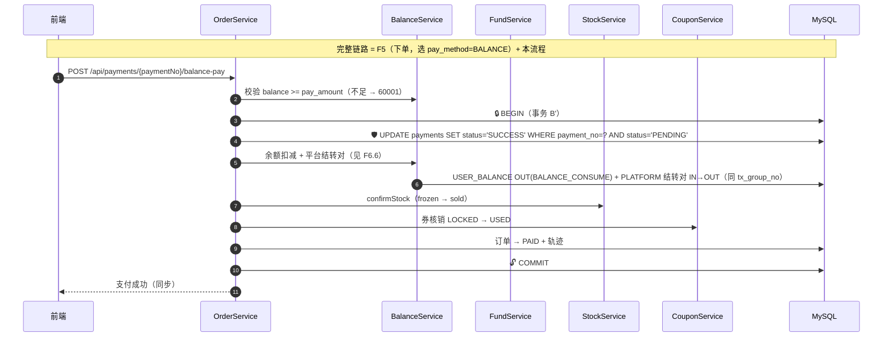
```mermaid
sequenceDiagram
    autonumber
    participant C as 前端
    participant OS as OrderService
    participant BS as BalanceService
    participant FS as FundService
    participant SS as StockService
    participant CS as CouponService
    participant DB as MySQL

    note over C,DB: 完整链路 = F5（下单，选 pay_method=BALANCE）+ 本流程
    C->>OS: POST /api/payments/{paymentNo}/balance-pay
    OS->>BS: 校验 balance >= pay_amount（不足 → 60001）
    OS->>DB: 🔒 BEGIN（事务 B'）
    OS->>DB: 🛡 UPDATE payments SET status='SUCCESS' WHERE payment_no=? AND status='PENDING'
    OS->>BS: 余额扣减 + 平台结转对（见 F6.6）
    BS->>DB: USER_BALANCE OUT(BALANCE_CONSUME) + PLATFORM 结转对 IN→OUT（同 tx_group_no）
    OS->>SS: confirmStock（frozen → sold）
    OS->>CS: 券核销 LOCKED → USED
    OS->>DB: 订单 → PAID + 轨迹
    OS->>DB: 🔓 COMMIT
    OS-->>C: 支付成功（同步）
```

### F15.2 余额退款（事务 C'）

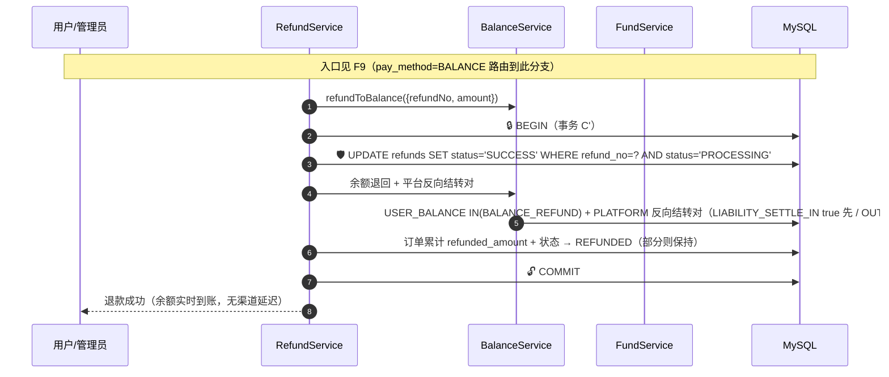
```mermaid
sequenceDiagram
    autonumber
    participant C as 用户/管理员
    participant RS as RefundService
    participant BS as BalanceService
    participant FS as FundService
    participant DB as MySQL

    note over C,DB: 入口见 F9（pay_method=BALANCE 路由到此分支）
    RS->>BS: refundToBalance({refundNo, amount})
    RS->>DB: 🔒 BEGIN（事务 C'）
    RS->>DB: 🛡 UPDATE refunds SET status='SUCCESS' WHERE refund_no=? AND status='PROCESSING'
    RS->>BS: 余额退回 + 平台反向结转对
    BS->>DB: USER_BALANCE IN(BALANCE_REFUND) + PLATFORM 反向结转对（LIABILITY_SETTLE_IN true 先 / OUT false 后）
    RS->>DB: 订单累计 refunded_amount + 状态 → REFUNDED（部分则保持）
    RS->>DB: 🔓 COMMIT
    RS-->>C: 退款成功（余额实时到账，无渠道延迟）
```

### F15.3 余额支付失败 / 关单回滚

| 场景 | 处理 | 记账 |
| --- | --- | --- |
| 余额不足（支付前校验） | 直接拒绝（60001），不进入事务 | 无 |
| 支付中异常回滚 | 事务 B' 回滚，支付单回 PENDING | 无（未写流水） |
| 关单/取消（已余额支付） | 触发退款，路由 BALANCE → 走 F15.2 退回 | USER_BALANCE IN + 反向结转对（负债回增、收入回减） |
| 余额支付订单整单退款返券 | 同 F9.3 整单退款 | 券 `USED → UNUSED` + 余额退回 |

> **关键不变量**：余额支付的「消费」与「退款」必须成对维护 `tx_group_no` 结转对，使 L2/L3 恒等式在任何退款场景下都不漂移（论证见 `03-database.md` §3.6.4 ⑤）。

---

## 附录 A：实现阶段高风险点 Top 3（架构师提示）

| 风险 | 为什么难 | 缓解措施 |
| --- | --- | --- |
| **① 并发库存（超卖）** | 三个机制要配合而非互相依赖；Redis 锁误用（当成权威）会直接造成超卖；热点 SKU 的 CAS 重试风暴 | ① 权威判定只能是事务内 CAS；② 多 SKU 按 `sku_id` 升序加锁防死锁；③ 集成测试 `order-concurrency.spec.ts` 必跑（100 并发抢库存 10）；④ `CHECK` 约束 + 巡检告警兜底 |
| **② 回调幂等与余额快照** | 渠道重复通知 + 事务重试 + 并发回调，任一环节漏掉幂等就会重复入账；`before/after` 余额必须严格连续 | ① 幂等表 + 业务状态机 + 流水唯一索引**三重保险**；② `FOR UPDATE` 锁账户串行记账；③ 固定加锁顺序（先账户后余额更新）；④ 测试 `payment-callback-idempotent.spec.ts`（重复回调 10 次仅 1 条 IN 流水）+ `fund-reconcile.spec.ts` |
| **③ 事务边界与长事务** | 事务 A/B 跨 6~9 张表，持有行锁时间长；把第三方调用（HTTP）放进事务会导致锁等待雪崩 | ① 事务内**禁止**任何外部 HTTP 调用，渠道 `closePayment`/`refund` 一律提交后异步；② 事务超时设 10s，超时即回滚；③ 监控慢事务与锁等待；④ 各流程的回滚点在本文档已逐条标注，实现时逐条对照 |
| **④ [v2] 余额负债确认收入的正确性** | 余额本质是平台对用户的负债；消费时现金不动，需在账上「确认收入」；结转对写错方向/`is_liability` 会让收入与负债串味，且无法靠简单余额对账发现 | ① 严格采用方案 A+（`tx_group_no` + `counterparty_account_id` + `is_liability`，见 `03-database.md` §3.6.4）；② 写入顺序恒「先 IN 后 OUT」，中间态恒为正，避免 `CHECK(balance>=0)` 失败；③ 双视图对账（F11.5）：用户余额账户 + 平台账户（收入 vs 负债分层）；④ L1/L2/L3 恒等式每日断言，`fund-reconcile.spec.ts` 必跑 |

## 附录 B：流程与验收标准对照

| PRD 成功标准 | 对应流程 | 验证方式 |
| --- | --- | --- |
| 交易闭环（注册 → 确认收货全程跑通） | F1 → F3 → F4 → F5 → F6 → F10 | 端到端手工/自动化用例 |
| 资金可溯源（输入订单号还原全部流水） | **F11** | `fund-reconcile.spec.ts` + 后台对账页 |
| 防超卖（100 并发抢库存 10） | **F5** | `order-concurrency.spec.ts` |
| 幂等（重复提交只产生一次结果） | F5 / F6 / F9 | `idempotency.spec.ts` + `payment-callback-idempotent.spec.ts` |
| 后台可用（上架/库存/发货/退款审核/流水查询） | F3 / F8 / F9 / F10 / F11 | 后台功能用例 |
| 第三方可切换（配置一键切 mock/真实） | `02-architecture.md` §6 | 改环境变量重启，业务代码零改动 |
| 工程规范（统一响应/异常/日志 traceId/脱敏） | `02-architecture.md` §5 | 中间件集成测试 + 日志抽检 |
| **[v2] 优惠券/促销端到端** | F5（引擎+券冻结）→ F6（核销）/ F13（领取）/ F9（退券） | `price-engine.spec.ts`（恒等式 E1~E10）+ `coupon-lifecycle.spec.ts` |
| **[v2] 动态角色管理台** | 后台流程统一 `authorize('资源:操作')`（F8/F9/F10/F11/F13/F14） | `rbac.spec.ts`（敏感权限实时判定、缓存 60s 失效） |
| **[v2] 银行卡支付** | F6（渠道路由 → 聚合服务商托管收银台） | `bankcard-adapter.spec.ts`（卡号不落库/日志）+ 生产 T+1 对账 |
| **[v2] 余额账户 + 充值 + 消费** | F14（充值）/ F15（余额支付+退款） | `balance-account.spec.ts` + F11.5 双视图对账（`balance-liability.spec.ts`） |
| **[v2] 单一支付 / 退款单源** | F6（pay_method 路由）/ F9.3（按 pay_method 退） | 混合支付用例必须全部失败（`pay_method` 单值约束） |
