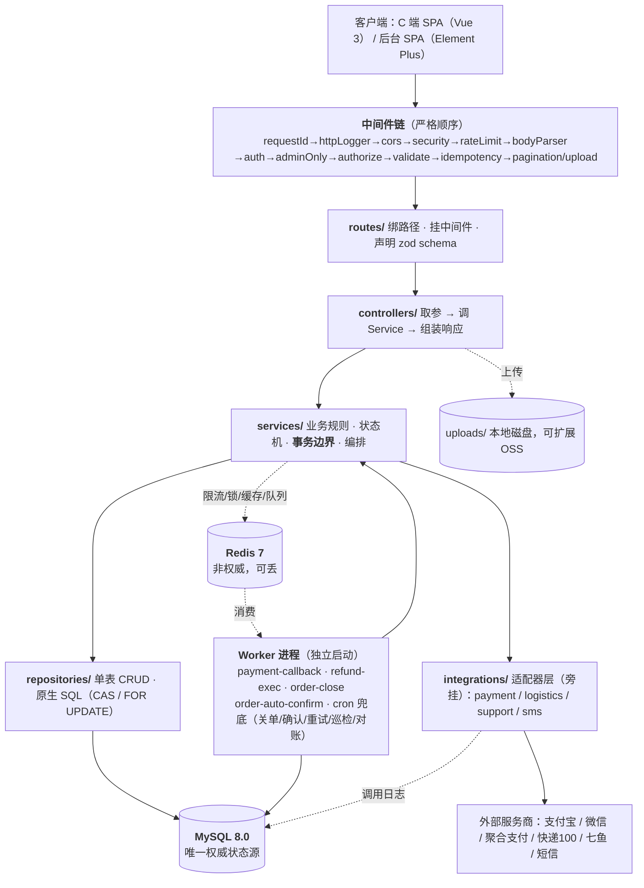
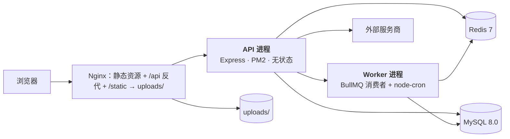
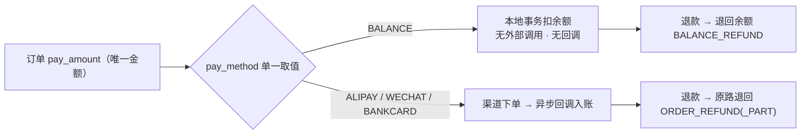
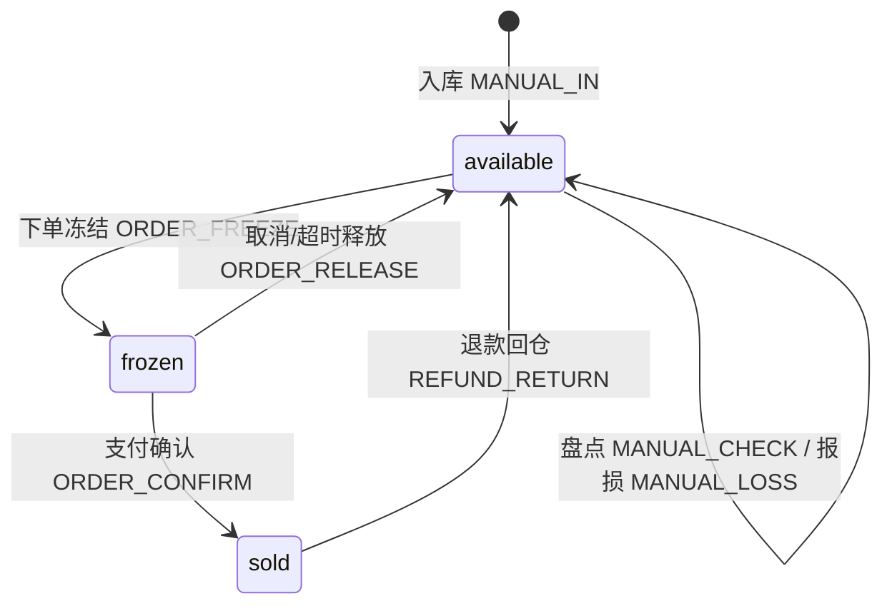
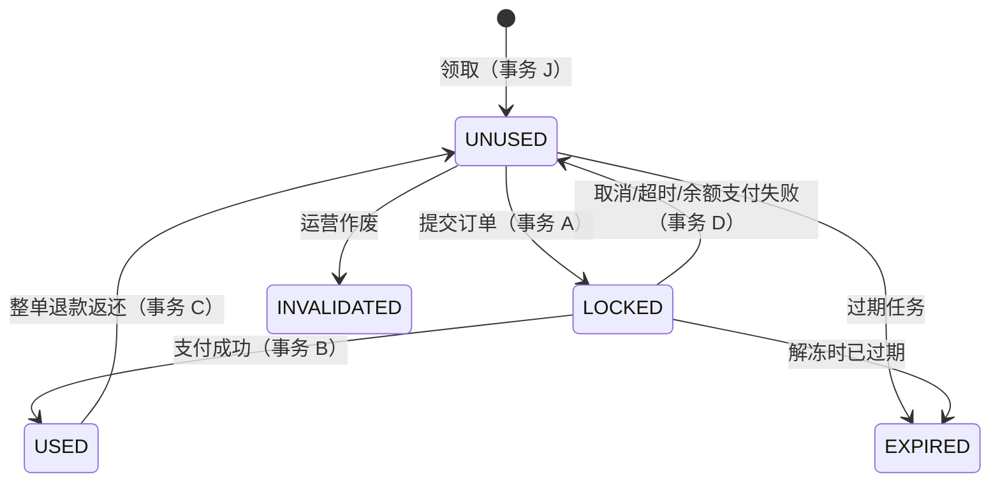
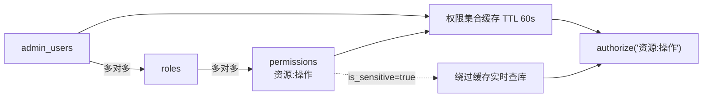

# 电商商城系统 · 项目功能说明

| 项 | 内容 |
| --- | --- |
| 版本 | v1.0（设计基线 v2.0 / PRD v1.1 的**只读说明书**，不定义新规则） |
| 项目名 / 读者 | `shop_web` ／ 接手项目的开发者、客户方技术人员 |
| 设计基线 | `01-PRD.md` v1.0 + `05-PRD-变更.md` v1.1 + `02-architecture.md` v2.0 + `03-database.md` v2.0 + `04-flows.md` v2.0 |

> 与设计文档冲突时以设计文档为准；设计文档之间的出入已列入 §7，未经拍板不得自行选定。

---

## 1. 项目概述

### 1.1 定位与两阶段规划

单商户自营 B2C 商城。C 端提供「浏览 → 加购 → 结算 → 支付 → 收货 → 售后」完整链路；后台提供商品、库存、订单、退款、资金、优惠券、促销、角色权限、支付渠道的运营管理能力。

| 阶段 | 范围 | 状态 |
| --- | --- | --- |
| **一期 · 商城核心** | 用户 / 商品 / 购物车 / 订单 / 支付 / 资金 / 退款 / 优惠券 / 促销 / RBAC / 余额充值 / 集成层 / 定时任务 | **本期交付** |
| **二期 · 积分体系** | 积分账户与流水、积分抵扣、发放与退回、有效期清理 | **不实现**，仅预留扩展点（§5） |

一期取舍：**单商户自营**（无多商户、无分账）、**单一支付方式**（无混合支付）、**下单冻结库存**、**资金权威源在 MySQL**。明确不做：提现、全文检索、评价、商品审核流、多规格图片。

### 1.2 技术栈

| 层 | 选型 |
| --- | --- |
| 前端 | Vue 3 ^3.4 + Vite ^5.2 + Pinia + Vue Router 4；后台 Element Plus ^2.7，C 端自研 SCSS（BEM）；axios / dayjs / lodash-es |
| 运行时 / 框架 | Node.js 20.x LTS + TypeScript ^5.4 + Express ^4.19（四层：routes / controllers / services / repositories） |
| ORM / 数据库 | Prisma ^5.22 + MySQL 8.0（交互式事务；CAS 与 `FOR UPDATE` 走原生 SQL） |
| 校验 / 鉴权 | zod ^3.23、jsonwebtoken ^9.0、bcrypt ^5.1（cost 12） |
| 日志 / 链路 | winston + daily-rotate-file；AsyncLocalStorage 透传 `requestId` |
| 缓存 / 队列 | Redis 7.x + ioredis ^5.4；**BullMQ ^5.13**（异步队列 + 延迟任务）；node-cron ^3.0 兜底扫描 |
| 工程 | multer、sanitize-html、helmet、exceljs；Jest + supertest 集成测试；PM2 / Docker |

### 1.3 文档导航

| 文档 | 职责 | 何时读 |
| --- | --- | --- |
| `overview.md` | 交付总览、v2 关键决策、高风险点 | 首次接手 |
| `docs/01-PRD.md` | 需求池（P0/P1/P2）、业务规则、线框 | 了解「为什么」 |
| `docs/05-PRD-变更.md` | 四项客户变更 + 取消混合支付的增量 PRD | 查券 / RBAC / 支付 / 余额规则 |
| `docs/02-architecture.md` | 技术选型、目录结构、统一约定、适配器、安全、队列、优惠引擎 | 建文件、写公共能力前 |
| `docs/03-database.md` | 38 个 Prisma 模型、逐表说明、枚举、ER 图、一致性铁律 | 建 schema、写 SQL 前 |
| `docs/04-flows.md` | F1~F15 时序图、事务边界、订单状态机 | 实现业务流程前 |
| `docs/06-开发进度.md` | **唯一权威进度源**：任务总表与状态 | 每次开工 / 收工 |
| `docs/07-开发流程记录.md` | 时间线式技术决策日志 | 中断恢复、追溯原因 |
| `docs/08-项目功能说明.md` | **本文件**：系统全貌与模块职责 | 快速理解系统 |
| `docs/09-使用文档.md` | 环境准备、启动运行、基本操作 | 部署与验收 |

---

## 2. 系统架构

### 2.1 分层架构



| 层 | 能做 | 禁止 |
| --- | --- | --- |
| `routes/` | 绑路径、挂中间件、声明 zod schema | 写业务逻辑 |
| `controllers/` | 取参、调 Service、组装响应 | 直连 Repository、写事务、写 SQL |
| `services/` | 业务规则、状态机、**事务边界**、编排 | 接触 `req` / `res` |
| `repositories/` | 单表 CRUD、原生 SQL、查询构造 | 业务规则、跨领域编排 |
| `integrations/` | 协议转换、签名、超时重试 | 直连 Repository（结果由 Service 落库） |

### 2.2 一次请求的完整链路（以 `POST /api/orders` 下单为例）

| # | 环节 | 要点 |
| --- | --- | --- |
| 1-4 | `requestId` → `httpLogger` → `cors` → `security` | 生成/透传 `X-Request-Id` 写 `AsyncLocalStorage`；白名单 CORS；helmet + hpp + 请求体 1mb |
| 5-6 | `rateLimit` → `bodyParser` | Redis 令牌桶（下单 10 次/1min、50 次/1h，Redis 故障 fail-open）；回调路由保留 `rawBody` 供验签 |
| 7-9 | `auth` → `validate` → `idempotency` | JWT 解析；zod `strict()` 拒绝未知字段；抢占 `Idempotency-Key`（scope `ORDER_CREATE:{userId}`），命中即回放 |
| 10 | **事务外** `PriceService.calculate()` | 重算价格 → 促销 → 券 → 分摊到行 → 运费 → 断言 E1~E10 |
| 11 | **事务 A** | 券冻结 → 库存 CAS 冻结 → 建单 + 订单行 + 状态轨迹 → 删购物车行 → 写幂等记录 |
| 12 | **事务外** | 注册 `order-close` 延迟 job（30min）；投递 `notify` 队列；**禁止在事务内做第三方 HTTP** |
| 13-14 | 响应 / 异常 | `ok(data)` = `{code,message,data,requestId,timestamp}`，BigInt 金额转 number；异常交全局 `errorHandler` |

> 事务内**禁止任何第三方 HTTP 调用**；外部调用一律提交后执行或投递队列。事务超时 10s。

### 2.3 部署拓扑



**部署约定**：**单机部署**，架构按多实例预留（服务无状态）；API 与 Worker **必须分离启动**，避免长任务拖慢 API；BullMQ 天然单消费者，cron 靠 Redis 锁选主（`SET NX PX`，TTL 55s < 间隔 60s）；`jobs/bootstrap.ts` 启动后立即做一次全量补偿扫描；多实例前提是 Redis 独立实例且已持久化。

---

## 3. 核心模块与功能职责

> 统一四段式：**职责 → 涉及数据表 → 关键流程（F 编号见 `04-flows.md`）→ 主要对外接口**。

### 3.1 用户域
- **职责**：手机号 + 密码注册登录；JWT 双 token（access 2h / refresh 7d）签发、轮换、重放检测、吊销；`token_version` 强制下线；地址 CRUD 与默认地址互斥；注册时同事务开 `USER_BALANCE` 账户。
- **表**：`users`、`addresses`、`refresh_tokens` ｜ **流程**：F1（注册/登录/刷新）、F2（地址，默认地址互斥事务 G） ｜ **接口**：`/api/auth/*`、`/api/user/profile`、`/api/addresses/*`

### 3.2 商品域
- **职责**：三级分类树；SPU/SKU 管理与查询；库存三段式管理与手工调整；库存流水；上传落盘。
- **表**：`categories`、`products`、`product_specs`、`product_images`、`skus`、`sku_stocks`、`stock_logs`、`upload_files` ｜ **流程**：F3（查询，Redis 缓存 + 失效） ｜ **接口**：`/api/{categories,products}/*`、`/api/upload`、`/admin/{categories,products,skus,stock,stock-logs}/*`

### 3.3 购物车
- **职责**：加购 / 改量 / 勾选 / 删除；未登录存 `localStorage`，登录后合并（同 SKU 累加，上限 999）；结算前校验失效与价格变动。
- **表**：`cart_items`（唯一键 `(user_id, sku_id)`） ｜ **流程**：F4 ｜ **接口**：`/api/cart/*`

### 3.4 订单域
- **职责**：下单（服务端重算价 + 优惠分摊 + 库存 CAS 冻结 + 建单）；状态机跃迁白名单；取消 / 超时关单；发货；确认收货与自动确认；轨迹留痕。
- **表**：`orders`、`order_items`、`order_status_logs`、`order_coupon_records`、`sku_stocks`、`stock_logs`、`cart_items` ｜ **流程**：F5（事务 A）、F7（超时关单，事务 D）、F8（取消）、F10（发货/确认，事务 E）、F12（状态机总图） ｜ **接口**：`/api/orders/*`、`/api/logistics/trace`、`/admin/orders/*`

### 3.5 支付域
- **职责**：创建支付单并按 `pay_method` 路由渠道；**统一异步回调**（验签 → 落日志 → 投递队列 → 立即应答）；回调幂等三重保险；入账事务（订单状态 + 库存 `frozen→sold` + 资金流水 + 券核销）；支付方式管理。
- **表**：`payments`（`biz_type` ∈ `ORDER`/`RECHARGE`）、`payment_methods`、`integration_call_logs`、`idempotency_records` ｜ **流程**：F6（事务 B 渠道 / B' 余额）、F6.5 渠道路由、F6.7 异步回调链路 ｜ **接口**：`/api/payments/*`、`/internal/callbacks/payment/:provider`、`/admin/payment-methods/*`

### 3.6 资金域
- **职责**：双账户体系（`PLATFORM_CASH` 全局 1 条 + `USER_BALANCE` 每用户 1 条）；记账（`FOR UPDATE` 锁账户 + 余额快照 + 只增不改不删的流水）；**负债结转对**；冲正；单笔订单资金全景还原与对账。
- **表**：`fund_accounts`、`fund_transactions` ｜ **流程**：F6（记账 B/B'）、F11（对账双视图）、F14（充值记账）、F15（余额支付记账） ｜ **接口**：`/api/user/fund/transactions`、`/admin/fund/{transactions,reconcile,accounts}`

### 3.7 退款域
- **职责**：退款申请（全额/部分）、审核、执行（渠道调用在事务外）、失败重试、退款行明细与优惠退还、整单退返还券。
- **表**：`refunds`、`refund_items`、`order_items`、`payments`、`fund_transactions`、`order_coupon_records` ｜ **流程**：F9（事务 C 渠道 / C' 余额）、F9.2 重试、F9.3 按 `pay_method` 路由 ｜ **接口**：`/api/refunds/*`、`/admin/refunds/*`

### 3.8 优惠券域
- **职责**：券模板 CRUD 与发放；领券（`issued_count` 原子扣减）；券状态机（领取/冻结/核销/解冻/返还/过期/作废）；用券记录与快照留痕。
- **表**：`coupon_templates`、`coupon_template_scopes`、`coupons`、`coupon_use_logs`、`order_coupon_records` ｜ **流程**：F13（领取与使用）、F5.5（下单冻结）、F6（支付核销）、F9（退款返还） ｜ **接口**：`/api/coupons/*`、`/admin/coupons/*`

### 3.9 促销域
- **职责**：活动与规则管理（满减/满折/限时折扣）；适用范围配置；在计算管道中提供**行级**与**订单级**优惠；命中择优（力度最大，不叠加）。
- **表**：`promotions`、`promotion_rules`、`promotion_scopes` ｜ **流程**：F5（优惠计算引擎调用点） ｜ **接口**：`/api/promotions/*`、`/admin/promotions/*`

### 3.10 RBAC 权限域
- **职责**：权限点 / 角色 / 角色-权限 / 管理员-角色四张关联表管理；`authorize('资源:操作')` 运行时校验；权限缓存与实时失效；数据权限（`ALL`/`SELF`）注入；变更审计。
- **表**：`admin_users`、`roles`、`permissions`、`role_permissions`、`admin_user_roles`、`operation_logs` ｜ **流程**：贯穿全部 `/admin/*`（规则见架构 §7.2、数据库 §3.10） ｜ **接口**：`/admin/{roles,permissions,admins,operation-logs}/*`

### 3.11 余额与充值域
- **职责**：余额开户与查询；余额明细（充值/消费/退款/赠送/调账/冲正）；充值单创建与入账；余额支付（本地扣减 + 负债结转对）；余额退款；支付密码校验与锁定；后台手工调账。
- **表**：`fund_accounts`（`USER_BALANCE`）、`fund_transactions`、`recharge_orders`、`payments`（`biz_type=RECHARGE`） ｜ **流程**：F14（充值，事务 I）、F15（支付/退款，事务 B'/C'）、F6.6（余额支付记账） ｜ **接口**：`/api/balance/*`、`/api/recharges/*`、`/admin/balance/*`、`/admin/recharges/*`

### 3.12 第三方集成层
- **职责**：适配器模式隔离外部协议差异，业务代码零改动切换服务商；统一超时（连 3s / 读 5s）、重试（幂等接口 2 次，指数退避）、熔断、降级、调用日志。
- **表**：`integration_call_logs`（回调必落，P0） ｜ **切换**：改环境变量 `SHOP__ADAPTER__PAYMENT__PROVIDER=alipay` + 补密钥，缺密钥启动即 fail-fast

| 适配器 | provider 选项 | 统一方法 |
| --- | --- | --- |
| `PaymentAdapter` | `mock` / `alipay` / `wechat` / `bankcard`（聚合服务商） | `createPayment`、`queryPayment`、`refund`、`closePayment`、`verifyCallback` |
| `LogisticsAdapter` | `mock` / `kuaidi100` / `kuaidiniao` | `queryTrace`、`subscribe` |
| `SupportAdapter` | `mock` / `qiyu` | `createSession`、`sendMessage`、`getMessages`、`closeSession` |
| `SmsAdapter` | `mock` / `aliyun` / `tencent` | `sendVerifyCode`、`sendNotify` |

### 3.13 定时任务

| Job | 触发 | 职责 |
| --- | --- | --- |
| `closeTimeoutOrder` | delayed（30min）+ cron 1min | 超时关单、释放冻结库存、解冻券（事务 D） |
| `autoConfirmReceipt` | delayed（15 天）+ cron 1h | 自动确认收货（事务 E） |
| `retryRefund` | cron 5min | 重试 `FAILED` 退款单，上限 5 次 |
| `cleanupIdempotency` / `cleanupRefreshToken` | cron 1h / 1d | 清理过期幂等记录 / 过期 refresh token |
| `scanStockAnomaly` | cron 10min | 库存恒等式与负数巡检，只告警不改数 |
| `dailyReconcile` | cron 每日 02:00 | 全量对账（P2） |

> BullMQ 天然单消费者；cron 靠 Redis 锁选主。**所有 job 与兜底扫描必须共用同一个幂等函数**。Job data 携带 `requestId`，Worker 消费时重建 `AsyncLocalStorage` 上下文。

---

## 4. 关键业务规则

### 4.1 单一支付与退款路由（无混合支付）



| 规则 | 说明 |
| --- | --- |
| 支付方式 | **单选**：余额 / 支付宝 / 微信 / 银行卡 / mock，`pay_amount` 全额由选中那一种支付 |
| 支付单 | 一订单**有且仅有 1 条 SUCCESS 支付单**；`PENDING`/`CLOSED` 的多次尝试可有多条，无父子结构 |
| 余额支付 | **不是第三方渠道**：不走适配器、无外部 HTTP、无回调，在下单事务内直接扣减记账 |
| 余额退款 | 写 `BALANCE_REFUND`（IN）+ 加余额，本地事务即时到账，**不调渠道 `refund`** |
| 渠道退款 | 调该渠道 `refund` 原路退；**不允许改退余额**（一期不做提现，退余额等于变相提现） |
| 原路失败 / 银行卡 | 失败后审批改退余额（P1）：super_admin 审批 + 审计 + 告知用户；银行卡走**聚合支付服务商**（非直连银联），托管收银台规避 PCI-DSS，**卡号不落地** |

### 4.2 金额恒等式 E1~E10 与优惠分摊

`PriceService` 返回前**逐条 assert**，任一不成立即抛 `BusinessError`，绝不允许带着算错的金额进入下单事务。

| # | 恒等式 | # | 恒等式 |
| --- | --- | --- | --- |
| E1 | `goods_amount = Σ(行 price × qty)`（服务端重算，**不信前端**） | E6 | `pay_amount ≥ 0` 且 `≥ freight_amount` |
| E2 | `discount_amount = promo_discount + coupon_discount` | E7 | `Σ(行 actual_amount) = goods_amount - discount_amount` |
| E3 | `discount_amount = Σ(行 discount_amount)` —— **必须完整分摊到行**，是部分退款能算清的前提 | E8 | `refund_amount ≤ pay_amount - already_refunded` |
| E4 | `pay_amount = goods_amount - discount_amount + freight_amount` | E9 | 部分退款 = `Σ(退款行 actual_amount) + 分摊运费`（**按行退已分摊优惠，非原价**） |
| E5 | `discount_amount ≤ goods_amount`（**运费不参与优惠**），超出 clamp 并告警 | E10 | `pay_amount = Σ(IN 流水) - Σ(OUT 流水)`（按 `order_no` 聚合） |

**计算管道（顺序不可调换）**：商品原价小计 → 促销优惠 → 券优惠（门槛基于**促销后**金额）→ **分摊到行**（断言 E3）→ 运费（满 9900 分包邮，否则 1200 分；基数为优惠后商品金额）→ 恒等式全量校验。

**分摊算法**（`MoneyUtil.allocate`）：按行「促销后金额」为权重 `bigint` 向下取整，**尾差加到权重最大的行**（并列取行号最小者）；单分摊额超权重则截断并按同规则补给其它行。结果写入 `order_items.allocated_discount`，**退款时只读不重算**。

> **强制**：结算页预览与下单**必须调用同一个 `calculate()`**；禁止前端传金额、禁止下单时走另一套简化逻辑。

### 4.3 库存三段式与并发 CAS



| 项 | 约定 |
| --- | --- |
| 三段 | `total = available + frozen + sold`；`CHECK` 约束 + `scanStockAnomaly` 巡检双重保障 |
| 扣减时机 / 权威判定 | **下单冻结**（`stock.deductMode='order'`）；事务内 CAS `WHERE available >= ? AND version = ?`；**Redis 锁只削峰，锁失效不产生超卖** |
| 防死锁 / 流水 | 多 SKU 按 `sku_id` **升序**；事务内加锁顺序「**先券后库存**」；任何变动必写 `stock_logs`（前后三段值），唯一索引 `(sku_id, idempotency_key)` |

### 4.4 优惠券状态机



| 流转 | 所属事务 | 同事务还要写 |
| --- | --- | --- |
| 领取 → `UNUSED` | 事务 J | `coupon_templates.issued_count` CAS +1；`coupon_use_logs`(CLAIM)；幂等记录 |
| 冻结 `UNUSED`→`LOCKED` | **事务 A（创建订单）** | `orders.coupon_id`；`order_coupon_records`；`coupon_use_logs`(LOCK) |
| 核销 `LOCKED`→`USED` | 事务 B（支付入账） | `used_count` +1；`coupon_use_logs`(USE)；订单状态轨迹 |
| 解冻 `LOCKED`→`UNUSED` | 事务 D（关单/取消） | `coupon_use_logs`(UNLOCK)；库存释放；支付单 CLOSED |
| 返还 `USED`→`UNUSED` | 事务 C（**仅整单退**） | `order_coupon_records.restored_at`；`refunds.restore_coupon=true`；`coupon_use_logs`(RESTORE) |

- **并发占券**靠条件更新 `WHERE id=? AND status='UNUSED'`，`affectedRows=0` 即已占用，拒绝下单。
- 冻结必须与建单**同事务**，否则存在「订单建成但券没锁上」的窗口，可致一券多用。
- **券状态与核销禁止走 Redis**，必须 MySQL 事务内条件更新。

### 4.5 资金记账模型（方案 A+）

**命题**：用户余额是**平台对用户的负债**。钱在充值时已进平台账户，但那是负债不是收入；用户拿余额消费时平台**没有新增现金**，收入必须在账上被「确认」出来。
**方案**：单式流水 + 对手方（`counterparty_account_id`）+ 交易组号（`tx_group_no`）+ 负债标记（`is_liability`），用 3 个字段拿到复式记账的核心语义。

| # | 恒等式 | 含义 |
| --- | --- | --- |
| L1 | `PLATFORM.balance = Σ(IN) - Σ(OUT)` | 平台余额 = 实际持有现金（含代管的用户钱） |
| L2 | `Σ 全体用户余额 = Σ PLATFORM 流水中 is_liability=true 的净额` | **余额总额 = 平台负债总额** |
| L3 | `平台真实收入 = Σ PLATFORM 流水中 is_liability=false 的净额` | 收入口径不被负债污染 |

**余额消费的「负债结转对」**（同一 `tx_group_no` 下 3 条流水）：① `USER_BALANCE` / `BALANCE_CONSUME` / OUT / `false` → 用户余额 −N；② `PLATFORM_CASH` / `LIABILITY_SETTLE_IN` / **IN** / **false** → **收入 +N**；③ `PLATFORM_CASH` / `LIABILITY_SETTLE_OUT` / **OUT** / **true** → **负债 −N**。

**三条硬约定**（违反会触发 DB `CHECK` 失败或账目漂移）：① **结转对必须成对**，同 `tx_group_no` 下 IN 与 OUT 金额相等、方向相反；② **写入顺序严格「先 IN 后 OUT」**，反过来会让中间态平台余额瞬间为负而触发 `CHECK(balance >= 0)` 使整个事务失败；③ **`is_liability` 语义固定** —— `LIABILITY_SETTLE_IN`→false（收入）、`_OUT`→true（负债）、`PLATFORM_RECHARGE_IN`→true（收款即负债）、`ORDER_PAY`→false（真收入），**`USER_BALANCE` 账户流水恒 false**。退款与调账补记写**反向结转对**（负债增、收入减），`is_liability` 取值相反，IN/OUT 顺序仍为「先 IN 后 OUT」。

### 4.6 支付回调统一异步（BullMQ）

```
渠道 POST → ① 验签（失败 400，不入队）→ ② 落 integration_call_logs（脱敏）
          → ③ 投递 payment-callback（jobId=${channel}:${channelTxNo}）→ ④ 立即应答渠道（目标 < 200ms）
──── 以上同步 / 以下异步 ────
Worker → ⑤ 幂等三重保险（jobId 去重 → idempotency_records 抢占 → 支付单状态机）
       → ⑥ 事务：订单状态 / 库存 frozen→sold / 券核销 / 资金流水 / 状态轨迹 → ⑦ 提交 → 事务外通知
```

| 项 | 约定 |
| --- | --- |
| 为何必须异步 | 微信 APIv3 强制 **5 秒内**应答，否则判失败并重试（最多 15 次）；入账事务涉多表写入，库压力下无法保证 5s。**一次超时就引发渠道重复回调** |
| 统一走异步 | **mock 与支付宝也走异步**。两条路径并存会导致幂等与回滚逻辑维护两遍 |
| 幂等权威源 | 仍是 DB（`idempotency_records` scope `PAY:{orderNo}` + 支付单状态机 + `fund_transactions` 唯一索引）；**队列只削峰去重，不作为幂等权威** |
| 事务内禁外部调用 / 死信 | 先本地提交，再调渠道/通知；超最大重试进 `failed` 并告警，后台提供「异常回调重放」入口（需 `fund:reconcile` 权限） |
| 兜底 | cron 每分钟扫异常订单；**兜底逻辑必须与 Worker 共用同一个幂等函数** |

### 4.7 动态 RBAC



| 项 | 约定 |
| --- | --- |
| 模型 / 权限点 | 管理员 ⇄ 角色 ⇄ 权限点，均为多对多（4 张关联表 + `admin_users`）；编码 `资源:操作`（如 `order:ship`、`order:refund:audit`），一期约 **50 个**，`module` 用于前端权限树分组 |
| 校验 / **禁止按角色名判断** | `authorize('order:ship')`（多个为「与」）、`authorize.any(...)`（「或」）；`if (role === 'ADMIN')` 一律禁止，只判权限点编码，Code Review 必查 |
| 敏感权限 | `is_sensitive=true`（`refund:audit`/`balance:adjust`/`fund:reconcile`/`rbac:*`/`pay:channel:*`）**绕过缓存实时查库** |
| 缓存 / 降级 | TTL 60s；角色/权限/绑定变更时反查受影响管理员立即 `DEL`，**变更实时生效**；Redis 不可用降级为**直查 DB**，不降级为放行 |
| 超级管理员 | `SUPER_ADMIN`（`is_builtin`）短路放行全部权限点；不可删除、不可改权限、不可解绑最后一个持有者 |
| 数据权限 / C 端 | `data_scope` ∈ `ALL`/`SELF`，在 **Repository 层**注入 `where`，Service 禁止绕过；买家不进 RBAC，靠 `where:{userId}` 行级隔离，越权返回 `AuthError(10009)` 403 |

### 4.8 跨模块一致性铁律

① 状态跃迁走 `OrderStateMachine.transition()`，禁止直接 `update status`；② 订单状态变更必须在同一事务写 `order_status_logs`；③ 库存变动必写 `stock_logs`（记录前后三段值）；④ 资金流水只增不改不删，改账走 `REVERSAL`；⑤ 余额快照连续（`before_balance` = 上一条 `after_balance`，靠 `FOR UPDATE` 串行化）；⑥ 金额全链路整数分（`BIGINT` 存储、`bigint` 运算，**禁浮点与小数元**，比例用万分比整数）；⑦ **权威在 DB**，Redis 锁/缓存失效不得导致资损。

---

## 5. 二期预留扩展点

> 以下**本期不实现**，但架构已留口子。一期只需保证对应位置不写死。

| 扩展点 | 预留位置 | 一期状态 |
| --- | --- | --- |
| **积分体系** | `orders.point_deduct_amount` + `PriceService` 扣减项 | 建字段，**恒为 0**；结算页展示「积分抵扣 ¥0.00（二阶段）」占位行 |
| 订单完成事件钩子 | `core/eventBus.ts` 的 `order.completed` | 建事件总线 + 空监听器；确认收货时 `emit`，无副作用 |
| 积分流水骨架 | `fund_transactions.account_type` 含 `POINT` 扩展位 | 一期只产生 `PLATFORM_CASH`；二期建 `point_transactions` 或按 `account_type` 分流 |
| 积分账户 / 开关 | 二期建 `point_accounts`；`SHOP__POINT__ENABLED` | **不建表**；开关恒 `false`，积分分支短路 |
| 积分有效期与退回 | 二期 `expirePoints.job.ts` + 退款按比例退回 | 不涉及 |
| **分账** / **提现** | 一期单商户自营（`PAYC-16` P2）；`BALANCE_WITHDRAW` 已占位 | 均不做；余额保持「充值 → 消费 → 退款退回」单向 |
| **全文检索** | `prisma/sql/002_add_fulltext_index.sql` | 一期用 `LIKE 'kw%'` 前缀匹配 |

**一期必须避免的反模式**：① 恒等式写死为「商品金额 − 优惠 + 运费」而漏掉积分项；② 确认收货里直接写业务而无事件钩子；③ `account_type` 写死字符串不走枚举。

---

## 6. 术语表

### 6.1 订单

| 枚举 | 取值与释义 |
| --- | --- |
| `OrderStatus` | `PENDING_PAYMENT` 待支付（`expire_at` 30min）→ `PAID`/`CANCELLED`；`PAID` 已支付待发货 → `SHIPPED`/`REFUNDING`/`CANCELLED`；`SHIPPED` 已发货 → `COMPLETED`/`REFUNDING`；`COMPLETED` 已完成（7 天售后期）→ `REFUNDING`；`REFUNDING` 退款中 → `REFUNDED` 或回退；`CANCELLED`、`REFUNDED` 为终态 |
| `CancelReason` | `USER_CANCEL` 用户取消 / `ADMIN_CANCEL` 管理员 / `TIMEOUT` 超时 / `SYSTEM` 系统补偿 |

### 6.2 支付与退款

| 枚举 | 取值与释义 |
| --- | --- |
| `PayStatus` | `PENDING` 待支付 / `SUCCESS` 成功 / `CLOSED` 已关闭 / `FAILED` 失败 / `REFUNDED` 已全额退款 |
| `RefundStatus` | `PENDING` 待审核 / `REJECTED` 已驳回 / `PROCESSING` 退款中 / `SUCCESS` 成功 / `FAILED` 失败（可重试） |
| `RefundType` / `RefundTarget` | `FULL`/`PARTIAL`（**部分退款一期为 P0**）；`BALANCE`/`CHANNEL`（**单一支付下去向唯一，不拆分**） |
| `PayChannel` / `SubChannel` | `MOCK`/`ALIPAY`/`WECHAT`/`BANKCARD`（聚合服务商）/`BALANCE`（余额，本地记账）；`WEB`/`SCAN`/`JSAPI`/`H5`/`GATEWAY`/`QUICK`/`BALANCE` 决定调用渠道哪个接口 |
| `PaymentBizType` / `RechargeStatus` | `ORDER`/`RECHARGE`（`payments` 表共承载）；充值单 `PENDING`/`SUCCESS`/`CLOSED`（`RC` 前缀，30min） |
| `PaymentNotifyStatus` | `RECEIVED`/`QUEUED`/`CONSUMED`/`SKIPPED`/`DEAD` —— 回调只落日志 + 投递队列，由 Worker 推进 |

### 6.3 资金业务类型 `FundBizType`

| 取值 | 中文 | 方向 | `is_liability` | 说明 |
| --- | --- | --- | --- | --- |
| `ORDER_PAY` | 订单支付 | IN | false | 买家付款入账（商品金额 + 运费） |
| `ORDER_REFUND` / `ORDER_REFUND_PART` / `ORDER_CANCEL_REFUND` | 全额退 / 部分退 / 取消退 | OUT | false | 部分退金额 ≤ 剩余可退；取消退独立统计取消率 |
| `CHANNEL_FEE` | 渠道手续费 | OUT | false | mock 阶段恒 0 |
| `FREIGHT_ADD` / `FREIGHT_REFUND` | 运费补收 / 退还 | IN / OUT | false | 补收为 P1 |
| `MANUAL_ADJUST_IN` / `_OUT` | 手工调账补记 / 冲减 | IN / OUT | false | super_admin，必填原因 |
| `REVERSAL` | 冲正 | 与原流水反向 | 同原流水 | 唯一允许的改账方式，必填 `related_tx_no` |
| `PLATFORM_RECHARGE_IN` | 充值-平台收款 | IN | **true** | 钱进平台但属用户，**是负债不是收入** |
| `BALANCE_RECHARGE` / `BALANCE_GIFT` | 充值-余额入账 / 赠送 | IN | false | 对手方 = 平台账户；赠送记营销费用（P1） |
| `BALANCE_CONSUME` | 余额消费 | OUT | false | 记 `USER_BALANCE`，**必须同时写结转对** |
| `LIABILITY_SETTLE_IN` | 负债结转-确认收入 | IN | **false** | 记 `PLATFORM_CASH`，**先写** |
| `LIABILITY_SETTLE_OUT` | 负债结转-冲减负债 | OUT | **true** | **后写**，与上行同 `tx_group_no` 同额 |
| `BALANCE_ROLLBACK` / `BALANCE_REFUND` | 支付回滚 / 退款退余额 | IN | false | 均需**反向结转对** |
| `BALANCE_ADJUST_IN` / `_OUT` | 余额调账补记 / 冲减 | IN / OUT | false | super_admin + 原因 + 二次确认，需结转对 |
| `BALANCE_WITHDRAW` | 余额提现 | OUT | false | **一期不做，占位不用** |

**账户与方向速查**：`PLATFORM_CASH` IN = 现金增加（收款/充值/结转确认收入），OUT = 现金减少（退款/手续费/结转冲减负债）；`USER_BALANCE` IN = 余额增加（充值/赠送/退款退回/回滚/调账补记），OUT = 余额减少（消费/调账冲减/提现）。

### 6.4 库存变动类型 `StockChangeType`

`ORDER_FREEZE` 下单冻结（`available -n` / `frozen +n`）｜`ORDER_CONFIRM` 支付确认（`frozen -n` / `sold +n`）｜`ORDER_RELEASE` 取消或超时释放（`available +n` / `frozen -n`）｜`REFUND_RETURN` 退款回仓（`available +n` / `sold -n`）｜`MANUAL_IN` 手工入库 / `MANUAL_LOSS` 报损 / `MANUAL_CHECK` 盘点（仅动 `available`）。

### 6.5 优惠券、促销与其它

| 枚举 | 取值与释义 |
| --- | --- |
| `CouponStatus` | `UNUSED` 未使用 → `LOCKED` 已锁定（订单已建未付）→ `USED` 已使用；解冻回 `UNUSED`；`EXPIRED` 过期、`INVALIDATED` 作废为终态（整单退款可 `USED`→`UNUSED`） |
| `CouponType` / `CouponValidType` | `FULL_REDUCE` 满减券 / `DISCOUNT` 折扣券（`max_discount` 必填）/ `NO_THRESHOLD` 无门槛券（门槛恒 0）；`FIXED_RANGE` 固定时段 / `AFTER_CLAIM` 领取后 N 天（互斥） |
| `CouponLogBizType` | `CLAIM` / `LOCK` / `UNLOCK` / `USE` / `RESTORE` / `EXPIRE` / `INVALIDATE`（券轨迹动作） |
| `PromotionType` / `PromotionLevel` | `FULL_REDUCE` 满减（订单级）/ `FULL_DISCOUNT` 满折（行级）/ `FLASH_SALE` 限时折扣（行级）；**`ORDER` 需分摊到行，`ROW` 天然归行** |
| `ScopeType` | `ALL` / `CATEGORY` / `PRODUCT` / `EXCLUDE_PRODUCT`（券模板与活动共用语义） |
| `FundAccountType` | `PLATFORM_CASH` 平台现金（全局 1 条）/ `USER_BALANCE` 用户余额负债（每用户 1 条）/ `POINT` 积分（二期） |
| `OperatorType` / `IdempotencyStatus` | `USER`/`ADMIN`/`SYSTEM`（`operator_id` 固定 0）；`PROCESSING`/`SUCCESS`（指纹一致则回放首次响应）/`FAILED` |
| `DataScope` / `StorageType` / `ProductStatus` | `ALL`/`SELF` 数据权限；`LOCAL`/`OSS` 文件存储；`DRAFT`/`PENDING_AUDIT`/`ON_SALE`/`OFF_SALE`（后两者为一期使用） |

**缩写**：SPU 商品聚合 / SKU 最小库存单位 / CAS 条件更新 Compare-And-Swap / RBAC 基于角色的访问控制 / TTL 缓存有效期。

---

## 7. 待补充与已发现的不一致

> 编写本文档时发现的设计文档**口径差异**。本文档按「以数据库与 PRD 变更为准」表述，**正式实现前需客户 / 架构师拍板**。

| # | 问题 | 冲突点 | 建议 |
| --- | --- | --- | --- |
| 1 | **恒等式的扣减层级** | 架构 §5.11 的 E2/E4 用聚合 `discount_amount`；数据库 §3.4 与 PRD 变更 §2.3.8 拆为四级（`row_promo` / `order_promo` / `coupon` / `point_deduct`） | **以四级拆分为准**（库表已按此建字段），实现时展开为四级表达式，保留 E1~E10 编号 |
| 2 | **积分项是否进恒等式** | 数据库 §3.4 含 `point_deduct_amount`；PRD 变更 §2.3.8 恒等式①未含 | 一期恒为 0，**建议公式保留该项**（与架构 §8「不要把恒等式写死而漏掉积分项」一致） |
| 3 | **券状态命名** | 架构 §11.4 写 `AVAILABLE → FROZEN`；数据库 §4.11 与 PRD 变更 §2.3.2 为 `UNUSED → LOCKED` | **以 `UNUSED / LOCKED / USED` 为准**，架构 §11.4 为笔误 |
| 4 | **权限缓存 Key** | 架构 §5.9 `shop:rbac:perms:{id}`、§7.2 `rbac:perms:{id}`、数据库 §3.7 `rbac:perm:{id}` | 统一为 `shop:rbac:perms:{adminUserId}`（符合 §5.9 的 `shop:{domain}:{...}` 规范） |
| 5 | **反向结转对的 DB 约束** | 数据库 §3.6.4 ⑤ 注明：`is_liability = (biz_type='LIABILITY_SETTLE_OUT')` 的 CHECK 只覆盖消费场景，退款/调账的反向对需放宽为「同组取值相反」，**由应用层 + 对账保证，不下推 DB** | 实现时按应用层校验 + F11 对账告警，并在流程记录留痕 |
| 6 | **代码目录命名** | 架构 §3 为 `services/ controllers/ repositories/` 四层；进度表 `06` 的产出路径写 `modules/xxx/*` | 以架构 §3 为准；若改用 `modules/` 域内聚结构，需同步修订两份文档 |
| 7 | **银行卡聚合商品牌** | `overview.md`/`07` 举「拉卡拉/收钱吧」；PRD 变更 §4.3.2 举「Ping++/收钱吧/汇付/连连/富友」 | 仅举例差异无实质冲突；**选型待客户确认**（`Q-B3`） |

**另需客户 / 架构师确认的开放项**（源自 PRD 变更 §8 与架构 §9，本文档未做假设）：`Q-B3` 银行卡渠道能否一期落地（资质与服务商选型）；`Q-B17` 结算页是否默认预选排序最靠前的可用渠道；`PAYC-08`（渠道原路退款失败后改退余额，P1）是否提前到一期；二期是否恢复混合支付（若恢复需引入支付单父子结构 + 退款分配模式，改动较大）。

---

**文档结束。** 实现中如发现本文档与代码不符，以代码 + 设计文档为准，并回改本文件。
